

 <h1>Universidad Peruana de Ciencias Aplicadas</h1>
 
  <h2>Carrera: Ingeniería de Software</h2>
  <h2>Periodo: 2026-10</h2>
 
  <h2>Curso: Desarrollo de Aplicaciones Open Source</h2>
  <h2>Codigo del Curso: 1ASI0729</h2>
  <h2>NRC: 11959</h2>
  <h2>Profesor: Hugo Allan Mori Paiva</h2>
 
 <h1>Informe del Trabajo Final</h1>
  <h2>Startup: ColdTech </h2>
  <h2>Producto: Frigora </h2>
 
  <h2>Integrantes</h2>
 

 
| 
Alumno
 | 
Código
 |
| :-----------------------------------: | :-----------------------------------: |
|   Galindo Montero, Alejandro Manuel   |              u202321264               |
|   Perez Tuesta,  Gabriel   |              u202321281               |
|   Fajardo Monrroy, Walter Luis   |              u202221632               |

 

   <h3>Abril 2026</h3>

## Registro de Versiones del Informe

 
| Versión | Fecha      | Autor             | Descripción de modificación                        	|
| :-----: | :--------: | :---------------: | :----------------------------------------------------- |

## Project Report Collaboration Insights

- **URL de la organización del proyecto: https://github.com/ColdTech-Peru**  
  
- **URL del repositorio del reporte: https://github.com/ColdTech-Peru/Report**  
  
- **URL del repositorio de la Landing Page:**  
  
- **URL del repositorio del Frontend:**  
  
- **URL del repositorio del Backend:**  

Durante la fase de preparación del informe, se llevaron a cabo las siguientes actividades:

**TB1:** Las tareas asignadas a la TB1 han sido finalizadas y se encuentran correctamente documentadas en el repositorio de GitHub:

  

## Contenido

- [Capitulo 1: Introducción](#capitulo-1-introducción)
  - [1.1 Startup Profile](#11-startup-profile)
    - [1.1.1 Descripción de la Startup](#111-descripción-de-la-startup)
    - [1.1.2 Perfiles de integrantes del equipo](#112-perfiles-de-integrantes-del-equipo)
  - [1.2 Solution Profile](#12-solution-profile)
    - [1.2.1 Antecedentes y Problematica](#121-antecedentes-y-problematica)
    - [1.2.2 Lean UX Process](#122-lean-ux-process)
      - [1.2.2.1 Lean UX Problem Statements](#1221-lean-ux-problem-statements)
      - [1.2.2.2 Lean UX Assumption](#1222-lean-ux-assumption)
      - [1.2.2.3 Lean UX Hypothesis Statements](#1223-lean-ux-hypothesis-statements)
      - [1.2.2.4 Lean UX Canvas](#1224-lean-ux-canvas)
  - [1.3 Segmentos objetivos](#13-segmentos-objetivos)
- [Capítulo II: Requirements Elicitation \& Analysis](#capítulo-ii-requirements-elicitation--analysis)
  - [2.1. Competidores](#21-competidores)
    - [2.1.1. Análisis competitivo](#211-análisis-competitivo)
    - [2.1.2. Estrategias y tácticas frente a competidores](#212-estrategias-y-tácticas-frente-a-competidores)
  - [2.2. Entrevistas](#22-entrevistas)
    - [2.2.1. Diseño de entrevistas](#221-diseño-de-entrevistas)
    - [2.2.2. Registro de entrevistas](#222-registro-de-entrevistas)
  - [Segmento objetivo #1: Negocios con equipos de refrigeración](#segmento-objetivo-1-negocios-con-equipos-de-refrigeración)
    - [Entrevista 1:](#entrevista-1)
      - [Entrevista 2:](#entrevista-2)
      - [Entrevista 3:](#entrevista-3)
  - [Segmento Objetivo 2 - Técnicos y empresas de mantenimiento:](#segmento-objetivo-2---técnicos-y-empresas-de-mantenimiento)
      - [**Entrevista 1:**](#entrevista-1-1)
      - [**Entrevista 2:**](#entrevista-2-1)
      - [Entrevista 3:](#entrevista-3-1)
    - [2.2.3. Análisis de entrevistas](#223-análisis-de-entrevistas)
  - [Segmento objetivo #1:](#segmento-objetivo-1)
      - [Entrevista 3:](#entrevista-3-2)
  - [Segmento Objetivo 2 -](#segmento-objetivo-2--)
      - [Entrevista 3:](#entrevista-3-3)
  - [2.3. Needfinding](#23-needfinding)
    - [2.3.1. User Personas](#231-user-personas)
    - [2.3.2. User Task Matrix](#232-user-task-matrix)
    - [2.3.3. User Journey Mapping](#233-user-journey-mapping)
    - [2.3.4. Empathy Mapping](#234-empathy-mapping)
  - [2.4. Big Picture Event Storming](#24-big-picture-event-storming)
  - [2.5. Ubiquitous Language](#25-ubiquitous-language)
- [Capítulo III: Requirements Specification](#capítulo-iii-requirements-specification)
  - [3.1. To-Be Scenario Mapping](#31-to-be-scenario-mapping)
  - [3.2. User Stories.](#32-user-stories)
  - [3.3. Impact Mapping.](#33-impact-mapping)
  - [3.4. Product Backlog.](#34-product-backlog)
- [Capítulo IV: Product Design](#capítulo-iv-product-design)
  - [4.1. Style Guidelines](#41-style-guidelines)
    - [4.1.1. General Style Guidelines](#411-general-style-guidelines)
    - [4.1.2. Web Style Guidelines](#412-web-style-guidelines)
      - [**Diseño Responsive**](#diseño-responsive)
      - [**Navegación**](#navegación)
      - [**Imágenes**](#imágenes)
      - [**Interacción del Usuario**](#interacción-del-usuario)
  - [4.2. Information Architecture](#42-information-architecture)
    - [4.2.1. Organization Systems](#421-organization-systems)
    - [4.2.2. Labeling Systems](#422-labeling-systems)
    - [4.2.3. SEO Tags and Meta Tags](#423-seo-tags-and-meta-tags)
    - [4.2.4. Searching Systems](#424-searching-systems)
    - [4.2.5. Navigation Systems](#425-navigation-systems)
  - [4.3. Landing Page UI Design](#43-landing-page-ui-design)
    - [4.3.1. Landing Page Wireframe](#431-landing-page-wireframe)
    - [4.3.2. Landing Page Mock-up](#432-landing-page-mock-up)
  - [4.4. Web Applications UX/UI Design](#44-web-applications-uxui-design)
    - [4.4.1. Web Applications Wireframes](#441-web-applications-wireframes)
  - [Login](#login)
  - [Register](#register)
  - [Dashboard](#dashboard)
  - [Sitios y Equipos](#sitios-y-equipos)
  - [Detalle de Equipos](#detalle-de-equipos)
  - [Alertas](#alertas)
  - [Ordenes](#ordenes)
  - [Reportes](#reportes)
  - [Administracion](#administracion)
    - [4.4.2. Web Applications Wireflow Diagrams](#442-web-applications-wireflow-diagrams)
    - [4.4.3. Web Applications Mock-ups](#443-web-applications-mock-ups)
  - [Login](#login-1)
  - [Register](#register-1)
  - [Dashboard](#dashboard-1)
  - [Sitios y Equipos](#sitios-y-equipos-1)
  - [Detalle de Equipos](#detalle-de-equipos-1)
  - [Alertas](#alertas-1)
  - [Ordenes](#ordenes-1)
  - [Reportes](#reportes-1)
  - [Administracion](#administracion-1)
    - [4.4.4. Web Applications User Flow Diagrams](#444-web-applications-user-flow-diagrams)
  - [4.5. Web Applications Prototyping](#45-web-applications-prototyping)
  - [4.6. Domain-Driven Software Architecture](#46-domain-driven-software-architecture)
    - [4.6.1. Design-Level EventStorming](#461-design-level-eventstorming)
    - [4.6.2. Software Architecture Context Diagram](#462-software-architecture-context-diagram)
    - [4.6.3. Software Architecture Container Diagrams](#463-software-architecture-container-diagrams)
    - [4.6.4. Software Architecture Components Diagrams](#464-software-architecture-components-diagrams)
  - [4.7. Software Object-Oriented Design](#47-software-object-oriented-design)
    - [4.7.1. Class Diagrams](#471-class-diagrams)
  - [4.8. Database Design](#48-database-design)
    - [4.8.1. Database Diagrams](#481-database-diagrams)
- [Capítulo V: Product Implementation, Validation \& Deployment](#capítulo-v-product-implementation-validation--deployment)
  - [5.1. Software Configuration Management](#51-software-configuration-management)
    - [5.1.1. Software Development Environment Configuration](#511-software-development-environment-configuration)
    - [5.1.2. Source Code Management](#512-source-code-management)
    - [**Beneficios de la Nomenclatura Predictiva**](#beneficios-de-la-nomenclatura-predictiva)
    - [**Estrategia de Ramificación (Git Flow)**](#estrategia-de-ramificación-git-flow)
    - [**Flujo de Trabajo y Herramientas**](#flujo-de-trabajo-y-herramientas)
    - [**Convenciones de Nomenclatura**](#convenciones-de-nomenclatura)
    - [5.1.3. Source Code Style Guide \& Conventions](#513-source-code-style-guide--conventions)
    - [5.1.4. Software Deployment Configuration](#514-software-deployment-configuration)
  - [5.2. Landing Page, Services \& Applications Implementation](#52-landing-page-services--applications-implementation)
    - [5.2.1. Sprint 1](#521-sprint-1)
      - [5.2.1.1. Sprint Planning 1](#5211-sprint-planning-1)
        - [5.2.1.2. Aspect Leaders and Collaborators](#5212-aspect-leaders-and-collaborators)
      - [5.2.1.3. Sprint Backlog 1](#5213-sprint-backlog-1)
        - [5.2.1.4. Development Evidence for Sprint Review](#5214-development-evidence-for-sprint-review)
      - [5.2.1.5. Execution Evidence for Sprint Review](#5215-execution-evidence-for-sprint-review)
      - [5.2.1.6. Services Documentation Evidence for Sprint Review](#5216-services-documentation-evidence-for-sprint-review)
      - [5.2.1.7. Software Deployment Evidence for Sprint Review](#5217-software-deployment-evidence-for-sprint-review)
      - [5.2.1.8. Team Collaboration Insights during Sprint](#5218-team-collaboration-insights-during-sprint)

## Student Outcome
El curso contribuye al cumplimiento del Student Outcome ABET:

**ABET – EAC - Student Outcome 5**

**Logro del Curso**: *Al finalizar el curso, el estudiante comunica resultados y proceso de ingeniería aplicado para el ciclo de desarrollo y despliegue de una solución web distribuida bajo una arquitectura orientada a servicios, que satisface requisitos para empresas o público en general, con un enfoque innovador e inclusivo, desplegada sobre plataformas Server Side o Cloud, haciendo uso de tecnologías open-source basadas en el lenguaje de programación Java para la lógica de lado servidor y tecnologías open-source para los componentes de la aplicación.*

En el siguiente cuadro se describe las acciones realizadas y enunciados de conclusiones por parte del grupo, que permiten sustentar el haber alcanzado el logro del ABET – EAC - Student Outcome 5.

| Criterio específico                                                                             | Acciones realizadas                                                      | Conclusiones                   |
|-------------------------------------------------------------------------------------------------|--------------------------------------------------------------------------|--------------------------------|
| Comunica oralmente con efectividad a diferentes rangos de audiencia                                 | <ul><li><b>Galindo Montero, Alejandro Manuel</b>   <b>TB1</b> | <ul><li><b>TB1</b>: Como equipo, </li></ul> |
| Comunica por escrito con efectividad a diferentes rangos de audiencia | <ul><li><b>Galindo Montero, Alejandro Manuel</b>   <b>TB1</b>:  </li></ul> | <ul><li><b>TB1</b>:     |

# Capitulo 1: Introducción

## 1.1 Startup Profile

### 1.1.1 Descripción de la Startup

Nuestra startup desarrolla una aplicación web orientada al monitoreo y gestión inteligente de equipos de refrigeración mediante sensores IoT. La plataforma permite supervisar en tiempo real variables como la temperatura, el rendimiento y el consumo energético, además de generar alertas preventivas, almacenar el historial de funcionamiento y facilitar la programación del mantenimiento.

La solución está dirigida a negocios y organizaciones que dependen de la cadena de frío, como supermercados, minimarkets, restaurantes, laboratorios y empresas de los sectores alimentario y farmacéutico. Su propósito es ayudar a reducir fallas inesperadas, disminuir costos operativos y evitar pérdidas de productos, ofreciendo un control más eficiente, preventivo y centralizado de los equipos de refrigeración.

**Misión:** Brindar una solución tecnológica inteligente que permita a las empresas proteger sus productos, optimizar el funcionamiento de sus equipos de refrigeración y mejorar la gestión de su mantenimiento.

**Visión:** Ser una startup líder en el mercado peruano en soluciones digitales para el monitoreo y mantenimiento de equipos de refrigeración, destacando por la innovación, confiabilidad y aporte a la eficiencia operativa.

### 1.1.2 Perfiles de integrantes del equipo

| **Integrante**            | **Galindo Montero Alejandro Manuel**        									    |
| :------------------------ | :-------------------------------------------------------------------------------- |
| **Código del Estudiante** | u202321264                                   										|
| **Carrera**               | Ingeniería de Software                       										|
| **Descripción**           | Mi nombre es Alejandro Manuel Galindo Montero, tengo 20 años y curso la carrera de Ingeniería de Software. Me considero una persona creativa y responsable. En mis tiempos libres me gusta aprender cosas nuevas. En este proyecto apoyaré con todos los conocimientos que he adquirido en los últimos años.   												|
| **Foto**                  |  |

---

| **Integrante**            | **Cumba Rengifo Leonardo Raul**        									    |
| :------------------------ | :-------------------------------------------------------------------------------- |
| **Código del Estudiante** | u202311912                           										|
| **Carrera**               | Ingeniería de Software                       										|
| **Descripción**           | Mi nombre es Cumba Rengifo Leonardo Raul, tengo 20 años y curso la carrera de Ingeniería de Software.Me quiere enfocarse en backend o en DBA. En la actualidad me gustaria especialiarse en DBA o como arquitecto de sofware            .   												|
| **Foto**                  |  |

---

| **Integrante**            | **Perez Tuesta, Gabriel**        									    |
| :------------------------ | :-------------------------------------------------------------------------------- |
| **Código del Estudiante** | u202321281                           										|
| **Carrera**               | Ingeniería de Software                       										|
| **Descripción**           | Mi nombre es Gabriel Perez Tuesta, tengo 23 años y curso la carrera de Ingeniería de Software. Me gustaria enfocarme en el desarrollo web y movil, tengo conocimientos promedios en Javascript, React, Vue y Next JS         .   												|
| **Foto**                  | 
 

---

| **Integrante**            | Fajardo Monrroy, Walter Luis        									    |
| :------------------------ | :-------------------------------------------------------------------------------- |
| **Código del Estudiante** | u202221632                           										|
| **Carrera**               | Ingeniería de Software                       										|
| **Descripción**           | Soy Walter Luis Fajardo Monrroy, cuento con 20 años y por motivos de estudio residente en Lima. Soy estudiante de la carrera de ingeniería de software, en mi formación como estudiante durante estos ciclos adquirí conocimientos en programación principalmente con lenguaje C++ y python, También cuanto con conocimientos en patrones de software al momento de realizar mis proyectos, además de experiencia realizando diagramas de clases y empleando el DDD (Diseño orientado a objetos). Las habilidades primarias para resaltar serán la responsabilidad y resiliencia frente a las adversidades. Cuento con experiencia en organización y trabajo grupal lo cual emplearé para beneficio del equipo.         .   												|
| **Foto**                  | 
 

## 1.2 Solution Profile

### 1.2.1 Antecedentes y Problematica

| **5W & 2H**                                     | **Descripcion**                                                                                                                                                                                                                                                                                                                                                                                           |
| :---------------------------------------------- | :-------------------------------------------------------------------------------------------------------------------------------------------------------------------------------------------------------------------------------------------------------------------------------------------------------------------------------------------------------------------------------------------------------- |
| **What: ¿Cuál es el problema?**                 			  | Los negocios que dependen de equipos de refrigeración presentan un control limitado sobre su funcionamiento, lo que ocasiona fallas inesperadas, alto consumo energético y mantenimiento tardío. Esto puede generar pérdidas económicas y afectar la continuidad de sus operaciones. 	 |
| **When: ¿Cuándo sucede este problema?**         			  | El problema puede presentarse en cualquier momento durante la operación diaria, especialmente cuando no existe monitoreo continuo ni mantenimiento preventivo. Su impacto aumenta ante fallas imprevistas o demoras en la atención técnica.																									   		   	 |
| **Where: ¿Dónde se produce este suceso?**      			  | Se presenta en negocios y organizaciones que utilizan equipos de refrigeración para conservar productos, principalmente en sectores como alimentos, comercio y salud. Aunque puede ocurrir en distintas ciudades, tiene especial relevancia en Lima por la concentración de este tipo de actividades.	 |
| **Who: ¿Quiénes están involucrados?**          			  | Están involucrados los dueños y administradores de negocios, que sufren las pérdidas por fallas; así como los técnicos y proveedores de mantenimiento, que necesitan información oportuna para actuar de forma eficiente.																					   	 |
| **Why: ¿Cuál es la causa del problema?**        			  | La causa principal es la falta de herramientas tecnológicas accesibles que permitan supervisar en tiempo real el estado de los equipos, generar alertas y organizar mantenimientos de manera preventiva.											   				 |
| **How: ¿Qué llevó a la persona a llegar a esta situación?** | Se llegó a esta situación por una gestión tradicional y reactiva del mantenimiento, basada en revisiones manuales o acciones correctivas después de que ocurre una falla, en lugar de prevenirla con información en tiempo real.|
| **How Much: ¿Cuánto es el impacto financiero?** 			  | El impacto puede ser alto, ya que incluye pérdidas de productos, costos de reparación de emergencia, mayor consumo energético y afectación en la calidad del servicio. En conjunto, estos factores reducen la eficiencia operativa y aumentan los gastos del negocio. 						 |

### 1.2.2 Lean UX Process

#### 1.2.2.1 Lean UX Problem Statements

**Dominio del problema**  
 El problema se ubica en la gestión y supervisión de equipos de refrigeración dentro de negocios que dependen de la cadena de frío. Actualmente, muchas empresas operan sin un sistema digital que les permita monitorear en tiempo real variables críticas como la temperatura, el rendimiento y el consumo energético, lo que dificulta la prevención de fallas y la correcta planificación del mantenimiento.

**Alcance del problema**  
 Este problema afecta la continuidad operativa de los negocios, ya que una falla en los equipos de refrigeración puede generar interrupciones en el servicio, deterioro de productos y mayores costos de operación. Su alcance es especialmente relevante en empresas que requieren conservar productos en condiciones controladas de temperatura, como ocurre en los sectores alimentario, comercial y farmacéutico.

**Segmentos de cliente (actores involucrados)**  
 **Segmento \#1:** Empresas con alta dependencia de sistemas de refrigeración, que buscan reducir pérdidas y optimizar su operación.  
 **Segmento \#2:** Empresas de mantenimiento, que necesitan herramientas digitales para mejorar la gestión de sus servicios y ofrecer un valor agregado a sus clientes.

**Puntos de dolor**  
 **Segmento \#1:** Las empresas que dependen de sistemas de refrigeración enfrentan fallas inesperadas, pérdidas de productos, consumo energético elevado y falta de visibilidad sobre el estado real de sus equipos. Además, suelen gestionar el mantenimiento de manera reactiva, lo que incrementa los riesgos operativos y los costos no planificados.

**Segmento \#2:** Las empresas de mantenimiento tienen dificultades para organizar sus servicios, realizar seguimiento del estado de los equipos y acceder al historial técnico de cada cliente. Esto limita su capacidad de respuesta, reduce la eficiencia de sus operaciones y dificulta ofrecer un servicio más preventivo y diferenciado.

**Brecha detectada**  
 Existe una brecha en el mercado debido a la falta de una solución integrada que permita centralizar el monitoreo en tiempo real, la generación de alertas preventivas, el historial de funcionamiento y la gestión del mantenimiento de equipos de refrigeración. Muchas organizaciones aún dependen de controles manuales o de acciones correctivas después de ocurrida la falla, lo cual reduce su capacidad de anticipación y respuesta.

**Impactos y riesgos del problema**  
 La falta de control y monitoreo sobre los equipos de refrigeración puede generar pérdidas económicas por productos dañados, gastos de reparación de emergencia, aumento del consumo energético y afectación en la continuidad del servicio. Además, representa un riesgo para la calidad operativa de las empresas y para la eficiencia del trabajo de los proveedores de mantenimiento, quienes no cuentan con información centralizada ni oportuna para actuar de manera preventiva. 

#### 1.2.2.2 Lean UX Assumption

**Problem Assumptions**  
 Se asume que muchas empresas que dependen de sistemas de refrigeración no cuentan con herramientas digitales que les permitan monitorear en tiempo real el estado de sus equipos. También se asume que la gestión actual del mantenimiento suele ser reactiva, por lo que las fallas se detectan tarde, generando pérdidas de productos, mayores costos operativos y consumo energético innecesario.

**User Assumptions – Segment \#1: Empresas con alta dependencia de sistemas de refrigeración**

 Se asume que este segmento necesita conocer en tiempo real el estado de sus equipos para reducir riesgos operativos. Asimismo, se considera que valora recibir alertas preventivas ante cambios de temperatura, fallas de funcionamiento o consumo energético inusual. Finalmente, se asume que estas empresas estarían interesadas en contar con un historial de funcionamiento y mantenimiento que les permita tomar mejores decisiones y evitar pérdidas.

**User Assumptions – Segment \#2:  Empresas de mantenimiento**

 Se asume que las empresas de mantenimiento necesitan una herramienta digital que centralice la información técnica de los equipos de sus clientes. También se considera que un acceso rápido al historial de funcionamiento, alertas y mantenimientos previos puede mejorar su tiempo de respuesta y la calidad del servicio. Además, se asume que este segmento ve valor en ofrecer un servicio más preventivo y organizado como ventaja competitiva frente a otros proveedores.

**Solution Assumptions**  
 Se asume que una aplicación web integrada con sensores IoT puede ayudar a resolver el problema al ofrecer monitoreo en tiempo real, alertas preventivas, historial de funcionamiento y gestión del mantenimiento en una sola plataforma. También se considera que centralizar esta información facilitará el control de los equipos, la prevención de fallas y una mejor planificación operativa tanto para las empresas usuarias como para los proveedores de mantenimiento.

**Value Assumptions**  
 Se asume que la principal propuesta de valor para el Segmento \#1 será la reducción de pérdidas, la mejora del control operativo y la optimización del consumo energético. En el caso del Segmento \#2, se asume que el valor estará en mejorar la gestión de sus servicios, aumentar su eficiencia y ofrecer un servicio técnico más confiable y diferenciado.

**Adoption Assumptions**  
 Se asume que los primeros usuarios con mayor interés en adoptar la solución serán empresas ubicadas en Lima que dependan directamente de la cadena de frío y que ya hayan experimentado problemas por fallas en sus equipos o deficiencias en su mantenimiento. También se considera probable que las empresas de mantenimiento con interés en modernizar sus operaciones sean parte del segmento inicial de adopción.

**Success Assumptions**  
 Se asume que la solución será percibida como útil si permite reducir fallas críticas, disminuir pérdidas por productos dañados, mejorar la programación del mantenimiento y brindar mayor visibilidad sobre el estado de los equipos. Del mismo modo, se considerará valiosa si ayuda a que los proveedores de mantenimiento gestionen mejor sus servicios y respondan de manera más eficiente ante incidencias.

#### 1.2.2.3 Lean UX Hypothesis Statements

**Hypothesis Statement \#1 – Segment \#1: : Empresas con alta dependencia de sistemas de refrigeración**

 Creemos que, si las empresas con alta dependencia de sistemas de refrigeración cuentan con una plataforma web que les permita monitorear en tiempo real la temperatura, el rendimiento y el consumo energético de sus equipos, entonces podrán detectar anomalías con mayor anticipación, reducir fallas críticas y disminuir pérdidas operativas.

**Hypothesis Statement \#2 – Segment \#1: Preventive Alerts and Maintenance Management**  
 Creemos que, si estas empresas reciben alertas preventivas y disponen de un historial de funcionamiento y mantenimiento de sus equipos, entonces podrán tomar decisiones más oportunas, mejorar la planificación del mantenimiento y optimizar la continuidad de sus operaciones.

**Hypothesis Statement \#3 – Segment \#2:  Empresas de mantenimiento** Creemos que, si las empresas de mantenimiento cuentan con acceso centralizado a la información técnica, historial de funcionamiento y alertas de los equipos de sus clientes, entonces podrán responder de manera más rápida, organizar mejor sus servicios y ofrecer un mantenimiento más eficiente y preventivo.

**Hypothesis Statement \#4 – Integrated Digital Solution**  
 Creemos que, si se integra en una sola plataforma el monitoreo en tiempo real, las alertas preventivas, el historial de funcionamiento y la gestión del mantenimiento, entonces los usuarios percibirán la solución como más útil y confiable que los métodos manuales o reactivos que utilizan actualmente.

**Hypothesis Statement \#5 – Business Value**  
 Creemos que, si la plataforma ayuda a prevenir fallas, reducir pérdidas de productos y mejorar el uso de los recursos energéticos, entonces las empresas usuarias estarán más dispuestas a adoptar la solución y a incorporarla como parte de su operación diaria.

**Hypothesis Statement \#6 – Initial Adoption**  
 Creemos que, si la solución se implementa inicialmente en empresas de Lima que dependen directamente de la cadena de frío, entonces será más factible validar la propuesta de valor, obtener retroalimentación temprana y ajustar la plataforma según las necesidades reales del mercado objetivo.

**Hypothesis Statement \#7 – Success Criteria**  
 Creemos que la solución será exitosa si los usuarios logran reducir incidencias críticas, mejorar el control de sus equipos, optimizar la gestión del mantenimiento y percibir una mejora en la eficiencia operativa gracias al uso de la plataforma.
 
#### 1.2.2.4 Lean UX Canvas

<figure style="page-break-inside: avoid; text-align: center;">
  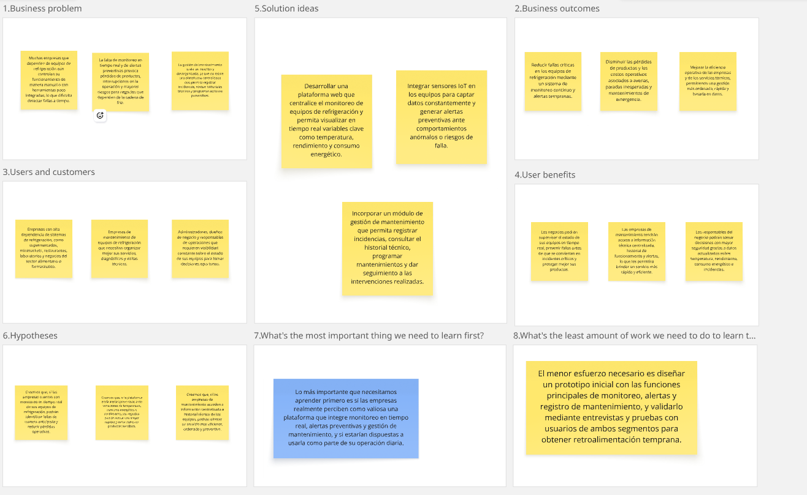
  <figcaption style="font-size: 0.9em; color: #555;">

Link del miro:
https://miro.com/welcomeonboard/WmZsK25CaFdYd041RFo5ejBKempQYXIveC85TmZaaUlpUGJrUUJ1VU1NUFVJVkp0NHVycks3UEZCK1M2WFV1TlVtazV5QmFNS1pGNllwTHh1bzRVMG0vZThsQTVOL0EwQlJwbEN0Y3NrQWVzSHUwWXk0OFgvTzBMSWJRMHF3eU9hWWluRVAxeXRuUUgwWDl3Mk1qRGVRPT0hdjE=?share_link_id=957048471438

## 1.3 Segmentos objetivos

La solución propuesta está dirigida a dos segmentos principales relacionados con la gestión y el mantenimiento de equipos de refrigeración. Ambos segmentos participan directamente en la operación de la cadena de frío y presentan necesidades específicas que justifican el desarrollo de una plataforma digital orientada al monitoreo en tiempo real, la prevención de fallas y la optimización del mantenimiento. De acuerdo con el enfoque del proyecto, estos segmentos se describen considerando sus características demográficas y su relación con el problema identificado.

**Segmento \#1: Empresas con alta dependencia de sistemas de refrigeración**  
 Este segmento está conformado por negocios y organizaciones que requieren equipos de refrigeración para conservar productos y garantizar la continuidad de sus operaciones. Aquí se incluyen supermercados, minimarkets, restaurantes, laboratorios, boticas, empresas del sector alimentario y empresas del sector farmacéutico. En términos demográficos, se trata principalmente de propietarios, administradores, jefes de operaciones o encargados de logística, generalmente adultos en edad laboral, ubicados en zonas urbanas y con actividad económica formal. Su principal necesidad es reducir pérdidas por fallas en los equipos, mantener condiciones adecuadas de conservación y optimizar el consumo energético y los costos operativos.

**Segmento \#2: Empresas de mantenimiento**  
 Este segmento está conformado por empresas y técnicos especializados en instalación, revisión y mantenimiento de equipos de refrigeración. Incluye pequeñas y medianas empresas de servicio técnico, así como proveedores que atienden a negocios que dependen de la cadena de frío. En términos demográficos, está integrado principalmente por técnicos, supervisores y responsables de servicio, generalmente adultos en edad laboral con conocimientos operativos y técnicos del sector. Su principal necesidad es contar con herramientas digitales que les permitan organizar mejor sus servicios, acceder al historial técnico de los equipos, mejorar sus tiempos de respuesta y ofrecer un servicio más eficiente y preventivo a sus clientes.

# Capítulo II: Requirements Elicitation & Analysis

## 2.1. Competidores

**Competidor 1: Copeland**  
Copeland es una empresa reconocida en el sector de la refrigeración comercial e industrial. Sus soluciones combinan hardware, sensores y plataformas digitales que permiten monitorear equipos a distancia, optimizar el consumo energético y anticipar fallas. Es una opción sólida para grandes empresas que buscan eficiencia y control avanzado en sus operaciones.

---

**Competidor 2: Monnit**  
Monnit se enfoca en ofrecer soluciones IoT simples y accesibles. A través de sensores inalámbricos, permite a los negocios monitorear variables como temperatura y humedad en tiempo real. Su principal ventaja es la facilidad de uso y rápida implementación, lo que la hace atractiva para pequeñas y medianas empresas.

---

**Competidor 3: ELPRO**  
ELPRO está orientado principalmente a sectores exigentes como el farmacéutico y laboratorios. Sus soluciones destacan por su alta precisión y por ayudar a cumplir normativas estrictas en la cadena de frío. Es una alternativa confiable cuando la calidad y el control son críticos.

---

### 2.1.1. Análisis competitivo

<table> 
  <tr>
    <th colspan="7"> Competitive Analysis Landscape </th>
  </tr>
  <tr>
    <td colspan="2" rowspan="2">¿Por qué llevar acabo este análisis? </td>
    <td colspan="5"> Este análisis se realiza para entender mejor el mercado, comparar lo que ofrecen otras soluciones y encontrar oportunidades que permitan a Frigora diferenciarse y aportar mayor valor a sus usuarios. </td>
  </tr>
  <tr>
  </tr>
  <tr>
    <td colspan="2"> </td>
    <td> Frigora </td>
    <td> Copeland </td>
    <td> Monnit </td>
    <td> ELPRO </td>
  </tr>
  <tr>
    <td rowspan="2">Perfil</td>
    <td>Overview</td>
    <td> Frigora es una plataforma que busca simplificar la gestión de sistemas de refrigeración, permitiendo monitorear equipos en tiempo real y contactar técnicos cuando sea necesario. </td>
    <td> Ofrece soluciones completas para grandes sistemas de refrigeración con enfoque en eficiencia y control. </td>
    <td> Proporciona sensores y una plataforma sencilla para monitoreo ambiental en tiempo real. </td>
    <td> Brinda soluciones de monitoreo altamente precisas para entornos donde el control es crítico. </td>
  </tr>
  <tr>
    <td>Ventaja competitiva</td>
    <td> Integra en un solo lugar el monitoreo, la gestión y la posibilidad de resolver problemas rápidamente con técnicos. </td>
    <td> Alta capacidad tecnológica y experiencia en el sector industrial. </td>
    <td> Fácil de instalar, usar y mantener. </td>
    <td> Alto nivel de confiabilidad y cumplimiento de estándares. </td>
  </tr>
  <tr>
    <td rowspan="2">Perfil de Marketing</td>
    <td> Mercado Objetivo </td>
    <td> Negocios como restaurantes, minimarkets, farmacias y técnicos independientes. </td>
    <td> Grandes empresas y cadenas comerciales. </td>
    <td> Pequeñas y medianas empresas. </td>
    <td> Empresas farmacéuticas y laboratorios. </td>
  </tr>
  <tr>
    <td> Estrategias de Marketing </td>
    <td> Uso de redes sociales, demostraciones gratuitas y alianzas locales. </td>
    <td> Estrategias B2B y relaciones con grandes industrias. </td>
    <td> Venta directa online y enfoque en facilidad de uso. </td>
    <td> Participación en ferias y cumplimiento de certificaciones. </td>
  </tr>
  <tr>
    <td rowspan="3">Perfil de Producto</td>
    <td> Productos & Servicios </td>
    <td> Monitoreo en tiempo real, alertas, historial de equipos y conexión con técnicos. </td>
    <td> Sistemas avanzados que combinan hardware y software para control de refrigeración. </td>
    <td> Sensores IoT junto a una plataforma de monitoreo en la nube. </td>
    <td> Equipos y software para monitoreo con alta precisión. </td>
  </tr>
  <tr>
    <td> Precios & Costos </td>
    <td> Modelo accesible con versión gratuita y pagos según uso. </td>
    <td> Soluciones costosas orientadas a empresas grandes. </td>
    <td> Suscripciones económicas. </td>
    <td> Costos más altos debido a su especialización. </td>
  </tr>
  <tr> 
    <td>Canales de distribución</td>
    <td> Plataforma web y aplicación móvil. </td>
    <td> Soluciones empresariales y plataformas digitales. </td>
    <td> Web y aplicación móvil. </td>
    <td> Web y aplicación móvil. </td>
  </tr>
  <tr>
    <td rowspan="4"> Análisis SWOT </td>
    <td> Fortalezas </td>
    <td> Plataforma completa y fácil de entender. </td>
    <td> Tecnología avanzada y gran experiencia. </td>
    <td> Bajo costo y facilidad de uso. </td>
    <td> Alta precisión y confiabilidad. </td>
  </tr>
  <tr>
    <td> Debilidades </td>
    <td> Depende de que los usuarios adopten la plataforma. </td>
    <td> Puede ser complejo y costoso para muchos negocios. </td>
    <td> Menor cantidad de funcionalidades avanzadas. </td>
    <td> Enfocado a un nicho específico. </td>
  </tr>
  <tr>
    <td> Oportunidades </td>
    <td> Crecimiento de la digitalización y uso de IoT en negocios. </td>
    <td> Expansión en más industrias. </td>
    <td> Aumento de adopción de tecnología IoT. </td>
    <td> Mayor regulación en cadena de frío. </td>
  </tr>
  <tr>
    <td> Amenazas </td>
    <td> Competencia de soluciones ya posicionadas. </td>
    <td> Nuevas startups más flexibles. </td>
    <td> Competidores con más funciones. </td>
    <td> Alternativas más económicas. </td>
  </tr>
</table>

### 2.1.2. Estrategias y tácticas frente a competidores

Hemos identificado diversas estrategias y tácticas para diferenciarnos y competir de manera efectiva en el mercado de la refrigeración. A continuación, se presentan las principales:

1. **Estrategias de Diferenciación:**

**Solución Integral para Refrigeración Comercial:**  
Frigora busca ser más que una herramienta de monitoreo, integrando también la gestión y la solución de problemas en un mismo lugar. Esto permite a los usuarios no solo detectar fallas, sino actuar rápidamente.

**Trazabilidad Completa de Equipos:**  
Cada equipo cuenta con un historial claro de uso, fallas y mantenimientos, lo que facilita el control y mejora la toma de decisiones.

**Interfaz Intuitiva y Fácil de Usar:**  
La plataforma está diseñada para ser simple, incluso para usuarios sin experiencia tecnológica, reduciendo la barrera de entrada.

2. **Tácticas de Marketing:**

**Marketing Digital y Demostraciones Gratuitas:**  
Se buscará llegar a los negocios mediante redes sociales y pruebas gratuitas que permitan conocer el valor de la plataforma sin compromiso.

**Educación del Usuario:**  
Se generará contenido que ayude a los usuarios a entender la importancia del monitoreo y el mantenimiento preventivo.

**Fidelización de Usuarios:**  
Se implementarán beneficios para usuarios recurrentes con el fin de mantener su preferencia en el tiempo.

3. **Estrategias de Precios:**

**Modelo Freemium:**  
Se ofrece una versión gratuita para facilitar la adopción inicial.

**Pagos según uso:**  
Los usuarios solo pagan por servicios adicionales, reduciendo el riesgo y facilitando la decisión de compra.

4. **Expansión y Adaptabilidad:**

**Enfoque Regional Inicial:**  
Frigora iniciará en Lima, con la intención de expandirse progresivamente a otras ciudades.

**Alianzas Locales:**  
Se buscará trabajar con técnicos y proveedores locales, fortaleciendo la red de servicios y adaptándose mejor al mercado.

## 2.2. Entrevistas

### 2.2.1. Diseño de entrevistas

En esta sección, se han planteado diversas preguntas dirigidas a nuestros segmentos objetivos con el objetivo de obtener información relevante, como opiniones, necesidades y experiencias. Estos datos serán fundamentales para el desarrollo de nuestra solución.

**Preguntas para el Segmento Objetivo 1 - Negocios con equipos de refrigeración**

1. ¿Qué tipo de equipos de refrigeración usas en tu negocio?
2. ¿Con qué frecuencia sueles tener problemas con estos equipos?
3. Cuando ocurre una falla, ¿qué es lo primero que haces?
4. ¿Te resulta difícil encontrar un técnico confiable cuando lo necesitas?
5. ¿Qué tanto te afecta una falla en tus equipos (por ejemplo, pérdidas o retrasos)?
6. ¿Sueles hacer mantenimiento preventivo o solo cuando algo falla?
7. ¿Cómo llevas el control del mantenimiento de tus equipos?
8. ¿Te gustaría poder monitorear tus equipos o recibir alertas antes de que fallen?
9. ¿Qué te gustaría que tenga una herramienta que te ayude con esto?
10. ¿Pagarías por una solución que te ayude a evitar fallas? ¿Qué precio te parecería razonable?

---

**Preguntas para el Segmento Objetivo 2 - Empresas de mantenimiento**

1. ¿Qué tipo de trabajos técnicos realizas con mayor frecuencia?
2. ¿Cómo sueles conseguir nuevos clientes actualmente?
3. ¿Qué es lo más complicado de gestionar tu trabajo día a día como técnico?
4. ¿Cómo organizas tus citas o servicios?
5. ¿Prefieres hacer mantenimiento preventivo o correctivo? ¿Por qué?
6. ¿Qué problemas sueles tener con los clientes?
7. ¿Te gustaría recibir solicitudes de trabajo técnico de forma más organizada?
8. ¿Qué herramientas usas actualmente para tu trabajo?
9. ¿Te ayudaría tener información previa del equipo antes de atender un servicio técnico?
10. ¿Usarías una plataforma que te conecte con más clientes? ¿Qué tendría que tener para que te convenza?

### 2.2.2. Registro de entrevistas
## Segmento objetivo #1: Negocios con equipos de refrigeración

### Entrevista 1:

- **Nombres y apellidos:** Mauricio Mego 
- **Edad:** 24
- **Distrito:** Magdalena del Mar

- **Inicio:** 0:00
- **Duración:** 3:54 min
- **URL:** [`https://upcedupe-my.sharepoint.com/:v:/g/personal/u202321264_upc_edu_pe/IQCD75JaCB67Rqbnmgayr_P2AUStbuDTZL4pS3Bs8Pi0i7U?nav=eyJyZWZlcnJhbEluZm8iOnsicmVmZXJyYWxBcHAiOiJPbmVEcml2ZUZvckJ1c2luZXNzIiwicmVmZXJyYWxBcHBQbGF0Zm9ybSI6IldlYiIsInJlZmVycmFsTW9kZSI6InZpZXciLCJyZWZlcnJhbFZpZXciOiJNeUZpbGVzTGlua0NvcHkifX0&e=jroC0y`](https://upcedupe-my.sharepoint.com/:v:/g/personal/u202321264_upc_edu_pe/IQCD75JaCB67Rqbnmgayr_P2AUStbuDTZL4pS3Bs8Pi0i7U?nav=eyJyZWZlcnJhbEluZm8iOnsicmVmZXJyYWxBcHAiOiJPbmVEcml2ZUZvckJ1c2luZXNzIiwicmVmZXJyYWxBcHBQbGF0Zm9ybSI6IldlYiIsInJlZmVycmFsTW9kZSI6InZpZXciLCJyZWZlcnJhbFZpZXciOiJNeUZpbGVzTGlua0NvcHkifX0&e=jroC0y)
- **Resumen:** Mauricio administra un negocio de alimentos junto a su padre, en el que almacenan carnes, pescados y otros productos que requieren refrigeración. Para ellos, es fundamental que sus equipos de refrigeración funcionen correctamente, ya que de ello dependen sus ingresos. Durante la entrevista, comentó que en una ocasión sufrió una pérdida considerable debido a una falla en los equipos ocasionada por la falta de mantenimiento.

Además, menciona que cada semana debe revisar personalmente el estado de los equipos y, en caso de detectar algún problema, tiene que contactar a un técnico externo para solucionarlo. Considera que sería muy útil contar con alertas automáticas, ya que le permitirían reducir esa preocupación constante y confiar más en el monitoreo del sistema.

En conclusión, Mauricio estaría dispuesto a adquirir una aplicación como Frigora, ya que responde a sus necesidades y le ayudaría a mantener sus equipos de refrigeración en buen estado sin tantas preocupaciones. 

---

#### Entrevista 2:

- **Nombres y apellidos:** 
- **Edad:** 
- **Distrito:** 

- **Inicio:** 0:00
- **Duración:** 3:44 min
- **URL:** 
- **Resumen:** 

---

#### Entrevista 3:

- **Nombre:** Henrry
- **Edad:** 28 años
- **Distrito:** Lima

- **Inicio:** 0:00
- **Duración:** 6:14 min
- **URL:** [``]()
- **Resumen:** 

---

## Segmento Objetivo 2 - Técnicos y empresas de mantenimiento:

#### **Entrevista 1:**

- **Nombres y apellidos:** 
- **Edad:** 
- **Distrito:** 
- **Inicio:** 
- **Duración:** 
- **Url:** [``]()

- **Resumen:** 

---

#### **Entrevista 2:**

- **Nombres y apellidos:** 
- **Distrito:** 
- **Duración:** 
- **Resumen:** 
- **Url:**

#### Entrevista 3:

- **Nombre:** 
- **Edad:** 38 años
- **Distrito:** Lima

- **Inicio:** 0:00
- **Duración:** 4:39 min
- **URL:** [``]()
- **Resumen:** 

---

### 2.2.3. Análisis de entrevistas

## Segmento objetivo #1:

#### Entrevista 3:
**Análisis:** 

## Segmento Objetivo 2 -

#### Entrevista 3:
**Análisis:** 

## 2.3. Needfinding

### 2.3.1. User Personas

En esta sección se presentan las fichas de User Personas construidas a partir de los datos recolectados del análisis de entrevistas a nuestros segmentos objetivos. Estas fichas permiten representar de forma clara y estratégica los perfiles de cada segmento objetivo, considerando sus metas, habilidades, motivaciones y dificultades. De esta manera se integra la perspectiva del usuario y tendencias del sector para identificar oportunidades en el mercado y ofrecer una solución alineada a lo que el usuario necesita.

**Segmento Objetivo 1: Negocios con equipos de refrigeración**

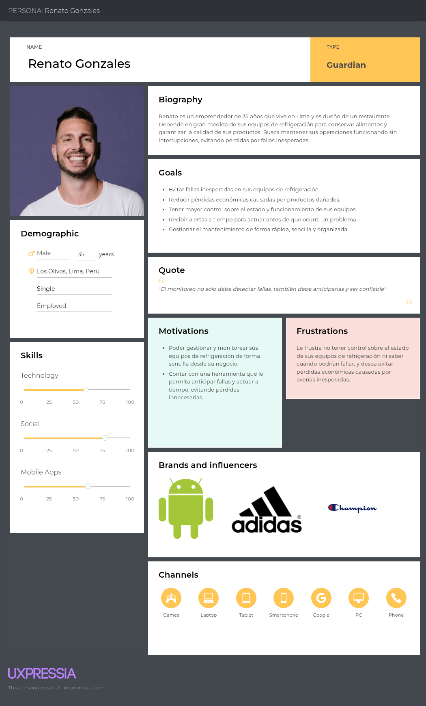

 

**Segmento Objetivo 2: Empresas de mantenimiento**

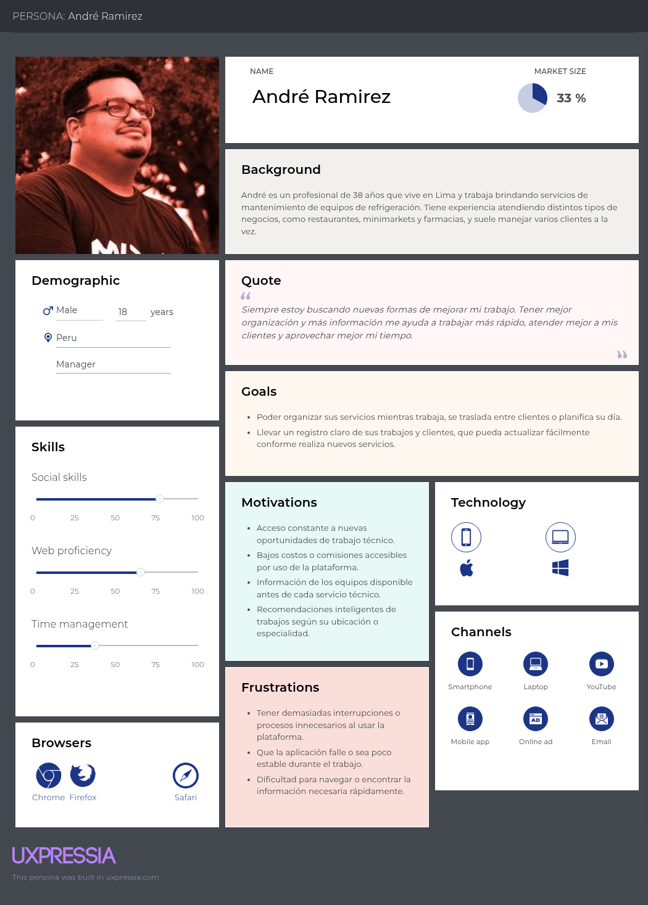

### 2.3.2. User Task Matrix

En esta sección se presenta el User Task Matrix, construido a partir de los User Persona que representan a los dos segmentos clave identificados:

Segmento 1: Negocios con equipos de refrigeración (representado por Renato Gonzales).

Segmento 2: Empresas de mantenimiento (representado por André Ramirez).

Las tareas fueron identificadas a partir del análisis cualitativo de entrevistas, y cada una fue evaluada según su frecuencia y nivel de importancia para los respectivos perfiles.

<table border="1" cellpadding="8" cellspacing="0">
  <thead>
    <tr>
      <th rowspan="2">Tarea / Task</th>
      <th colspan="2">Renato</th>
      <th colspan="2">André</th>
    </tr>
    <tr>
      <th>Frecuencia</th>
      <th>Importancia</th>
      <th>Frecuencia</th>
      <th>Importancia</th>
    </tr>
  </thead>
  <tbody>
    <tr>
      <td>Revisar estado de los equipos de refrigeración</td>
      <td>Alta</td>
      <td>Alta</td>
      <td>Media</td>
      <td>Alta</td>
    </tr>
    <tr>
      <td>Recibir alertas de fallas o anomalías</td>
      <td>Alta</td>
      <td>Alta</td>
      <td>Alta</td>
      <td>Alta</td>
    </tr>
    <tr>
      <td>Contactar a un técnico para mantenimiento</td>
      <td>Media</td>
      <td>Alta</td>
      <td>-</td>
      <td>-</td>
    </tr>
    <tr>
      <td>Programar mantenimiento preventivo</td>
      <td>Media</td>
      <td>Alta</td>
      <td>Alta</td>
      <td>Alta</td>
    </tr>
    <tr>
      <td>Revisar historial de mantenimiento de equipos</td>
      <td>Media</td>
      <td>Media</td>
      <td>Alta</td>
      <td>Alta</td>
    </tr>
    <tr>
      <td>Registrar servicios realizados</td>
      <td>-</td>
      <td>-</td>
      <td>Alta</td>
      <td>Alta</td>
    </tr>
    <tr>
      <td>Organizar agenda de servicios técnicos</td>
      <td>-</td>
      <td>-</td>
      <td>Alta</td>
      <td>Alta</td>
    </tr>
    <tr>
      <td>Recibir solicitudes de nuevos trabajos</td>
      <td>-</td>
      <td>-</td>
      <td>Alta</td>
      <td>Alta</td>
    </tr>
    <tr>
      <td>Evaluar el estado de equipos antes del servicio</td>
      <td>Baja</td>
      <td>Media</td>
      <td>Alta</td>
      <td>Alta</td>
    </tr>
    <tr>
      <td>Monitorear múltiples equipos desde una plataforma</td>
      <td>Alta</td>
      <td>Alta</td>
      <td>Media</td>
      <td>Alta</td>
    </tr>
    <tr>
      <td>Calificar el servicio recibido / realizado</td>
      <td>Baja</td>
      <td>Media</td>
      <td>Media</td>
      <td>Media</td>
    </tr>
  </tbody>
</table>

### 2.3.3. User Journey Mapping

En esta sección se presentan los User Journey Maps de los dos segmentos objetivo: Renato Gonzales, propietario de un mini-market, y André Ramirez, técnico de una empresa de mantenimiento especializad en refrigeración. Cada mapa refleja el recorrido actual que estos usuarios realizan para cumplir sus objetivos sin contar aún con una solución tecnológica integrada, mostrando los puntos críticos, emociones, tareas clave y oportunidades de mejora. Estos recorridos nos permiten entender los desafíos que enfrentan los usuarios día a día.

 

**Segmento Objetivo 1: Negocios con equipos de refrigeración**

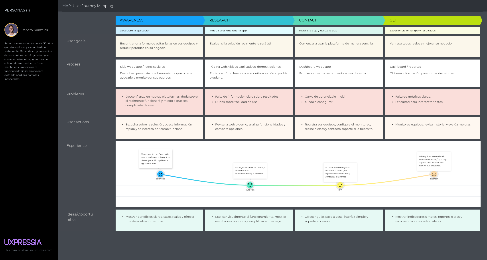

 

**Segmento Objetivo 2: Técnicos y empresas de mantenimiento**

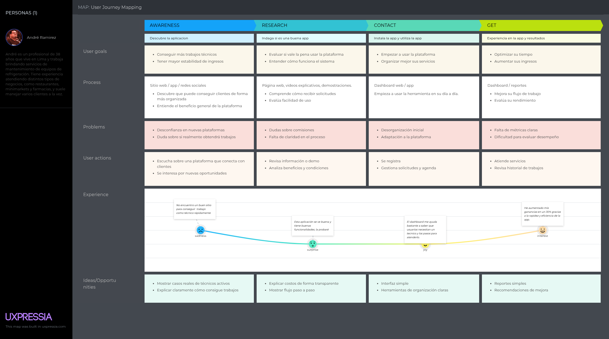

### 2.3.4. Empathy Mapping

En esta sección se presentan los Empathy Maps. Estos nos ayudarán a comprender las experiencias, emociones y pensamientos que expresan los usuarios de cada segmento objetivo.

 

**Segmento Objetivo 1: Negocios con equipos de refrigeración**

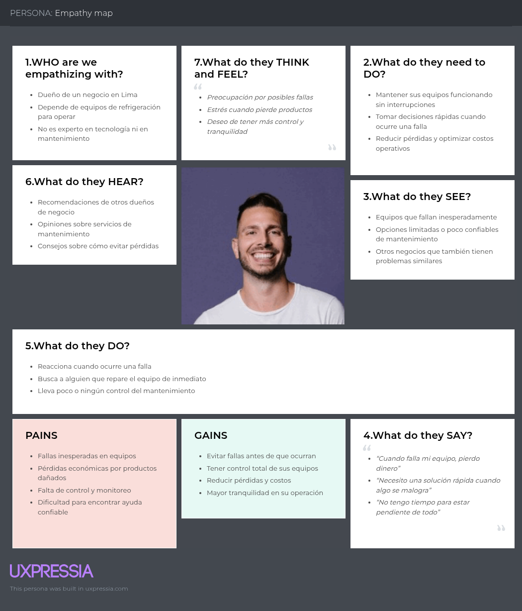

 

**Segmento Objetivo 2: Empresas de mantenimiento**

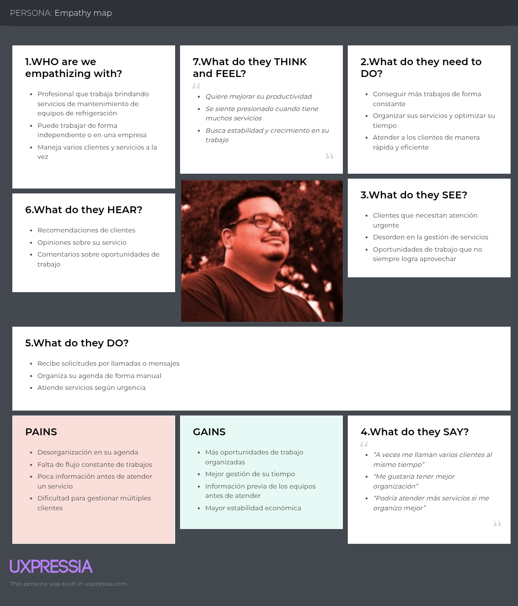

## 2.4. Big Picture Event Storming

En esta sección se presenta el trabajo realizado durante la sesión de Big Picture Event Storming, enfocada en comprender el dominio general del negocio. Para ello se utilizaron post-its en LucidChart para mapear los eventos significativos que ocurren en el flujo operativo actual, desde la detección de fallas en los equipos de refrigeración hasta el seguimiento posterior al servicio técnico. Ello nos permitió identificar procesos clave, actores involucrados, relaciones entre eventos, y oportunidades de mejora para el desarrollo de nuestra solución.

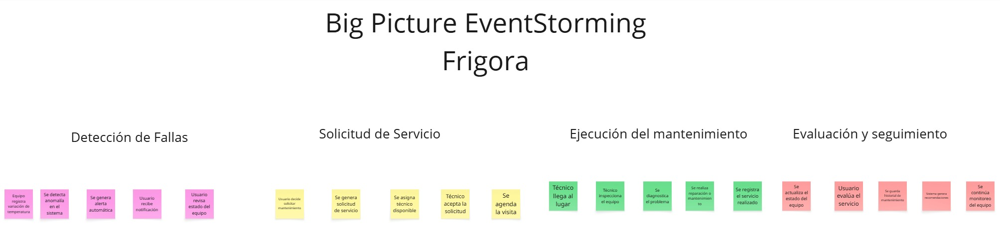

## 2.5. Ubiquitous Language

1. **User Profile (Perfil de Usuario):** Perfil del usuario dentro de la plataforma.

2. **Smart Dashboard (Panel Inteligente):** Interfaz central donde los usuarios monitorean el estado de sus equipos, reciben alertas y gestionan sus servicios.

3. **Performance Report (Reporte de Rendimiento):** Informe técnico con historial de uso, consumo energético, temperatura y fallas de cada equipo.

4. **Maintenance Schedule (Agenda de Mantenimientos):** Calendario inteligente para programar mantenimientos preventivos o correctivos.

5. **Failure Alert (Alerta de Falla):** Notificación automática ante anomalías críticas como sobrecalentamiento o cortes de energía.

6. **Equipment Inventory (Inventario de Equipos):** Registro de todos los equipos de congelación con sus datos técnicos y ubicación.

7. **Service Provider (Proveedor de Servicio):** Técnico o empresa que brinda mantenimiento, instalación o reparación de equipos de refrigeración.

8. **Technical History (Historial Técnico):** Registro detallado de todas las intervenciones realizadas a un equipo.

9. **Work Order (Orden de Trabajo):** Documento digital con las tareas asignadas a un técnico para una visita de servicio.

10. **Service Coordination (Coordinación de Servicio):** Proceso de conexión entre clientes y proveedores según disponibilidad, ubicación y necesidad.

11. **Automatic Report Generation (Generación Automática de Reportes):** Función que crea informes técnicos sin intervención manual.

12. **Real-Time Monitoring (Monitoreo en Tiempo Real):** Supervisión constante del estado operativo del equipo (temperatura, consumo, uso).

13. **Service Zone (Zona de Servicio):** Área donde un proveedor puede atender equipos con rapidez y eficiencia.

14. **Client Portfolio (Cartera de Clientes):** Lista de negocios atendidos por un proveedor, con sus datos y equipos registrados.

15. **Cold Equipment (Equipo de Congelación):** Unidad de refrigeración usada para conservar productos, como congeladoras, cámaras o vitrinas.

16. **Energy Consumption (Consumo Energético):** Registro del uso eléctrico de los equipos para detectar anomalías y optimizar recursos.

17. **Preventive Maintenance (Mantenimiento Preventivo):** Servicio planificado para evitar fallas y extender la vida útil del equipo.

18. **Corrective Maintenance (Mantenimiento Correctivo):** Servicio realizado para solucionar una falla existente en un equipo.

19. **Notification (Notificación):** Mensajes enviados automáticamente para informar sobre mantenimientos, fallas o cambios importantes.

# Capítulo III: Requirements Specification

## 3.1. To-Be Scenario Mapping

**Segmento objetivo #1: Negocios con equipos de refrigeración**

<figure style="page-break-inside: avoid; text-align: center;">
  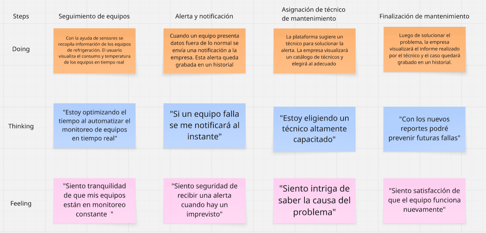
  <figcaption style="font-size: 0.9em; color: #555;">
    <strong>Figura 1:</strong> To Be Scenario Mapping: Negocios con equipos de refrigeración (Segmento 1).
  </figcaption>
</figure>

**Segmento objetivo #2: Técnicos y empresas de mantenimiento**

<figure style="page-break-inside: avoid; text-align: center;">
  
  <figcaption style="font-size: 0.9em; color: #555;">
    <strong>Figura 2:</strong> To Be Scenario Mapping - Técnicos y empresas de mantenimiento (Segmento 2).
  </figcaption>
</figure>

## 3.2. User Stories.

Las historias de usuario para este proyecto se crearon en colaboración con el equipo de desarrollo, enfocándose en las necesidades principales de dos tipos de usuarios: los clientes, que son dueños de equipos de refrigeración, y los proveedores de servicios y equipos.

Para mantener la organización, las historias se agruparon en épicas según sus funcionalidades. Los criterios de aceptación de cada historia se definieron utilizando la sintaxis Gherkin, asegurando que el equipo comprendiera el problema desde la perspectiva del usuario final.

**Épicas del Sistema** 
Las siguientes épicas representan los bloques funcionales principales del producto. Cada épica agrupa un conjunto de User Stories que definen las funcionalidades asociadas tanto al usuario, como los componentes de interfaz y backend necesarios para soportar dichas capacidades. 

| **ID de Epic** | **Título** | **Descripción** |
| :---: | :--- | :--- |
| **EP-01** | Gestión de Cuentas de Usuario | Esta epic se centra en todo lo necesario para que los usuarios puedan crear, acceder y administrar sus perfiles de forma segura en la plataforma. |
| **EP-02** | Gestión y Monitoreo de Equipos | Esta epic abarca la funcionalidad para que los clientes agreguen, editen y monitoreen sus equipos de refrigeración, facilitando su control. |
| **EP-03** | Proceso de Solicitudes de Servicio | Esta epic cubre el ciclo completo de las solicitudes de servicio, desde que un cliente pide una reparación o mantenimiento hasta que el trabajo se completa y se le da seguimiento. |
| **EP-04** | Análisis e Informes de Datos | Esta epic se encarga de la generación de reportes clave sobre el rendimiento de los equipos, el consumo energético y la eficiencia de los servicios, permitiendo un análisis detallado. |
| **EP-05** | Sistema de Alertas y Notificaciones | Esta epic está dedicada a la creación de un sistema robusto que envía alertas automáticas a clientes y empresarios sobre fallas, necesidades de mantenimiento y el progreso de los servicios. |
| **EP-06** | Página de Aterrizaje y Experiencia Inicial | Esta epic cubre el desarrollo de la página de aterrizaje (landing page), asegurando que los visitantes entiendan rápidamente la propuesta de valor y puedan contactar al equipo comercial con facilidad. |

**User Stories** 

| **ID** | **Título** | **Descripción** | **Criterios de Aceptación** | **Epic** |
| :--- | :--- | :--- | :--- | :---: |
| **US-01** | Registro de usuario | Como nuevo usuario, quiero registrarme para acceder a la plataforma y empezar a gestionar mis equipos. | **Escenario 1: Crear cuenta exitosamente** Dado que el nuevo usuario tiene todos los datos correctos, Cuando completa el registro, Entonces su cuenta es creada correctamente.  **Escenario 2: Intento de crear cuenta con email ya registrado** Dado que el nuevo usuario intenta registrarse con un correo ya registrado, Cuando envía el formulario, Entonces el sistema muestra un mensaje indicando que el correo ya existe. | EP-01 |
| **US-02** | Inicio de sesión | Como usuario, quiero acceder a mi cuenta en la plataforma para utilizar sus funcionalidades. | **Escenario 1: Iniciar sesión correctamente** Dado que el usuario tiene una cuenta activa, Cuando ingresa sus datos correctamente, Entonces accede a su panel de control.  **Escenario 2: Intento de iniciar sesión con datos incorrectos** Dado que el usuario ingresa datos incorrectos, Cuando intenta iniciar sesión, Entonces el sistema muestra un mensaje de error. | EP-01 |
| **US-03** | Gestionar equipos de refrigeración | Como cliente, quiero gestionar mis equipos de refrigeración en la plataforma para mantener un registro y control detallado de cada uno. | **Escenario 1: Registro de un nuevo equipo** Dado que el cliente tiene los detalles de un nuevo equipo, Cuando los ingresa, Entonces el equipo se registra correctamente.  **Escenario 2: Actualización de la información de un equipo** Dado que el cliente desea modificar los datos de un equipo ya registrado, Cuando realiza los cambios, Entonces la información del equipo se actualiza. | EP-02 |
| **US-04** | Recibir notificaciones de estado del equipo | Como cliente, quiero recibir notificaciones automáticas sobre el estado de mis equipos para tomar acciones rápidas ante cualquier incidencia o necesidad de mantenimiento. | **Escenario 1: Alerta de falla detectada** Dado que un equipo presenta una falla, Cuando la falla es detectada, Entonces el cliente recibe una alerta.  **Escenario 2: Alerta de mantenimiento preventivo** Dado que se acerca una necesidad de mantenimiento preventivo, Cuando se identifica esa necesidad, Entonces el cliente es notificado con antelación. | EP-05 |
| **US-05** | Analizar el consumo energético de equipos | Como cliente, quiero ver y comparar el consumo energético de mis equipos para evaluar su eficiencia y tomar decisiones informadas. | **Escenario 1: Visualización del consumo individual** Dado que el cliente tiene equipos registrados, Cuando solicita ver los datos de consumo de un equipo, Entonces se muestra un informe de consumo energético.  **Escenario 2: Comparación del consumo energético** Dado que el cliente selecciona múltiples equipos, Cuando solicita la comparación, Entonces se genera una vista comparativa. | EP-04 |
| **US-06** | Solicitar y gestionar servicios de mantenimiento y reparación | Como cliente, quiero solicitar servicios de mantenimiento (preventivo) y reparación (correctivo) para mis equipos, y recibir confirmación. | **Escenario 1: Solicitud de servicio exitosa** Dado que el cliente requiere un servicio, Cuando selecciona el tipo de servicio y detalla la solicitud, Entonces se registra en el sistema y se le notifica.  **Escenario 2: Recepción de confirmación** Dado que la solicitud ha sido enviada, Cuando el sistema procesa la solicitud, Entonces el cliente recibe confirmación con los detalles. | EP-03 |
| **US-07** | Dar seguimiento al progreso del servicio | Como cliente, quiero seguir el avance de mi servicio solicitado para saber en qué etapa se encuentra y cuándo estará completado. | **Escenario 1: Visualización del estado** Dado que el cliente tiene una solicitud activa, Cuando accede a su información de servicios, Entonces se presenta el estado actualizado.  **Escenario 2: Actualización de estado** Dado que una solicitud está en curso, cuando su estado cambia, entonces el sistema refleja el nuevo estado. | EP-03 |
| **US-08** | Ver reporte de servicio realizado | Como cliente, quiero ver el reporte de servicio detallado para saber qué reparaciones se hicieron en mi equipo. | **Escenario 1: Generación del reporte** Dado que el servicio ha sido completado, Cuando el técnico termina, Entonces el sistema genera un reporte detallado.  **Escenario 2: Enviar reporte por correo** Dado que el reporte ha sido generado, Cuando se finaliza el servicio, Entonces el sistema lo envía al cliente por correo electrónico. | EP-04 |
| **US-09** | Recepción de alertas sobre solicitudes de servicio | Como empresario, quiero recibir alertas automáticas cuando un cliente solicite un servicio de reparación o mantenimiento. | **Escenario 1: Recepción de solicitud** Dado que un cliente ha enviado una solicitud, Cuando se recibe, Entonces el empresario recibe una alerta.  **Escenario 2: Alerta de mantenimiento preventivo** Dado que se ha solicitado mantenimiento preventivo, Cuando se registra, Entonces el empresario recibe una alerta. | EP-05 |
| **US-10** | Ver historial de servicios | Como empresario, quiero ver el historial de servicios realizados para cada cliente y equipo, para llevar un control detallado. | **Escenario 1: Visualización del historial** Dado que el empresario requiere consultar los servicios, Cuando accede a la sección de historial, Entonces puede ver el historial completo.  **Escenario 2: Filtrado del historial** Dado que el empresario desea filtrar, Cuando aplica un filtro por cliente o equipo, Entonces el historial se actualiza mostrando solo esos resultados. | EP-04 |
| **US-11** | Realizar seguimiento a solicitudes de servicio | Como empresario, quiero realizar un seguimiento detallado a las solicitudes de servicio de mis técnicos, para saber cómo van. | **Escenario 1: Ver estado de la solicitud** Dado que el empresario tiene acceso a solicitudes, Cuando ingresa al sistema, Entonces puede ver el estado actualizado.  **Escenario 2: Actualización del estado** Dado que el empresario quiere seguir el progreso, Cuando un técnico actualiza el estado, Entonces el sistema muestra el estado en tiempo real. | EP-03 |
| **US-12** | Registrar y gestionar técnicos | Como empresario, quiero registrar técnicos en la plataforma para incluirlos en mi equipo de trabajo y gestionar sus perfiles. | **Escenario 1: Registro exitoso** Dado que el empresario completa los datos requeridos, Cuando guarda la información, Entonces el técnico queda registrado exitosamente.  **Escenario 2: Intento con datos faltantes** Dado que el empresario intenta registrar sin completar los campos obligatorios, Cuando intenta guardar, Entonces no se permite la operación. | EP-01 |
| **US-13** | Consultar el perfil de un técnico | Como empresario, quiero ver el perfil de cada técnico, incluyendo sus datos y métricas de rendimiento. | **Escenario 1: Acceso a la información completa** Dado que el empresario selecciona un técnico, Cuando accede a su perfil, Entonces puede visualizar sus datos y métricas.  **Escenario 2: Visualización sin evaluaciones** Dado que un técnico no ha recibido evaluaciones, Cuando se consulta su perfil, Entonces las métricas no son visibles. | EP-01 |
| **US-14** | Asignar técnicos a servicios | Como empresario, quiero asignar un técnico a una solicitud de servicio para asegurar que se realice el trabajo adecuadamente. | **Escenario 1: Asignación de técnico** Dado que el empresario ha recibido una solicitud, Cuando selecciona un técnico, Entonces es asignado a la solicitud.  **Escenario 2: Notificación de asignación** Dado que un técnico ha sido asignado, Cuando el empresario confirma, Entonces el técnico recibe una notificación con los detalles. | EP-03 |
| **US-15** | Generar reporte de desempeño de técnicos | Como empresario, quiero generar reportes sobre el desempeño de mis técnicos para evaluar su eficiencia y productividad. | **Escenario 1: Generar reporte** Dado que el empresario quiere evaluar el desempeño, Cuando selecciona generar reporte, Entonces el sistema crea un informe.  **Escenario 2: Descargar reporte** Dado que el reporte ha sido generado, Cuando el empresario quiere descargarlo, Entonces el sistema permite descargarlo en PDF. | EP-04 |
| **US-16** | Configurar alertas de mantenimiento | Como empresario, quiero configurar alertas automáticas para el mantenimiento preventivo de los equipos. | **Escenario 1: Configuración de alerta** Dado que el empresario desea configurar una alerta, Cuando ingresa los parámetros necesarios, Entonces se configura correctamente.  **Escenario 2: Actualización de alerta existente** Dado que el empresario quiere modificar una alerta, Cuando ajusta los parámetros, Entonces es actualizada. | EP-05 |
| **US-17** | Visualizar clientes y servicios asociados | Como empresario, quiero ver un listado de clientes y los servicios que han solicitado para organizar el trabajo de los técnicos. | **Escenario 1: Acceso a información** Dado que el empresario necesita ver clientes pendientes, Cuando accede a la funcionalidad, Entonces puede visualizar clientes y servicios.  **Escenario 2: Filtrado de servicios** Dado que el empresario quiere enfocarse en servicios específicos, Cuando aplica un filtro por estado, Entonces la lista se actualiza. | EP-04 |
| **US-18** | Visualizar equipos asignados a clientes | Como empresario, quiero ver un listado de los equipos que han sido entregados a los clientes para darles un seguimiento. | **Escenario 1: Acceso a la lista** Dado que el empresario quiere consultar los equipos, Cuando accede al listado, Entonces puede visualizarlos.  **Escenario 2: Filtrado de equipos** Dado que el empresario necesita encontrar equipos específicos, Cuando aplica filtros, Entonces la lista se actualiza mostrando resultados. | EP-02 |
| **US-19** | Recibir notificaciones de eventos importantes | Como cliente, quiero recibir notificaciones sobre eventos importantes como el progreso del servicio. | **Escenario 1: Problema reportado** Dado que el técnico detecta una complicación, Cuando se genera un evento interno, Entonces se envía una notificación que requiere acción del cliente.  **Escenario 2: Notificación sobre progreso** Dado que el servicio está en ejecución, Cuando el estado cambia, Entonces se envía una notificación. | EP-05 |
| **US-20** | Visualizar la propuesta de valor principal | Como visitante, quiero conocer la propuesta de valor de la plataforma para entender si se ajusta a mis necesidades. | **Escenario 1: Propuesta visible** Dado que un visitante llega a la página principal, Cuando carga, Entonces se le presenta una frase que explica la propuesta.  **Escenario 2: Contenido orientado** Dado que el visitante pertenece a la gestión de equipos, Cuando revisa la propuesta, Entonces encuentra conceptos de gestión inteligente. | EP-06 |
| **US-21** | Explorar soluciones específicas para mi rubro | Como visitante, quiero conocer las soluciones que ofrece la plataforma para mi tipo de negocio. | **Escenario 1: Negocios de refrigeración** Dado que un visitante explora soluciones, Cuando revisa el contenido, Entonces encuentra descripciones dirigidas a negocios de refrigeración.  **Escenario 2: Empresas proveedoras** Dado que explora soluciones, Cuando revisa, Entonces encuentra información para empresas de mantenimiento. | EP-06 |
| **US-22** | Comprender las funcionalidades clave | Como visitante, quiero entender las funcionalidades principales de la plataforma para evaluar si se adaptan a mi operación. | **Escenario 1: Acceso a funcionalidades** Dado que consulta características, Cuando revisa la lista, Entonces identifica opciones clave.  **Escenario 2: Descripciones orientadas al valor** Dado que lee las descripciones, Cuando evalúa cada una, Entonces comprende el beneficio que aporta. | EP-06 |
| **US-23** | Conocer la misión y visión | Como visitante, quiero conocer la misión y visión de la empresa para entender su enfoque y propuesta de valor. | **Escenario 1: Acceso a misión** Dado que accede a la información, Cuando revisa el contenido corporativo, Entonces encuentra una descripción clara.  **Escenario 2: Acceso a visión** Dado que accede a la información institucional, Cuando revisa el contenido estratégico, Entonces encuentra la visión a futuro. | EP-06 |
| **US-24** | Contactar con el equipo de ventas | Como visitante empresario, quiero contactar fácilmente con el equipo de ventas para iniciar una posible relación comercial. | **Escenario 1: Canal de contacto** Dado que está interesado en contactar, Cuando busca información, Entonces encuentra una opción clara.  **Escenario 2: Redirección al canal adecuado** Dado que selecciona la opción, Cuando es redirigido, Entonces llega a un canal funcional (ej. formulario). | EP-06 |
| **US-25** | Acceder a la plataforma web (Call to Action) | Como usuario registrado, quiero acceder fácilmente a la plataforma web desde la página de inicio. | **Escenario 1: Visibilidad del acceso** Dado que un usuario registrado visita la página principal, Cuando busca cómo ingresar, Entonces encuentra una opción clara.  **Escenario 2: Redirección a la plataforma** Dado que selecciona la opción, Cuando es redirigido, Entonces llega a la página de inicio de sesión. | EP-06 |
| **TS-01** | Gestión de alertas críticas vía API | Como desarrollador, busco implementar un mecanismo que exponga las alertas críticas detectadas en los equipos a través de una API RESTful, para activar notificaciones automáticas al usuario. | **Escenario 1: Envío de notificación al detectar falla** Dado que se procesa una alerta crítica desde un equipo, Cuando se genera una notificación al usuario, Entonces se envía la alerta.  **Escenario 2: Falla detectada sin notificación activa** Dado que el servicio de notificaciones está deshabilitado, Cuando se genera la alerta crítica, Entonces no se envía la notificación, y se registra en el historial. | EP-05 |
| **TS-02** | Creación de solicitudes de mantenimiento (API) | Como desarrollador, quiero implementar una API que me permita crear solicitudes de mantenimiento para que los negocios reporten necesidades de soporte técnico. | **Escenario 1: Creación exitosa de solicitud** Dado que se envía una solicitud POST a `/api/v1/service-requests` con los datos del equipo y la descripción del problema, Cuando la solicitud es procesada, Entonces se recibe una respuesta 201 y se guarda la solicitud en el sistema.  **Escenario 2: Datos incompletos en la solicitud** Dado que se envía una solicitud a `/api/v1/service-requests` sin un campo obligatorio, Cuando la solicitud es procesada, Entonces se recibe una respuesta 400 con el mensaje "Invalid data". | EP-03 |
| **TS-03** | Registro de intervenciones técnicas por API RESTful | Como desarrollador, quiero registrar las intervenciones técnicas realizadas a través de la API para llevar un seguimiento detallado del mantenimiento. | **Escenario 1: Registro exitoso** Dado que se envía una solicitud POST a `/api/v1/interventions` con los datos del técnico y equipo, Cuando la solicitud es procesada, Entonces se recibe una respuesta 201 y el registro se almacena.  **Escenario 2: Registro con técnico no existente** Dado que el ID del técnico no existe, Cuando se realiza la solicitud POST a `/api/v1/interventions`, Entonces se recibe una respuesta 404 con el mensaje "Technician not found". | EP-03 |
| **TS-04** | Registrar nuevo usuario a través de API RESTful | Como desarrollador, quiero exponer un endpoint para registrar nuevos usuarios en la plataforma, validando datos como correo único y formato de contraseña, para permitir el acceso seguro. | **Escenario 1: Registro exitoso** Dado que el endpoint `/api/v1/users` está disponible, Cuando se envía una solicitud POST con datos válidos, Entonces el sistema responde con 201 y devuelve el usuario registrado.  **Escenario 2: Registro con email existente** Dado un correo ya registrado, Cuando se intenta registrar nuevamente, Entonces se devuelve un 400 con mensaje "Email already registered". | EP-01 |
| **TS-05** | Consulta de estado de servicios por API | Como desarrollador, mi objetivo es crear un endpoint para que clientes y empresarios puedan consultar el estado de una solicitud de servicio en tiempo real. | **Escenario 1: Consulta exitosa del estado** Dado que se envía una solicitud GET a `/api/v1/requests/{id}` con un ID válido, Cuando la solicitud es procesada, Entonces se recibe una respuesta 200 y se devuelve el estado actual de la solicitud.  **Escenario 2: Consulta con ID inexistente** Dado que el ID de la solicitud no existe, Cuando se realiza la consulta, Entonces se recibe una respuesta 404 con el mensaje "Request not found". | EP-03 |

## 3.3. Impact Mapping.
El equipo desarrolló un Impact Mapping en colaboración utilizando la herramienta UXPressia. Este mapa se creó para conectar los objetivos de negocio directamente con los requisitos funcionales de la plataforma.

 **Segmento 1 - Negocios con equipos de refrigeración** 
<figure style="page-break-inside: avoid; text-align: center;">
  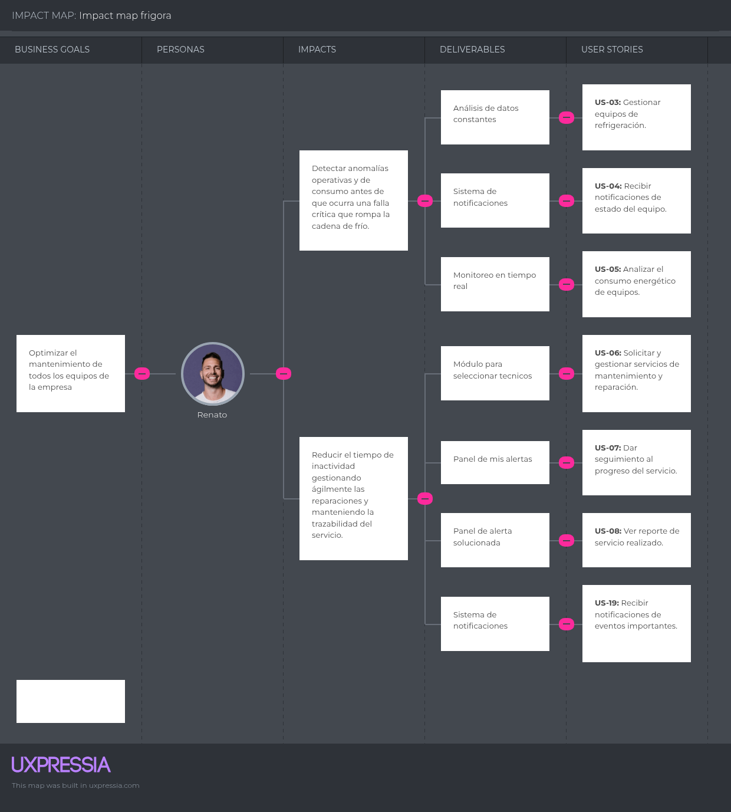
  <figcaption style="font-size: 0.9em; color: #555;">
    <strong>Figura 1:</strong> Impact Mapping.
  </figcaption>
</figure>

 **Segmento 2 - Empresas de mantenimiento** 
<figure style="page-break-inside: avoid; text-align: center;">
  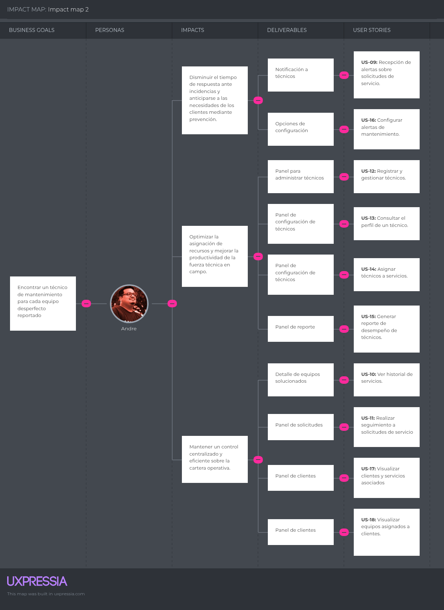
  <figcaption style="font-size: 0.9em; color: #555;">
    <strong>Figura 2:</strong> Impact Mapping.
  </figcaption>
</figure>

## 3.4. Product Backlog.
Para el desarrollo de nuestra plataforma, hemos creado un Product Backlog que funciona como una lista completa de todas las funcionalidades, características e incluso tareas técnicas necesarias para avanzar en el proyecto.

Para mantener el proyecto organizado, usamos la escala de Fibonacci (1, 2, 3, 5, 8, 13, 21) para estimar el esfuerzo de cada tarea. Esta escala de Story Points nos ayuda a priorizar y planificar de la siguiente manera: 

1: Tareas sencillas y rápidas. 
2: Tareas de complejidad moderada. 
3: Tareas que requieren más tiempo y esfuerzo. 
5: Tareas complejas. 
8: Tareas de alta complejidad que impactan varias áreas del proyecto. 

<figure style="page-break-inside: avoid; text-align: center;">
  
  <figcaption style="font-size: 0.9em; color: #555;">
    <strong>Figura 1:</strong> Product Backlog.
  </figcaption>
</figure>

Link del Backlog en trello: https://trello.com/invite/b/69edc7316e396d01726fc9c1/ATTIc41d50b3166de3cd176b5b3c82be8c51F5BBF481/frigora-product-backlog

| **Orden** | **ID** | **Título** | **Descripción** | **Story Points** | **Epic** |
| :---: | :---: | :--- | :--- | :---: | :---: |
| 1 | **US-20** | Visualizar la propuesta de valor principal | Como visitante, quiero conocer la propuesta de valor de la plataforma para entender si se ajusta a mis necesidades. | 1 | EP-06 |
| 2 | **US-21** | Explorar soluciones específicas para mi rubro | Como visitante, quiero conocer las soluciones que ofrece la plataforma para mi tipo de negocio. | 2 | EP-06 |
| 3 | **US-22** | Comprender las funcionalidades clave | Como visitante, quiero entender las funcionalidades principales de la plataforma para evaluar si se adaptan a mi operación. | 2 | EP-06 |
| 4 | **US-23** | Conocer la misión y visión | Como visitante, quiero conocer la misión y visión de la empresa para entender su enfoque y propuesta de valor. | 1 | EP-06 |
| 5 | **US-24** | Contactar con el equipo de ventas | Como visitante empresario, quiero contactar fácilmente con el equipo de ventas para iniciar una posible relación comercial. | 3 | EP-06 |
| 6 | **US-25** | Acceder a la plataforma web (Call to Action) | Como usuario registrado, quiero acceder fácilmente a la plataforma web desde la página de inicio. | 1 | EP-06 |
| 7 | **TS-04** | Registrar nuevo usuario a través de API RESTful | Como desarrollador, quiero exponer un endpoint para registrar nuevos usuarios en la plataforma, validando datos como correo único y formato de contraseña, para permitir el acceso seguro. | 3 | EP-01 |
| 8 | **US-01** | Registro de usuario | Como nuevo usuario, quiero registrarme para acceder a la plataforma y empezar a gestionar mis equipos. | 3 | EP-01 |
| 9 | **US-02** | Inicio de sesión | Como usuario, quiero acceder a mi cuenta en la plataforma para utilizar sus funcionalidades. | 2 | EP-01 |
| 10 | **US-12** | Registrar y gestionar técnicos | Como empresario, quiero registrar técnicos en la plataforma para incluirlos en mi equipo de trabajo y gestionar sus perfiles. | 5 | EP-01 |
| 11 | **US-13** | Consultar el perfil de un técnico | Como empresario, quiero ver el perfil de cada técnico, incluyendo sus datos y métricas de rendimiento. | 2 | EP-01 |
| 12 | **US-03** | Gestionar equipos de refrigeración | Como cliente, quiero gestionar mis equipos de refrigeración en la plataforma para mantener un registro y control detallado de cada uno. | 5 | EP-02 |
| 13 | **US-18** | Visualizar equipos asignados a clientes | Como empresario, quiero ver un listado de los equipos que han sido entregados a los clientes para darles un seguimiento. | 3 | EP-02 |
| 14 | **TS-02** | Creación de solicitudes de mantenimiento (API) | Como desarrollador, quiero implementar una API que me permita crear solicitudes de mantenimiento para que los negocios reporten necesidades de soporte técnico. | 3 | EP-03 |
| 15 | **US-06** | Solicitar y gestionar servicios de mantenimiento y reparación | Como cliente, quiero solicitar servicios de mantenimiento y reparación para mis equipos, y recibir confirmación. | 5 | EP-03 |
| 16 | **TS-05** | Consulta de estado de servicios por API | Como desarrollador, mi objetivo es crear un endpoint para que clientes y empresarios puedan consultar el estado de una solicitud de servicio en tiempo real. | 2 | EP-03 |
| 17 | **US-09** | Recepción de alertas sobre solicitudes de servicio | Como empresario, quiero recibir alertas automáticas cuando un cliente solicite un servicio de reparación o mantenimiento. | 3 | EP-05 |
| 18 | **US-14** | Asignar técnicos a servicios | Como empresario, quiero asignar un técnico a una solicitud de servicio para asegurar que se realice el trabajo adecuadamente. | 3 | EP-03 |
| 19 | **TS-03** | Registro de intervenciones técnicas por API RESTful | Como desarrollador, quiero registrar las intervenciones técnicas realizadas a través de la API para llevar un seguimiento detallado del mantenimiento. | 3 | EP-03 |
| 20 | **US-07** | Dar seguimiento al progreso del servicio | Como cliente, quiero seguir el avance de mi servicio solicitado para saber en qué etapa se encuentra y cuándo estará completado. | 3 | EP-03 |
| 21 | **US-11** | Realizar seguimiento a solicitudes de servicio | Como empresario, quiero realizar un seguimiento detallado a las solicitudes de servicio de mis técnicos, para saber cómo van. | 3 | EP-03 |
| 22 | **TS-01** | Gestión de alertas críticas vía API | Como desarrollador, busco implementar un mecanismo que exponga las alertas críticas detectadas en los equipos a través de una API RESTful, para activar notificaciones automáticas al usuario. | 5 | EP-05 |
| 23 | **US-19** | Recibir notificaciones de eventos importantes | Como cliente, quiero recibir notificaciones sobre eventos importantes como el progreso del servicio. | 5 | EP-05 |
| 24 | **US-04** | Recibir notificaciones de estado del equipo | Como cliente, quiero recibir notificaciones automáticas sobre el estado de mis equipos para tomar acciones rápidas. | 5 | EP-05 |
| 25 | **US-16** | Configurar alertas de mantenimiento | Como empresario, quiero configurar alertas automáticas para el mantenimiento preventivo de los equipos. | 5 | EP-05 |
| 26 | **US-08** | Ver reporte de servicio realizado | Como cliente, quiero ver el reporte de servicio detallado para saber qué reparaciones se hicieron en mi equipo. | 3 | EP-04 |
| 27 | **US-10** | Ver historial de servicios | Como empresario, quiero ver el historial de servicios realizados para cada cliente y equipo, para llevar un control detallado. | 3 | EP-04 |
| 28 | **US-17** | Visualizar clientes y servicios asociados | Como empresario, quiero ver un listado de clientes y los servicios que han solicitado para organizar el trabajo de los técnicos. | 3 | EP-04 |
| 29 | **US-05** | Analizar el consumo energético de equipos | Como cliente, quiero ver y comparar el consumo energético de mis equipos para evaluar su eficiencia y tomar decisiones informadas. | 8 | EP-04 |
| 30 | **US-15** | Generar reporte de desempeño de técnicos | Como empresario, quiero generar reportes sobre el desempeño de mis técnicos para evaluar su eficiencia y productividad. | 8 | EP-04 |

# Capítulo IV: Product Design

## 4.1. Style Guidelines
En este apartado se detalla la evolución de las interfaces y los procedimientos de la aplicación Frigora. El diseño busca ser atractivo y fácil de usar, empleando colores llamativos y un diseño espacioso adaptado a cada dispositivo. Se ha priorizado una clasificación de herramientas por categorías específicas para no abrumar al usuario con exceso de información.

### 4.1.1. General Style Guidelines

- Branding: Frigora es una aplicación para empresas dependientes de sistemas de refrigeración y mantenimientos del mismo, el objetivo es optimizar el proceso de supervisión y mantenimiento de los aparatos de refrigeración mediante tecnología iot. Asimismo la startup usara conceptos de buenas practicas de UX/UI, pruebas gratuitas para los usuarios y constante actualización para el buen funcionamiento de la aplicación.

- Typography:
La tipografía seleccionada es Roboto Serif, por su claridad, legibilidad y llamativa, ideal para interfaces digitales enfocadas en datos técnicos. Para el cuerpo de texto, se utiliza Inter 14px con un interlineado de 1.5, garantizando una lectura fluida. Los tamaños se adaptan en contexto web según la jerarquía: títulos, subtítulos y párrafos.
  
- Colors:
Los colores para la aplicación Frigora se decidieron tomando en cuenta el core de negocio, que es mantenimiento a aparatos electrónicos de refrigeración, por lo tanto se tomara variantes de color azul que combina con el tema central y un color blanco que ayuda a la limpieza visual del usuario.

- Spacing:
El espaciado está diseñado para ofrecer una experiencia clara y ordenada, facilitando la lectura de datos técnicos y alertas:
o	Entre secciones principales: mínimo 20px para marcar el cambio de contexto.
o	Entre encabezados y párrafos: 16px para reforzar jerarquía visual.
o	Entre párrafos consecutivos: 14px para mantener continuidad y evitar bloques densos.
o	Espaciado de botones e inputs: mínimo 10px entre elementos para garantizar usabilidad.

- Tono de comunicación:
- 
| Dimensión              | Nivel Adoptado    |
| :--------------------- | :---------------- |
| Divertido/Serio        | Medio-Serio       |
| Formal/Casual          | Semi-Formal       |
| Respetuoso/Irreverente | Muy Respetuoso    |
| Entusiasta/Sereno      | Sereno y Empático |

Decidimos mantener una comunicación clara, cálida y profesional, porque este enfoque nos permite conectar de manera efectiva con el público, especialmente en un contexto tan profesional.

- Lenguaje aplicado:
  - Claro y directo, evitando tecnicismos complejos cuando no son necesarios.
  - Orientado a la acción, con instrucciones breves y fáciles de seguir.
  - Consistente en terminología técnica, garantizando coherencia en alertas, reportes y documentación.

### 4.1.2. Web Style Guidelines

#### **Diseño Responsive**

Para asegurar que la página se ajuste correctamente a distintos tamaños de pantalla y que el contenido siga siendo comprensible y visualmente atractivo, se emplea CSS junto con media queries. Estas herramientas permitirán definir estilos específicos según la resolución del dispositivo. Elementos fundamentales, como la barra de navegación y el pie de página, se adaptarán automáticamente para garantizar una experiencia óptima en diversos dispositivos. Siguiendo los siguientes breakpoints:

| Dispositivo | Ancho mínimo | Ejemplo de uso           |
| :---------- | :----------- | :----------------------- |
| Mobile      | ≥ 320px      | Teléfonos                |
| Tablet      | ≥ 768px      | iPad / tablets genéricas |
| Laptop      | ≥ 1024px     | Monitores y laptops      |
| Widescreen  | ≥ 1440px     | Pantallas grandes o TV   |

#### **Navegación**

Usaremos un menú de hamburguesa en dispositivos móviles para optimizar el espacio disponible, mientras que el menú horizontal nos permitirá acceder de manera inmediata a las opciones principales, mejorando la navegación y la experiencia del usuario.

#### **Imágenes**

Emplearemos los formatos de imagen JPEG y PNG para garantizar una calidad visual óptima. Asimismo, se definirán tamaños específicos y se aplicarán técnicas de compresión para optimizar el rendimiento del sitio web sin afectar la nitidez de las imágenes.

#### **Interacción del Usuario**

Se implementarán animaciones sutiles para mostrar imágenes y textos informativos sobre el servicio. En computadoras portátiles y PCs, será suficiente desplazarse por la página para visualizar todo el contenido y disfrutar de estas interacciones dinámicas.

## 4.2. Information Architecture

### 4.2.1. Organization Systems
 Se utilizaran diversos métodos para organizar la información según su relevancia, y su presentación visual se ha realizado de las siguientes maneras:

- Organización Jerárquica: Se usara en el dashboard principal, donde se prioriza mostrar primero las alertas críticas, luego los indicadores de consumo energético, y en reportes históricos.

- Organización Secuencial: En los flujos de interacción, como el registro de equipos, creación de solicitudes de servicio o configuración de alertas de mantenimiento.

- Organización Matricial: Para la comparación de datos energéticos y desempeño de equipos en los sistemas.

### 4.2.2. Labeling Systems

En Frigora, el sistema de etiquetado ha sido pensado para la claridad de los usuarios. Todas las etiquetas en la navegación, en los reportes o en la gestión de equipos, priorizan la simplicidad, la consistencia semántica y un lenguaje directo, profesional y fácil de comprender.

Principios clave del sistema de etiquetado:

Las etiquetas evitarán tecnicismos innecesarios y ambigüedades. Se emplearán términos comunes que puedan ser entendidos tanto por empresarios como por técnicos.

Un mismo concepto siempre se representará con la misma palabra en todos los entornos.

Las etiquetas se limitarán a 1–3 palabras, descriptivas y directas.

Las etiquetas más críticas tendrán un mayor peso visual en la jerarquía tipográfica definida en la guía de estilo.

Etiquetas principales por área:

Navegación global: Inicio, Equipos, Servicios, Reportes, Alertas, Administración, Ayuda.

Landing Page: Bienvenido a Frigora, Soluciones, Funcionalidades, Casos de uso, Contáctanos.

Gestión de equipos: Añadir equipo, Control remoto, Ajustar temperatura, Historial.

Servicios de mantenimiento: Solicitudes, Progreso, Confirmación, Historial.

Reportes y métricas: Consumo, Comparar, Descargar, Desempeño técnico.

Acciones del usuario:

Crear cuenta, Iniciar sesión, Solicitar servicio, Ver reporte, Configurar alerta, Descargar PDF, Cerrar sesión.

Asociaciones entre etiquetas:

“Equipo crítico”, “Alerta preventiva”, “Reporte generado”.

### 4.2.3. SEO Tags and Meta Tags
- Landing Page
  - Title: Gestión inteligente de equipos de refrigeración.
  - Meta Description: Optimiza la gestión de tu cadena de frío con monitoreo en tiempo real, alertas automáticas y mantenimiento predictivo, protegiendo tu inventario y reduciendo pérdidas.
  - Meta Keywords: gestión de refrigeración, mantenimiento predictivo, monitoreo en tiempo real, cadena de frío, eficiencia energética, equipos de refrigeración
  - Meta Author: Frigora 

- Web Application:
  - Title: Monitoreo y gestión de tus equipos de refrigeración
  - Meta Description: Supervisa el estado de tus equipos, recibe alertas inmediatas y gestiona servicios de mantenimiento desde una sola plataforma.
  - Meta Keywords: monitoreo de refrigeración, gestión de equipos, alertas preventivas, mantenimiento en línea, reportes energéticos, técnicos de refrigeración
  - Meta Author: Frostshield 

### 4.2.4. Searching Systems
Las decisiones de búsqueda en Frigora están orientadas a garantizar que los usuarios —empresarios, técnicos y proveedores— encuentren rápidamente la información crítica de sus equipos y servicios, sin sentirse abrumados por grandes volúmenes de datos.

- Opciones de Búsqueda
  - Barra de búsqueda
    - Permite ingresar términos específicos como nombre del equipo, tipo de servicio o estado del equipo.
    - Los resultados se muestran de forma instantánea conforme el usuario escribe.
  
  - Categorías
    - Congeladoras
    - Refrigeradores
    - Equipos de frío industrial
    - Mantenimiento preventivo
    - Alertas de fallas
    - Historial de consumo
  
  - Etiquetas populares
    - Mantenimiento programado
    - Alerta crítica
    - Servicio completado

- Filtros disponibles
  - Por tipo de equipo: Congeladoras o refrigeradores.
  - Por estado del equipo: Activo, en reparación, necesita mantenimiento.
  - Por fecha de última revisión: Últimos 7 días, últimos 30 días.
  - Por consumo energético: Rango mínimo–máximo según eficiencia.

- Apariencia de los datos después de la búsqueda
  - Listados de resultados: Incluyen nombre del equipo, estado, próxima fecha de mantenimiento y consumo energético.
  - Resumen y descripción: Cada resultado presenta un historial de mantenimiento o alertas recientes.
  - Ordenación y filtros aplicados: El usuario puede ordenar por relevancia, estado del equipo, consumo energético. Los filtros activos se muestran claramente en la parte superior.
  - Revisiones y comentarios: Cada resultado puede incluir reseñas o comentarios de técnicos/clientes sobre el desempeño y la calidad del servicio.

### 4.2.5. Navigation Systems

La estructura de navegación en Frigora está diseñada para ofrecer una experiencia de usuario fluida, asegurando acceso rápido a funcionalidades críticas y manteniendo coherencia visual con la identidad de la marca.
Páginas principales 

Inicio: Dashboard con estado general de equipos y alertas críticas.

Funcionalidades: Descripción de herramientas clave como monitoreo en tiempo real, alertas automáticas y reportes.

Beneficios: Explicación de ventajas competitivas (ahorro energético, reducción de pérdidas, eficiencia operativa).

Nosotros: Información sobre la misión, visión y el equipo de IceTrack.

Contacto: Formulario de contacto y datos de soporte.

## 4.3. Landing Page UI Design

### 4.3.1. Landing Page Wireframe
El wireframe del landing page de IceTrack se diseñó para guiar la creación de una interfaz clara e intuitiva. Este esquema visual, enfocado en la usabilidad y el flujo de información, define la estructura de cada sección:

**Header:** Contiene el logo de IceTrack y una navegación simple que facilita el acceso a las diferentes secciones de la página.

**Hero Section:** Muestra la propuesta de valor de forma impactante. Es la primera impresión del usuario y comunica de inmediato el valor principal de la solución.

**Beneficios:** Detalla los puntos clave que los clientes ganarán al usar la aplicación, explicando cómo IceTrack resuelve sus problemas específicos.

**Sobre Nosotros:** Presenta la misión y visión de la empresa, construyendo confianza y conectando con el usuario a través de los valores de la marca.

**Testimonios:** Incluye el feedback de clientes satisfechos, sirviendo como prueba social para validar la efectividad y calidad del servicio.

**Contacto (Formulario):** Ofrece un formulario sencillo para que los usuarios puedan solicitar información o una demostración, facilitando la conversión.

**Footer:** Contiene información legal, enlaces a redes sociales y datos de contacto, ofreciendo un cierre profesional y completo.

El objetivo principal de este wireframe es asegurar que el diseño final sea lógico, atractivo y, sobre todo, que guíe al usuario hacia una acción clara, como registrarse o contactar a la empresa.

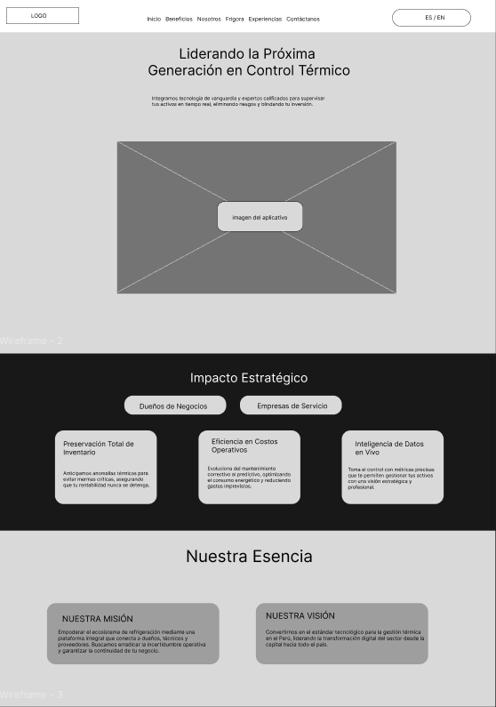

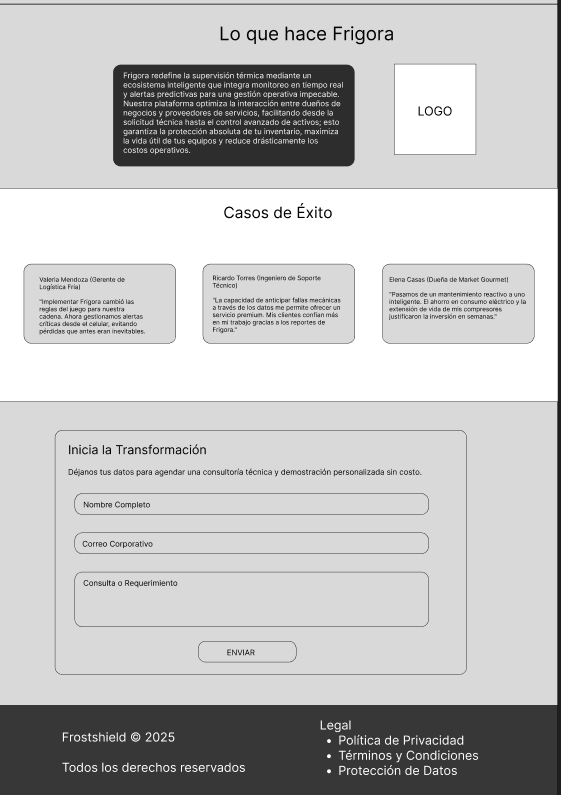

### 4.3.2. Landing Page Mock-up

Los mockups de la landing page de Frigora transforman la arquitectura esquemática del wireframe en una interfaz de alta fidelidad, donde la estética y la psicología del diseño convergen. En esta etapa, el enfoque trasciende la mera disposición de elementos para dar paso a una propuesta visual coherente, donde cada decisión cromática, tipográfica y gráfica está alineada con los valores de precisión y confiabilidad de la marca.

**Inicio**
Presenta la propuesta de valor principal con una imagen atractiva y un texto impactante, capturando la atención del visitante de inmediato.

---

**Beneficios**
Usa íconos personalizados y un diseño limpio para destacar las ventajas clave de la app, facilitando la lectura y comprensión.

---

**Sobre Nosotros**
Comunica la misión y visión de la empresa con un estilo visual que inspira confianza y conecta con los valores del usuario.

---

**Testimonios**
Incluye citas de clientes reales, proporcionando prueba social para validar la calidad del servicio.

---

**Contacto**
Ofrece un formulario simple y directo con campos bien organizados para que los interesados puedan solicitar información fácilmente.

## 4.4. Web Applications UX/UI Design

### 4.4.1. Web Applications Wireframes
Los wireframes de la plataforma integran una arquitectura de información estratégica que prioriza la usabilidad y la jerarquía visual mediante el uso de espacios en blanco (whitespace) para evitar la saturación y formas (shapes) que delimitan bloques lógicos de contenido. Basado en principios de diseño inclusivo, el sistema garantiza la accesibilidad a través de iconos descriptivos y un lenguaje directo, asegurando que los procesos de registro e ingreso sean intuitivos, minimicen la carga cognitiva y ofrezcan una experiencia de usuario fluida y profesional desde el primer contacto.

## Login

## Register

## Dashboard

## Sitios y Equipos

## Detalle de Equipos

## Alertas

## Ordenes

## Reportes

## Administracion

### 4.4.2. Web Applications Wireflow Diagrams

El presente Wireflow representa la arquitectura de navegación y la lógica de interacción de la plataforma. Este diagrama combina la estructura de las pantallas con el flujo de decisiones del usuario, permitiendo visualizar el recorrido completo desde el acceso inicial hasta la gestión operativa de activos, el monitoreo de alertas y la ejecución de órdenes de trabajo. Su objetivo es garantizar una navegación intuitiva y una distribución de información eficiente, asegurando que los procesos críticos de supervisión térmica sean fluidos y lógicos.

### 4.4.3. Web Applications Mock-ups

## Login

## Register

## Dashboard

## Sitios y Equipos

## Detalle de Equipos

## Alertas

## Ordenes

## Reportes

## Administracion

### 4.4.4. Web Applications User Flow Diagrams

## 4.5. Web Applications Prototyping

La sección de Prototipado de Aplicaciones Web muestra un modelo interactivo y funcional de la aplicación IceTrack antes de su desarrollo final. Este proceso permite simular el flujo de usuario, la navegación y las interacciones principales, garantizando que el diseño sea intuitivo y que la experiencia de usuario sea la mejor posible. Es la fase donde las ideas se validan con un producto tangible.

URL: https://github.com/ColdTech-Peru/Report

## 4.6. Domain-Driven Software Architecture
### 4.6.1. Design-Level EventStorming

### 4.6.2. Software Architecture Context Diagram
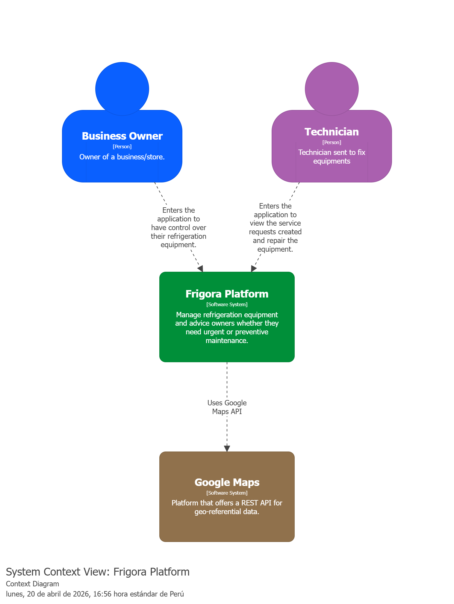
<figcaption style="font-size: 0.9em; color: #555;">
    <strong>Figura 1:</strong> Context Diagram.
  </figcaption>

### 4.6.3. Software Architecture Container Diagrams
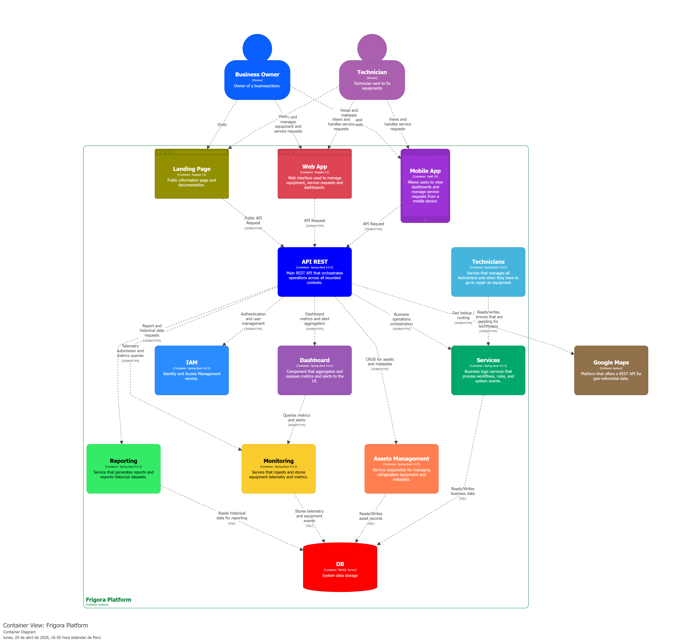
<figcaption style="font-size: 0.9em; color: #555;">
    <strong>Figura 2:</strong> Container Diagrams.
  </figcaption>

### 4.6.4. Software Architecture Components Diagrams
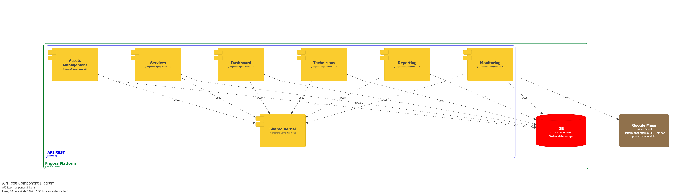
<figcaption style="font-size: 0.9em; color: #555;">
    <strong>Figura 3:</strong> API REST Component Diagrams.
  </figcaption>

  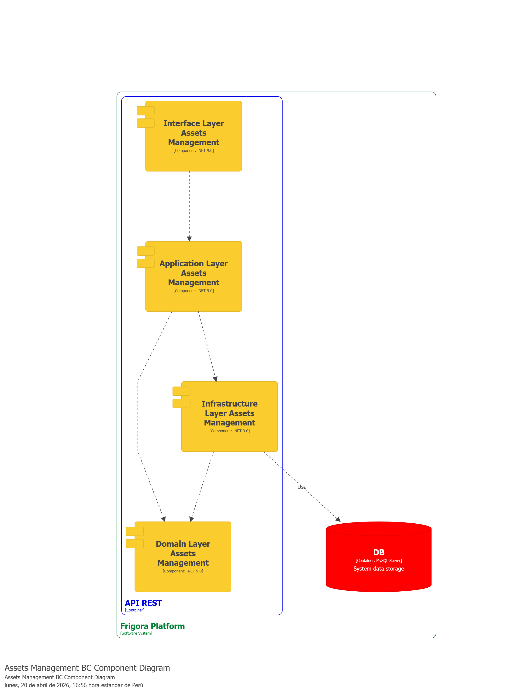
<figcaption style="font-size: 0.9em; color: #555;">
    <strong>Figura 4:</strong> Assets Management BC Component Diagrams.
  </figcaption>

  
<figcaption style="font-size: 0.9em; color: #555;">
    <strong>Figura 5:</strong> Dashboard BC Component Diagrams.
  </figcaption>

   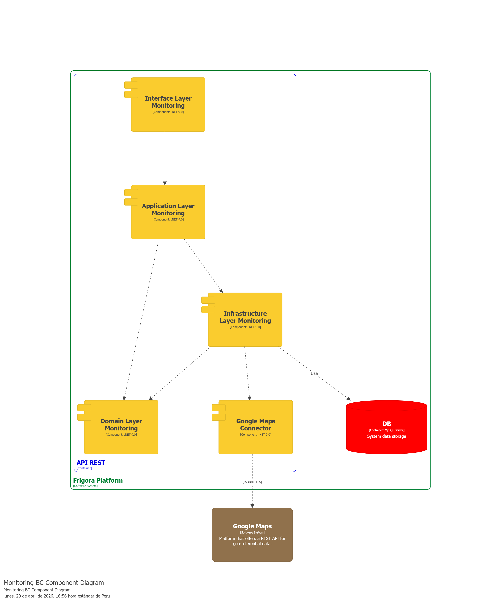
<figcaption style="font-size: 0.9em; color: #555;">
    <strong>Figura 6:</strong> Monitoring BC Component Diagrams.
  </figcaption>

  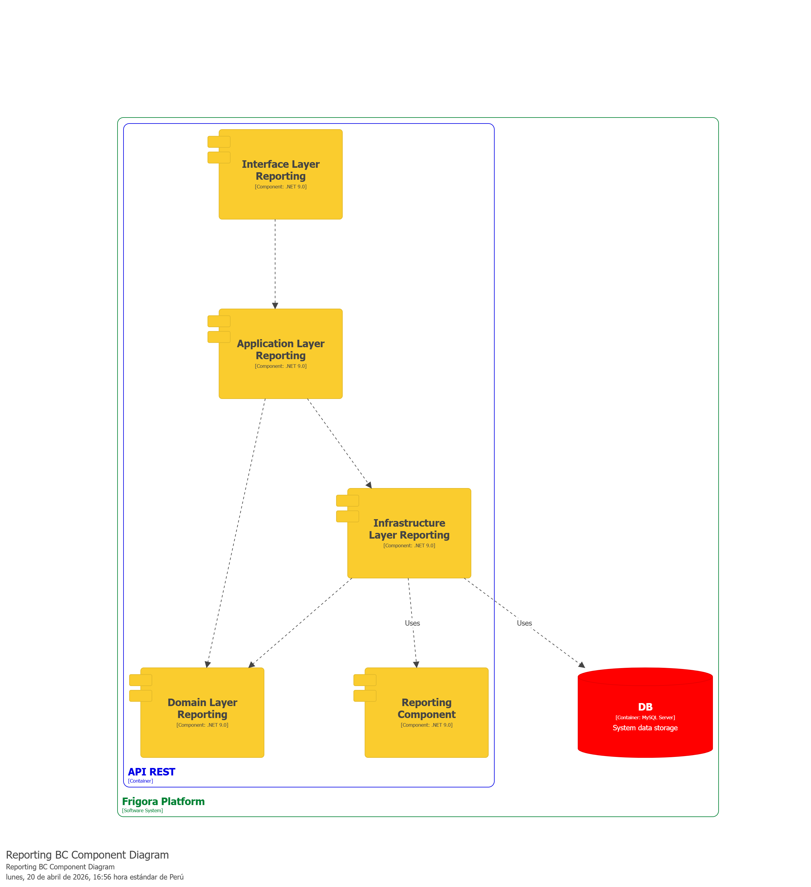
<figcaption style="font-size: 0.9em; color: #555;">
    <strong>Figura 7:</strong> Reporting BC Component Diagrams.
  </figcaption>

   
<figcaption style="font-size: 0.9em; color: #555;">
    <strong>Figura 8:</strong> Services BC Component Diagrams.
  </figcaption>

  
<figcaption style="font-size: 0.9em; color: #555;">
    <strong>Figura 9:</strong> Technicians BC Component Diagrams.
  </figcaption>

## 4.7. Software Object-Oriented Design
### 4.7.1. Class Diagrams
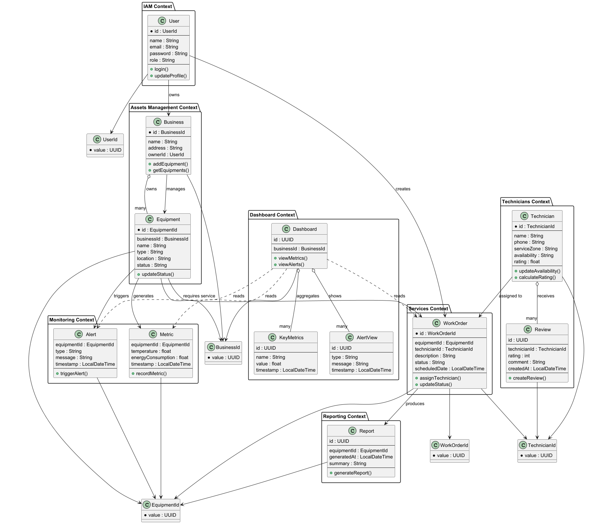
<figcaption style="font-size: 0.9em; color: #555;">
    <strong>Figura 1:</strong> Class Diagram.
  </figcaption>

## 4.8. Database Design
### 4.8.1. Database Diagrams

Descripción: El diagrama ER representa las entidades principales del sistema Frigora, sus atributos y las relaciones entre usuarios, técnicos, negocios, equipos, métricas, alertas y órdenes.

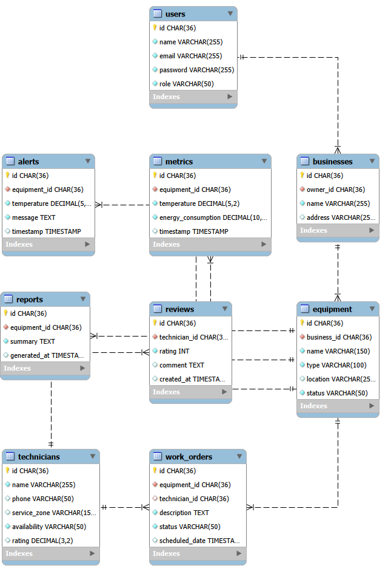
<figcaption style="font-size: 0.9em; color: #555;">
    <strong>Figura 1:</strong> Database Diagram.
  </figcaption>

# Capítulo V: Product Implementation, Validation & Deployment

## 5.1. Software Configuration Management

### 5.1.1. Software Development Environment Configuration

**Project Management**

Para la administración del proyecto, se utilizaron varias herramientas para la comunicación, la planificación y el control de versiones.

| Plataforma                   | Descripción                                                                                                                                                                                             | Enlace               |
| :--------------------------: | :------------------------------------------------------------------------------------------------------------------------------------------------------------------------------------------------------ | :------------------- |
| Trello                       | Esta plataforma de gestión de proyectos ofrece el seguimiento detallado del progreso de cada tarea, además de permitir la designación de responsables para cada actividad dentro del equipo de trabajo. | https://trello.com   |
| Herramientas de Comunicación | La comunicación interna del equipo se gestionó a través de Discord y WhatsApp para reuniones y mensajes rápidos, respectivamente.                                                                       | https://discord.com/ |
| GitHub                       | Se creó una organización para centralizar el código fuente y su versionado, lo que permitió un control de versiones eficiente y una gestión ordenada.                                                   | https://github.com   |

**Requirement Management**

En la fase inicial, se emplearon herramientas para la recolección y organización de los requisitos del proyecto, lo que aseguró una base sólida para el desarrollo.

| Plataforma | Descripción                                                                                                                                                                                                     | Enlace                 |
| :--------: | :-------------------------------------------------------------------------------------------------------------------------------------------------------------------------------------------------------------- | :--------------------- |
| UXPressia  | Fue la herramienta principal para el diseño. Permitió al equipo crear y validar propuestas de diseño con wireframes, mockups y prototipos interactivos, lo que aseguró un producto final efectivo y atractivo.  | https://uxpressia.com/ |
| Miro       | Esta herramienta se usó para visualizar y desarrollar los escenarios "As-Is" (estado actual) y "To-Be" (estado futuro), lo que ayudó a planificar la evolución del proyecto.                                    | https://miro.com/es/   |

**Product UX/UI Desing**

Para el diseño de la experiencia y la interfaz de usuario, se usó una plataforma colaborativa que simplificó el flujo de trabajo.

| Plataforma | Descripción        																																															  |						  |
| :--------: | :------------------------------------------------------------------------------------------------------------------------------------------------------------------------------------------------------------- | :-------------------- |
| Figma      | Fue la herramienta principal para el diseño. Permitió al equipo crear y validar propuestas de diseño con wireframes, mockups y prototipos interactivos, lo que aseguró un producto final efectivo y atractivo. | https://www.figma.com |

**Software Development**

El desarrollo se realizó utilizando un conjunto de lenguajes y entornos de programación que garantizan la estructura, el estilo y la interactividad del producto.

| Plataforma          | Descripción                                                                                                                                    | Link                                       |
|---------------------| :--------------------------------------------------------------------------------------------------------------------------------------------- | :----------------------------------------- |
| HTML                | Sirve para definir la estructura y el contenido de una página web.                                                                             | https://www.w3schools.com/html/default.asp |
| CSS                 | Se encarga de la presentación visual y el estilo de la página web.                                                                             | https://www.w3schools.com/css/default.asp  |
| JS                  | Añade interactividad y dinamismo a la página web.                                                                                              | https://www.w3schools.com/js/default.asp   |
| Visual Studio Code  | Entorno de desarrollo que facilita la escritura, edición, depuración y gestión de código para una amplia gama de lenguajes y proyectos.        | https://code.visualstudio.com              |
| JetBrains ToolBox   | Aplicación de gestión que contiene IDEs como IntelliJ IDEA, WebStorm y Rider (cada miembro del equipo trabajó en alguna de estas herramientas) | https://www.jetbrains.com/toolbox-app/     |

**Software Documentation**

La documentación y la publicación del proyecto se manejaron con herramientas que optimizan la colaboración y el despliegue final.

| Plataforma | Descripción                                             | Link                                                              |
|------------|---------------------------------------------------------|-------------------------------------------------------------------|
| GitHub     | Gestión de la documentación en función a repositorios y organizaciones | `https://github.com`          |
| Markdown   | Formato base para la presentación y documentación del proyecto | `https://markdown.es/  `                   |

Se utilizó la estrategia GitHub Flow para la colaboración y el control de versiones, usando ramas específicas para cada funcionalidad. Esto mantuvo el proyecto organizado. También sirvió como repositorio central para toda la documentación.
Para el despliegue de la Landing Page se utilizó GitHub Pages, una herramienta perfecta para publicar sitios web estáticos.

 

### 5.1.2. Source Code Management

Definir convenciones de nomenclatura para ramas en Git es crucial para mantener un flujo de trabajo organizado y mejorar la colaboración. Al seguir modelos como Git Flow, se puede crear una estructura clara que hace más predecible la gestión del proyecto.

---

### **Beneficios de la Nomenclatura Predictiva**

Un esquema de nombres consistente ofrece múltiples ventajas:

- **Automatización de procesos (CI/CD)**: Facilita la configuración de flujos de trabajo de integración y despliegue continuos.
- **Identificación de propósito**: Permite a los desarrolladores identificar rápidamente el objetivo y el alcance de cada rama.

---

### **Estrategia de Ramificación (Git Flow)**

En nuestro proyecto, aplicamos un modelo simplificado de Git Flow con las siguientes ramas principales:

* **Rama `main`**: Contiene el **código de producción**, incluyendo archivos CSS, imágenes, JavaScript y el `index.html`. Esta rama se mantiene siempre en un estado **estable y listo para ser desplegado**.
* **Rama `gh-pages`**: Esta rama se usa para **desplegar el proyecto en GitHub Pages**, lo que permite una visualización en tiempo real del sitio web.

Además de estas, gestionamos el progreso del desarrollo en un repositorio separado, donde organizamos las tareas en epics y usamos archivos `.feature` para definir los **criterios de aceptación** de cada funcionalidad.

---

### **Flujo de Trabajo y Herramientas**

Elegimos **GitHub** como nuestra plataforma de colaboración principal. Esto nos ayuda a **dar seguimiento al progreso** del equipo, **gestionar los cambios** y **visualizar las actualizaciones** del proyecto. Una de las ventajas es que las actualizaciones en el código se reflejan automáticamente en la rama `gh-pages`, lo que permite a los interesados ver los avances en tiempo real.

---

### **Convenciones de Nomenclatura**

A continuación, se detallan las convenciones de nomenclatura para diferentes tipos de ramas que usamos en nuestro proyecto:

1. **Master branch (Rama principal):** Es la rama principal del proyecto, donde se almacena el código estable y listo para producción. Solo se integrarán cambios que hayan sido probados y validados previamente en las ramas de desarrollo y funcionalidad.

2. **Develop Branch (Rama de Desarrollo):** Esta rama actúa como un espacio de integración para el trabajo en equipo, permitiendo pruebas y ajustes de las nuevas funcionalidades antes de fusionarlas con la rama principal. Garantiza que el código sea funcional y estable.

3. **Feature branch (Ramas de funcionalidad):** Cada nueva funcionalidad o tarea específica se desarrollará en su propia rama. Una vez completada y probada, se integrará en la rama de desarrollo. Las ramas de funcionalidad seguirán un esquema de nombres descriptivos.

✔ **Ramas de característica (`feature`)**
- Prefijo: `feature/`
- Formato: `feature/nombre-corto-descriptivo`
- Ejemplos: `feature/login-ui`, `feature/pdf-export`, `feature/api-integration-usuarios`

✔ **Ramas de lanzamiento (`release`)**
- Prefijo: `release/`
- Formato: `release/x.y.z (donde x, y, z representan el número mayor, menor y de parche)`
- Ejemplos: `release/1.0.0`, `release/2.1.0`

✔ **Ramas de corrección urgente (`hotfix`)**
- Prefijo: `hotfix/`
- Formato: `hotfix/x.y.z-nombre-corto`
- Ejemplos: `hotfix/1.0.1-fix-login-error`, `hotfix/2.3.2-bug-carrito`

---

**Repositorio de Github:**
- Enlace para acceder a la organizacion en Github:
- Enlace para acceder al repositorio de la Landing Page: 
- Enlace para acceder al repositorio del Informe: 

---

### 5.1.3. Source Code Style Guide & Conventions

Para asegurar la calidad, mantenibilidad y coherencia de nuestra solución, hemos definido un conjunto de convenciones y buenas prácticas. Dado que el proyecto inicial es una landing page, nos centramos en los estándares para HTML, CSS y JavaScript, los pilares de nuestro desarrollo.

**Convenciones de Nomenclatura**

Para mantener la consistencia y la claridad, seguimos las siguientes convenciones:

**Variables y Funciones en JavaScript:** Se utiliza la convención camelCase (ej. myVariable, initializeVideos()). Los nombres deben ser descriptivos.

**Constantes en JavaScript:** Se utilizan letras mayúsculas y guiones bajos para separar las palabras (SNAKE_CASE) para valores que no cambian (ej. VIDEO_CONFIG).

**Archivos:** Los nombres de archivos se escriben en minúsculas y se separan con guiones (ej. index.html, style.css, languages.js).

**HTML**
La estructura de nuestro documento HTML se basa en la semántica web, utilizando etiquetas con un significado claro para el navegador y los desarrolladores. Esto no solo mejora la accesibilidad y el SEO, sino que también facilita la comprensión del código. A continuación, se detallan las etiquetas utilizadas:

* `<!DOCTYPE html>` - Define el tipo de documento como HTML5.
* `<html>` - Raíz del documento HTML.
* `<head>` - Encabezado del documento, donde se incluyen metadatos.
* `<meta>` - Define metadatos sobre el documento (charset y viewport).
* `<title>` - Título del documento.
* `<link>` - Para enlaces de icono, hoja de estilos CSS y fuente externa.
* `<body>` - Cuerpo del documento, donde se encuentra el contenido visible.
* `<header>` - Encabezado de la página.
* `
` - Contenedor para el logo y otros elementos.
* `` - Imagen del logo.
* `<nav>` - Contenedor para la navegación.
* `<ul>` - Lista no ordenada de enlaces de navegación.
* `<li>` - Elemento de lista para cada enlace de navegación.
* `<a>` - Enlaces de navegación.
* `<button>` - Botón para el modo de deuteranopia.
* `<section>` - Define secciones de contenido principal:
    * Sección principal: `<h1>`, `
`
    * Por Qué Interactiva: `<h2>`, ``, `
`, `<h3>`, `
`
    * Valor Propuesto: `<h3>`, `
`, ``
    * Presentamos a...: `<h2>`, `<h4>`, `
`, ``
    * Servicios: `<h2>`, `
`, `<h4>`, `
`
    * Testimonios: `<h2>`, `
`, ``
    * Cómo empezar: `<h2>`, `<h5>`, `<strong>`, `
`
    * Descargar: `<h2>`, `<h3>`, ``, `<a>`, ``
* `<footer>` - Pie de página.
* `<small>` - Texto de derechos reservados.
* `<script>` - Script JavaScript para funcionalidades.

**CSS**

Nuestra guía de estilo para CSS se centra en la claridad y la consistencia. Se han definido propiedades clave para el diseño visual, asegurando que todos los elementos se vean y se comporten de manera uniforme.

* `width:` Representa el ancho de un elemento.
* `height:` Representa el alto de un elemento.
* `padding:` Representa el espacio con relleno entre el borde y el contenido.
* `font-family:` Representa el tipo de letra.
* `font-size:` Representa el tamaño de letra.
* `font-weight:` Representa el grueso o el peso de la letra.
* `font-style:` Representa el estilo de letra.
* `Text-align:` Representa la alineación del texto.
* `color:` Otorga color al elemento.
* `Background-color:` Otorga color del fondo del elemento.

### 5.1.4. Software Deployment Configuration

Para poder publicar nuestra landing page, seguimos una serie de pasos específicos utilizando GitHub Pages, que permite alojar sitios web estáticos directamente desde un repositorio.

El despliegue en GitHub Pages requiere que los archivos estén organizados de una manera particular para que la plataforma los reconozca y los sirva correctamente.

**1. Organización del Repositorio:**

- Los archivos principales deben estar en la carpeta raíz del repositorio.

- Los nombres de los archivos deben seguir la convención establecida: index.html para la página principal, styles.css para los estilos, y script.js para los scripts.

- Las imágenes se guardan en una carpeta llamada assets/images.

- El archivo languages.js se utiliza para gestionar las traducciones.

**2. Subida de Archivos:**

- Una vez que los archivos están correctamente organizados, se suben al repositorio a través de un commit.

**3. Configuración en GitHub Pages:**

- Se navega a Settings > Pages dentro del repositorio.

- Se selecciona la rama main como la fuente de despliegue.

- Se configura la carpeta raíz (/root) para el origen de la página.

**4. Despliegue Automático:**

- GitHub Pages inicia un proceso de verificación y despliegue automático.

- Al finalizar, se genera una URL pública para acceder a la landing page.

Además, nuestra solución incluye un archivo llamado languages.js, que contiene las traducciones en español e inglés. Este archivo es cargado por el script principal main.js para permitir que los usuarios cambien el idioma de la página de forma dinámica.

**Github Pages:**

URL de la Landing Page desplegada en Github Pages: 

## 5.2. Landing Page, Services & Applications Implementation

### 5.2.1. Sprint 1

#### 5.2.1.1. Sprint Planning 1

<table border="1">
  <tr>
    <th colspan="5">Sprint 1</th>
    <th colspan="9">Sprint 1</th>
  </tr>
  <tr>
    <td colspan="13">Sprint Planning Background</td>
  </tr>
  <tr>
    <td colspan="5">Date</td>
    <td colspan="8">2026-04-23</td>
  </tr>
  <tr>
    <td colspan="5">Time</td>
    <td colspan="8">1:00 PM</td>
  </tr>
  <tr>
    <td colspan="5">Location</td>
    <td colspan="8">Presencial (Universidad Peruana de Ciencias Aplicadas - sede San Miguel)</td>
  </tr>
  <tr>
    <td colspan="5">Prepared By</td>
    <td colspan="8">Alejandro Galindo</td>
  </tr>
  <tr>
    <td colspan="5">Attendees (to planning meeting)</td>
    <td colspan="8">Alejandro Galindo, Walter Fajardo, Leonardo Cumba, Joaquin Cuentas, Gabriel Perez</td>
  </tr>
  <tr>
    <td colspan="5">Sprint 1 Review Summary</td>
    <td colspan="8">Durante este sprint se avanzó en la definición inicial de la plataforma y se establecieron lineamientos clave para el desarrollo de la landing page.</td>
  </tr>
  <tr>
    <td colspan="5">Sprint 1 Retrospective Summary</td>
    <td colspan="8">En este sprint, el equipo compartió ideas sobre la plataforma web, incluyendo el rubro, segmentos objetivo, beneficios y funcionalidades principales. Las tareas se organizaron de manera eficiente y se lograron avances visibles tanto en el informe como en la landing page.</td>
  </tr>
  <tr>
    <td colspan="13">Sprint Goal & User Stories</td>
  </tr>
  <tr>
    <td colspan="5">Sprint 1 Goal</td>
    <td colspan="8">El objetivo principal es desarrollar la landing page de la plataforma, garantizando su adaptabilidad a distintos dispositivos, coherencia visual y soporte multilenguaje. Se busca brindar una experiencia clara, atractiva y accesible para los usuarios. Esto se validará cuando el usuario pueda cambiar el idioma fácilmente, navegar sin errores visuales y verificar que los elementos gráficos y textuales estén correctamente alineados.</td>
  </tr>
  <tr>
    <td colspan="5">Sprint 1 Velocity</td>
    <td colspan="8">15</td>
  </tr>
  <tr>
    <td colspan="5">Sum of Story Points</td>
    <td colspan="8">10</td>
  </tr>
</table>

##### 5.2.1.2. Aspect Leaders and Collaborators

Durante este primer Sprint, el equipo se enfocó principalmente en el desarrollo, la mejora estructural y visual de la Landing Page, asegurando su visualización en distintos dispositivos (diseño responsive), la integración armoniosa de imágenes y textos, y la implementación de un cambio de idioma dinámico mediante un botón.
Con el fin de organizar de manera más eficiente el trabajo colaborativo, se ha elaborado la matriz de Liderazgo y Colaboración (LACX). Esta matriz asigna responsabilidades específicas a cada miembro del equipo en relación con los aspectos clave del Sprint.

<table border="1">
  <tr>
    <td colspan="2"><strong>Team Member (Last Name, First Name)</strong></td>
    <td><strong>GitHub Username</strong></td>
    <td><strong>Diseño visual y maquetación web (Landing Page) Leader (L) / Collaborator (C)</strong></td>
    <td><strong>Responsividad y pruebas en distintos dispositivos Leader (L) / Collaborator (C)</strong></td>
    <td><strong>Implementación técnica del cambio de idioma (Multilenguaje funcional) Leader (L) / Collaborator (C)</strong></td>
  </tr>
  <tr>
    <td colspan="2">Galindo Montero, Alejandro Manuel</td>
    <td>AlejandroG12970</td>
    <td>C</td>
    <td>L</td>
    <td>L</td>
  </tr>
  <tr>
    <td colspan="2">Fajardo, Walter</td>
    <td>walterfajardo</td>
    <td>L</td>
    <td>C</td>
    <td>C</td>
  </tr>
  <tr>
    <td colspan="2">Cumba, Leonardo</td>
    <td>LeonardoC72</td>
    <td>C</td>
    <td>C</td>
    <td>L</td>
  </tr>
  <tr>
    <td colspan="2">Cuentas, Joaquin</td>
    <td>joaCUPE</td>
    <td>C</td>
    <td>L</td>
    <td>C</td>
  </tr>
  <tr>
    <td colspan="2">Perez, Gabriel</td>
    <td>Gabyoko</td>
    <td>C</td>
    <td>C</td>
    <td>C</td>
  </tr>
</table>

#### 5.2.1.3. Sprint Backlog 1

El objetivo principal de este Sprint es elaborar la Landing Page de nuestra plataforma. Para ello, dividimos el desarrollo de esta según las User Stories pertenecientes a la Epic enfocada en Landing Page. La plataforma elegida para ser la herramienta de control de tareas fue Trello, el cuál se presenta una captura de pantalla de nuestro tablero y su enlace público.

Enlace: https://trello.com/invite/b/69edc7316e396d01726fc9c1/ATTIfe4224969e7f89d8cf52d5f416485b4519519493/frigora-product-backlog

<figcaption style="font-size: 0.9em; color: #555;">
    <strong>Figura 1:</strong> Sprint Backlog 1.
  </figcaption>

---
| User Story ID | User Story Título | Task ID | Task Título | Descripción | Estimación (Horas) | Asignado a | Estado (To do/ In-Process/ To-Review/ Done) |
| :---: | :--- | :---: | :--- | :--- | :---: | :--- | :---: |
| **US-20** | Visualizar la propuesta de valor principal | **UT-01** | Crear la sección "Hero" | Diseñar y añadir la sección principal superior (Hero) que comunique el monitoreo inteligente de equipos IoT. | 2 | [Walter Fajardo] | Done |
| **US-21** | Explorar soluciones específicas para mi rubro | **UT-01** | Crear sección de "Soluciones" | Redactar y maquetar las tarjetas de soluciones específicas para supermercados, laboratorios y sector alimentario. | 3 | [Walter Fajardo] | Done |
| **US-22** | Comprender las funcionalidades clave | **UT-01** | Crear sección "Características" | Diseñar la sección donde se listan las funciones de telemetría, alertas preventivas y control de temperatura. | 3 | [Joaquin Cuentas] | Done |
| **US-23** | Conocer la misión y visión | **UT-01** | Crear la sección "Nosotros" | Añadir la sección visual que refleje la misión y visión de la startup para generar confianza en el cliente B2B. | 1.5 | [Joaquin Cuentas] | Done |
| **US-24** | Contactar con el equipo de ventas | **UT-01** | Diseñar interfaz de "Contacto" | Maquetar el formulario de contacto solicitando datos clave de la empresa (Nombre, RUC, Teléfono, Mensaje). | 2 | [Alejandro Galindo] | Done |
| **US-24** | Contactar con el equipo de ventas | **UT-02** | Definir flujo de validación | Documentar y prototipar los mensajes de éxito/error al enviar el formulario de ventas. | 1.5 | [Gabriel Perez] | Done |
| **US-25** | Acceder a la plataforma web (Call to Action) | **UT-01** | Crear Navbar y botón CTA | Añadir la barra de navegación superior con el botón "Ingresar" que redirija a la futura vista de Login. | 1 | [Leonardo Cumba] | Done |

##### 5.2.1.4. Development Evidence for Sprint Review

En este primer Sprint hemos realizado la implementación de nuestra Landing Page, donde todo el equipo ha aportado en varias tareas. En la siguiente tabla se muestran los commits realizados.

<table>
    
</table>

#### 5.2.1.5. Execution Evidence for Sprint Review

**Inicio**

---

**Beneficios**

---

**Sobre Nosotros**

---

**Testimonios**

---

**Contacto**

#### 5.2.1.6. Services Documentation Evidence for Sprint Review

#### 5.2.1.7. Software Deployment Evidence for Sprint Review

A continuación, se presenta las  secciones principales de la Landing Page desplegada en GitHub Pages:

**Inicio**

---
**Beneficios**

---
**Sobre Nosotros**

---
**Testimonios**

---
**Contacto**

---

URL del Landing Page desplegado: 

#### 5.2.1.8. Team Collaboration Insights during Sprint

---
