

# Universidad Peruana de Ciencias Aplicadas

## Carrera: Ingeniería de Software
## Periodo: 2026-10

---

## Curso: Desarrollo de Aplicaciones Open Source
**Código del Curso:** 1ASI0729 | **NRC:** 11959  
**Profesor:** Hugo Allan Mori Paiva

---

# Informe del Trabajo Final

## Startup: ColdTech
## Producto: Frigora

---

## Integrantes

| Alumno | Código |
| :---: | :---: |
| Galindo Montero, Alejandro Manuel | u202321264 |
| Perez Tuesta, Gabriel | u202321281 |
| Fajardo Monrroy, Walter Luis | u202221632 |
| Cumba Rengifo, Leonardo Raul | u202311912 |
| Cuentas Peña, Joaquin Alberto | u20201f788 |

### Abril 2026

---

## Registro de Versiones del Informe

| Versión | Fecha | Autor | Descripción de modificación |
| :---: | :---: | :---: | :--- |
| 1.0 | 2026-04-26 | ColdTech | Desarrollo del Capítulo I, Capítulo II, Capítulo III, Capítulo IV y el Sprint 1 del Capítulo V |

---

## Project Report Collaboration Insights

| Recurso | URL |
| :--- | :--- |
| Organización del proyecto | https://github.com/ColdTech-Peru |
| Repositorio del reporte | https://github.com/ColdTech-Peru/Report |
| Repositorio de la Landing Page | https://github.com/ColdTech-Peru/Landing-Page |
| Repositorio del Frontend | *(pendiente)* |
| Repositorio del Backend | *(pendiente)* |

Durante la fase de preparación del informe, se llevaron a cabo las siguientes actividades:

**AV1:** Las tareas asignadas al AV1 han sido finalizadas y se encuentran correctamente documentadas en el repositorio de GitHub:

- Se redactaron y crearon los contenidos asignados a cada miembro utilizando el formato Markdown, y se realizaron *Conventional Commits* para documentar el avance en el repositorio.
- Se generaron los recursos necesarios y se agregaron las imágenes al repositorio en la carpeta `assets` correspondiente a cada rama del informe.
- Se organizaron reuniones para coordinar el progreso de los componentes del informe y del Sprint 1, enfocado en el desarrollo de la Landing Page.

 

**TB1:** Las tareas asignadas al TB1 fueron desarrolladas e integradas correctamente en el Front-End de la aplicación utilizando Angular y Angular Material, manteniendo una arquitectura modular y organizada:

- Se implementaron los distintos módulos funcionales del sistema, incluyendo Dashboard, Monitoring, Asset Management, Reports y Service Requests, utilizando componentes standalone y servicios para el consumo de datos.
- Se desarrollaron operaciones CRUD conectadas mediante `json-server` y `db.json`, permitiendo gestionar información dinámica dentro de la aplicación.
- Se configuraron rutas, filtros, formularios reactivos, componentes visuales y estilos responsivos para mejorar la experiencia de usuario en cada sección del sistema.
- Se realizaron commits utilizando *Conventional Commits* para documentar el progreso del Sprint y mantener trazabilidad del desarrollo en GitHub.
- Se integraron capturas, recursos visuales e insights del Front-End en la documentación técnica del proyecto.

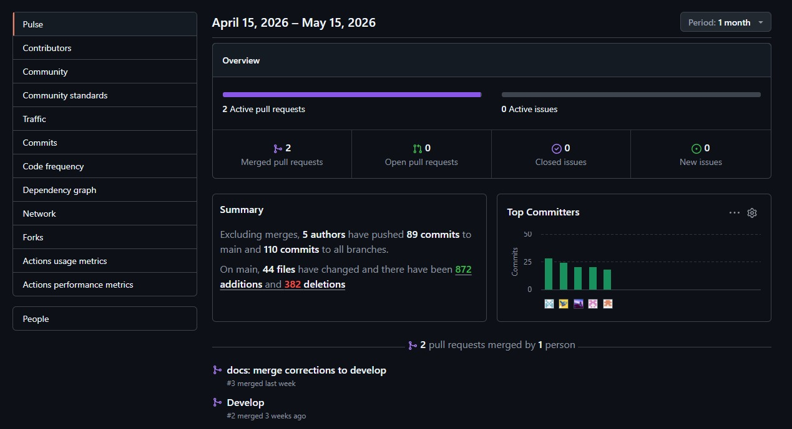

---

## Contenido

- [Capítulo I: Introducción](#capítulo-i-introducción)
  - [1.1 Startup Profile](#11-startup-profile)
    - [1.1.1 Descripción de la Startup](#111-descripción-de-la-startup)
    - [1.1.2 Perfiles de integrantes del equipo](#112-perfiles-de-integrantes-del-equipo)
  - [1.2 Solution Profile](#12-solution-profile)
    - [1.2.1 Antecedentes y Problemática](#121-antecedentes-y-problemática)
    - [1.2.2 Lean UX Process](#122-lean-ux-process)
      - [1.2.2.1 Lean UX Problem Statements](#1221-lean-ux-problem-statements)
      - [1.2.2.2 Lean UX Assumptions](#1222-lean-ux-assumptions)
      - [1.2.2.3 Lean UX Hypothesis Statements](#1223-lean-ux-hypothesis-statements)
      - [1.2.2.4 Lean UX Canvas](#1224-lean-ux-canvas)
  - [1.3 Segmentos Objetivos](#13-segmentos-objetivos)
- [Capítulo II: Requirements Elicitation & Analysis](#capítulo-ii-requirements-elicitation--analysis)
  - [2.1 Competidores](#21-competidores)
    - [2.1.1 Análisis Competitivo](#211-análisis-competitivo)
    - [2.1.2 Estrategias y Tácticas frente a Competidores](#212-estrategias-y-tácticas-frente-a-competidores)
  - [2.2 Entrevistas](#22-entrevistas)
    - [2.2.1 Diseño de Entrevistas](#221-diseño-de-entrevistas)
    - [2.2.2 Registro de Entrevistas](#222-registro-de-entrevistas)
    - [2.2.3 Análisis de Entrevistas](#223-análisis-de-entrevistas)
  - [2.3 Needfinding](#23-needfinding)
    - [2.3.1 User Personas](#231-user-personas)
    - [2.3.2 User Task Matrix](#232-user-task-matrix)
    - [2.3.3 User Journey Mapping](#233-user-journey-mapping)
    - [2.3.4 Empathy Mapping](#234-empathy-mapping)
  - [2.4 Big Picture Event Storming](#24-big-picture-event-storming)
  - [2.5 Ubiquitous Language](#25-ubiquitous-language)
- [Capítulo III: Requirements Specification](#capítulo-iii-requirements-specification)
  - [3.1 To-Be Scenario Mapping](#31-to-be-scenario-mapping)
  - [3.2 User Stories](#32-user-stories)
  - [3.3 Impact Mapping](#33-impact-mapping)
  - [3.4 Product Backlog](#34-product-backlog)
- [Capítulo IV: Product Design](#capítulo-iv-product-design)
  - [4.1 Style Guidelines](#41-style-guidelines)
  - [4.2 Information Architecture](#42-information-architecture)
  - [4.3 Landing Page UI Design](#43-landing-page-ui-design)
  - [4.4 Web Applications UX/UI Design](#44-web-applications-uxui-design)
  - [4.5 Web Applications Prototyping](#45-web-applications-prototyping)
  - [4.6 Domain-Driven Software Architecture](#46-domain-driven-software-architecture)
  - [4.7 Software Object-Oriented Design](#47-software-object-oriented-design)
  - [4.8 Database Design](#48-database-design)
- [Capítulo V: Product Implementation, Validation & Deployment](#capítulo-v-product-implementation-validation--deployment)
  - [5.1 Software Configuration Management](#51-software-configuration-management)
  - [5.2 Landing Page, Services & Applications Implementation](#52-landing-page-services--applications-implementation)
- [Conclusiones](#conclusiones)
- [Anexos](#anexos)

---

## Student Outcome

El curso contribuye al cumplimiento del Student Outcome ABET:

**ABET – EAC - Student Outcome 3**

> *Al finalizar el curso, el estudiante comunica resultados y proceso de ingeniería aplicado para el ciclo de desarrollo y despliegue de una solución web distribuida bajo una arquitectura orientada a servicios, que satisface requisitos para empresas o público en general, con un enfoque innovador e inclusivo, desplegada sobre plataformas Server Side o Cloud, haciendo uso de tecnologías open-source basadas en el lenguaje de programación Java para la lógica de lado servidor y tecnologías open-source para los componentes de la aplicación.*

| Criterio específico | Acciones realizadas | Conclusiones |
| :--- | :--- | :--- |
| **Comunica oralmente con efectividad a diferentes rangos de audiencia** | **Galindo Montero, Alejandro Manuel** **AV1:** Fortaleció la comunicación oral al participar en la elaboración del capítulo dos, el diseño del modelo C4 y el apoyo en el desarrollo de la landing page, transmitiendo conceptos técnicos de manera clara según el nivel de la audiencia. **TB1:** Desarrolló el módulo de **Service Requests** del frontend, explicando el flujo de solicitudes, las operaciones CRUD y la conexión con `json-server` mediante `db.json`.  **Perez Tuesta, Gabriel** **AV1:** Redactó descripciones técnicas para los diagramas de Wireflow y Userflow, transformando conceptos de diseño en lenguaje formal apto para un informe académico. **TB1:** Desarrolló el módulo de **Reports**, presentando el funcionamiento de formularios, filtros dinámicos, vistas de detalle y operaciones CRUD implementadas en Angular con conexión a `db.json`.  **Cuentas Peña, Joaquin** **AV1:** Planteó las user stories y diseñó el sprint de la entrega, planificando el product backlog y proyectando las necesidades de los segmentos en el desarrollo de la aplicación. **TB1:** Implementó el módulo de **Assets Management**, comunicando la organización de activos, visualización de datos y funcionamiento dinámico del frontend conectado mediante `json-server`.  **Cumba Rengifo, Leonardo Raúl** **AV1:** Participó en la elaboración del Capítulo I, el análisis Lean UX y el diseño de la landing page, logrando explicar conceptos técnicos y de negocio de forma efectiva según el contexto. **TB1:** Desarrolló el módulo de **Monitoring**, explicando la visualización de estados, métricas y monitoreo de equipos usando datos simulados desde `db.json`.  **Fajardo Monrroy, Walter Luis** **AV1:** Organizó el sprint en base a las user stories generadas y contribuyó a la realización y despliegue de la landing page. **TB1:** Implementó el **Dashboard** principal del frontend, presentando métricas, tarjetas y visualizaciones dinámicas para facilitar la interpretación de información operativa. | **AV1:** El equipo logró comunicar oralmente con efectividad al presentar la problemática, el proceso de needfinding y las soluciones propuestas mediante wireframes, mockups y la demostración de la landing page desplegada, transmitiendo ideas técnicas de manera clara según el tipo de audiencia.  **TB1:** El equipo fortaleció la comunicación oral mediante la exposición funcional del frontend desarrollado en Angular, explicando el funcionamiento de módulos interactivos, operaciones CRUD y consumo de datos simulados mediante `json-server` y `db.json`. |
| **Comunica por escrito con efectividad a diferentes rangos de audiencia** | **Galindo Montero, Alejandro Manuel** **AV1:** La redacción de documentación y la organización de información técnica le permitieron estructurar ideas de forma clara y coherente, adaptando el contenido para distintos tipos de audiencia. **TB1:** Documentó el funcionamiento del módulo de **Service Requests**, describiendo componentes, endpoints y flujo de datos conectados mediante `db.json`.  **Perez Tuesta, Gabriel** **AV1:** Sintetizó procesos técnicos complejos en instrucciones directas, diferenciando claramente los perfiles de Administrador y Proveedor. **TB1:** Documentó la implementación del módulo de **Reports**, incluyendo formularios, filtros, operaciones CRUD y arquitectura frontend desarrollada en Angular.  **Cuentas Peña, Joaquin** **AV1:** El product backlog permitió enfocarse en las tareas más importantes para la entrega, comunicando ideas de forma eficaz. **TB1:** Redactó la documentación funcional del módulo de **Assets Management**, organizando procesos de gestión de activos y comportamiento dinámico del frontend.  **Cumba Rengifo, Leonardo Raúl** **AV1:** Contribuyó en la elaboración del Capítulo I, el Solution Profile, el proceso Lean UX y la definición de segmentos, estructurando ideas de forma clara y coherente. **TB1:** Documentó el módulo de **Monitoring**, describiendo la visualización de estados, métricas y consumo de datos desde `json-server`.  **Fajardo Monrroy, Walter Luis** **AV1:** Comunicó adecuadamente la división de tiempos del proyecto mediante la metodología SCRUM usando sprints. **TB1:** Elaboró la documentación del **Dashboard**, describiendo la estructura visual, componentes y organización de indicadores en el frontend. | **AV1:** El equipo fortaleció su comunicación escrita mediante documentación estructurada que incluyó el análisis de la problemática, el proceso de needfinding, wireframes, mockups y diagramas de clases y base de datos.  **TB1:** El equipo fortaleció la comunicación escrita mediante la documentación del frontend desarrollado en Angular, incluyendo componentes, vistas, formularios, filtros y operaciones CRUD conectadas mediante `json-server` y `db.json`, explicando de manera clara la arquitectura y flujo de datos del sistema. |

---

# Capítulo I: Introducción

## 1.1 Startup Profile

### 1.1.1 Descripción de la Startup

**ColdTech** es una startup que desarrolla una aplicación web orientada al monitoreo y gestión inteligente de equipos de refrigeración mediante sensores IoT. La plataforma permite supervisar en tiempo real variables como la temperatura, el rendimiento y el consumo energético, además de generar alertas preventivas, almacenar el historial de funcionamiento y facilitar la programación del mantenimiento.

La solución está dirigida a negocios y organizaciones que dependen de la cadena de frío — supermercados, minimarkets, restaurantes, laboratorios y empresas de los sectores alimentario y farmacéutico — con el propósito de reducir fallas inesperadas, disminuir costos operativos y evitar pérdidas de productos.

> **Misión:** Brindar una solución tecnológica inteligente que permita a las empresas proteger sus productos, optimizar el funcionamiento de sus equipos de refrigeración y mejorar la gestión de su mantenimiento.
>
> **Visión:** Ser una startup líder en el mercado peruano en soluciones digitales para el monitoreo y mantenimiento de equipos de refrigeración, destacando por la innovación, confiabilidad y aporte a la eficiencia operativa.

---

### 1.1.2 Perfiles de integrantes del equipo

| **Integrante**            | **Galindo Montero Alejandro Manuel**        									    |
| :------------------------ | :-------------------------------------------------------------------------------- |
| **Código del Estudiante** | u202321264                                   										|
| **Carrera**               | Ingeniería de Software                       										|
| **Descripción**           | Mi nombre es Alejandro Manuel Galindo Montero, tengo 20 años y curso la carrera de Ingeniería de Software. Me considero una persona creativa y responsable. En mis tiempos libres me gusta aprender cosas nuevas. En este proyecto apoyaré con todos los conocimientos que he adquirido en los últimos años.   												|
| **Foto**                  |  |

---

| **Integrante**            | **Cumba Rengifo Leonardo Raul**        									    |
| :------------------------ | :-------------------------------------------------------------------------------- |
| **Código del Estudiante** | u202311912                           										|
| **Carrera**               | Ingeniería de Software                       										|
| **Descripción**           | Mi nombre es Cumba Rengifo Leonardo Raul, tengo 20 años y curso la carrera de Ingeniería de Software.Me quiere enfocarse en backend o en DBA. En la actualidad me gustaria especialiarse en DBA o como arquitecto de sofware            .   												|
| **Foto**                  |  |

---

| **Integrante**            | **Perez Tuesta, Gabriel**        									    |
| :------------------------ | :-------------------------------------------------------------------------------- |
| **Código del Estudiante** | u202321281                           										|
| **Carrera**               | Ingeniería de Software                       										|
| **Descripción**           | Mi nombre es Gabriel Perez Tuesta, tengo 23 años y curso la carrera de Ingeniería de Software. Me gustaria enfocarme en el desarrollo web y movil, tengo conocimientos promedios en Javascript, React, Vue y Next JS         .   												|
| **Foto**                  | 
 

---

| **Integrante**            | Fajardo Monrroy, Walter Luis        									    |
| :------------------------ | :-------------------------------------------------------------------------------- |
| **Código del Estudiante** | u202221632                           										|
| **Carrera**               | Ingeniería de Software                       										|
| **Descripción**           | Soy Walter Luis Fajardo Monrroy, cuento con 20 años y por motivos de estudio residente en Lima. Soy estudiante de la carrera de ingeniería de software, en mi formación como estudiante durante estos ciclos adquirí conocimientos en programación principalmente con lenguaje C++ y python, También cuanto con conocimientos en patrones de software al momento de realizar mis proyectos, además de experiencia realizando diagramas de clases y empleando el DDD (Diseño orientado a objetos). Las habilidades primarias para resaltar serán la responsabilidad y resiliencia frente a las adversidades. Cuento con experiencia en organización y trabajo grupal lo cual emplearé para beneficio del equipo.         .   												|
| **Foto**                  | 

---

| **Integrante**            | Cuentas Peña, Joaquin Alberto      									    |
| :------------------------ | :-------------------------------------------------------------------------------- |
| **Código del Estudiante** | u20201f788                          										|
| **Carrera**               | Ingeniería de Software                       										|
| **Descripción**           | Soy Joaquin Alerto Cuentas Peña, cuento con 22 años. Soy estudiante de la UPC de la carrera de Ingeniería de Software y me encuentro cursando el sexto ciclo. Cuento con habilidades de programación en C++ y Python, así como aptitudes para el desarrollo en UX y UI. Asimismo, en cuanto a habilidades extracurriculares, he contribuido en proyectos con edición de video y fomentando una actitud colaborativa en el equipo.   												|
| **Foto**                  | 

---

## 1.2 Solution Profile

### 1.2.1 Antecedentes y Problemática

| Dimensión | Descripción |
| :--- | :--- |
| **What — ¿Cuál es el problema?** | Los negocios que dependen de equipos de refrigeración presentan un control limitado sobre su funcionamiento, lo que ocasiona fallas inesperadas, alto consumo energético y mantenimiento tardío, generando pérdidas económicas y afectando la continuidad operativa. |
| **When — ¿Cuándo sucede?** | El problema puede presentarse en cualquier momento durante la operación diaria, especialmente cuando no existe monitoreo continuo ni mantenimiento preventivo. Su impacto aumenta ante fallas imprevistas o demoras en la atención técnica. |
| **Where — ¿Dónde ocurre?** | En negocios y organizaciones que utilizan equipos de refrigeración para conservar productos, principalmente en los sectores de alimentos, comercio y salud. Tiene especial relevancia en Lima por la concentración de este tipo de actividades. |
| **Who — ¿Quiénes están involucrados?** | Los dueños y administradores de negocios (que sufren las pérdidas por fallas) y los técnicos y proveedores de mantenimiento (que necesitan información oportuna para actuar de forma eficiente). |
| **Why — ¿Cuál es la causa?** | La falta de herramientas tecnológicas accesibles que permitan supervisar en tiempo real el estado de los equipos, generar alertas y organizar mantenimientos de manera preventiva. |
| **How — ¿Cómo se llegó a esta situación?** | Por una gestión tradicional y reactiva del mantenimiento, basada en revisiones manuales o acciones correctivas después de que ocurre una falla. |
| **How Much — ¿Cuánto es el impacto financiero?** | El impacto puede ser alto: incluye pérdidas de productos, costos de reparación de emergencia, mayor consumo energético y afectación en la calidad del servicio. |

---

### 1.2.2 Lean UX Process

#### 1.2.2.1 Lean UX Problem Statements

**Dominio del problema**
El problema se ubica en la gestión y supervisión de equipos de refrigeración dentro de negocios que dependen de la cadena de frío. Actualmente, muchas empresas operan sin un sistema digital que les permita monitorear en tiempo real variables críticas como la temperatura, el rendimiento y el consumo energético.

**Segmentos de cliente**
- **Segmento #1:** Empresas con alta dependencia de sistemas de refrigeración, que buscan reducir pérdidas y optimizar su operación.
- **Segmento #2:** Empresas de mantenimiento, que necesitan herramientas digitales para mejorar la gestión de sus servicios.

**Puntos de dolor**
- *Segmento #1:* Fallas inesperadas, pérdidas de productos, consumo energético elevado y falta de visibilidad sobre el estado real de los equipos. Gestión reactiva del mantenimiento.
- *Segmento #2:* Dificultad para organizar servicios, acceder al historial técnico y mejorar los tiempos de respuesta.

**Brecha detectada**
Existe una brecha por la falta de una solución integrada que permita centralizar el monitoreo en tiempo real, la generación de alertas preventivas, el historial de funcionamiento y la gestión del mantenimiento. Muchas organizaciones aún dependen de controles manuales o acciones correctivas post-falla.

---

#### 1.2.2.2 Lean UX Assumptions

| Categoría | Descripción |
| :--- | :--- |
| **Problem Assumptions** | Muchas empresas no cuentan con herramientas digitales para monitorear sus equipos. La gestión del mantenimiento suele ser reactiva, detectando fallas tarde y generando pérdidas innecesarias. |
| **Segmento #1** | Necesitan conocer en tiempo real el estado de sus equipos, valoran las alertas preventivas y están interesados en contar con un historial de funcionamiento para tomar mejores decisiones. |
| **Segmento #2** | Necesitan centralizar la información técnica de sus clientes. Un acceso rápido al historial y alertas mejora su tiempo de respuesta y les permite diferenciarse con un servicio más preventivo. |
| **Solution Assumptions** | Una aplicación web integrada con IoT puede resolver el problema al ofrecer monitoreo en tiempo real, alertas preventivas, historial y gestión del mantenimiento en una sola plataforma. |
| **Value Assumptions** | Para el Segmento #1: reducción de pérdidas y optimización energética. Para el Segmento #2: mejor gestión y servicio técnico más confiable. |
| **Adoption Assumptions** | Los primeros usuarios serán empresas en Lima con dependencia directa de la cadena de frío que hayan experimentado problemas por fallas o mantenimiento deficiente. |

---

#### 1.2.2.3 Lean UX Hypothesis Statements

| # | Hipótesis |
| :---: | :--- |
| **H1** | Si las empresas cuentan con monitoreo en tiempo real de temperatura, rendimiento y consumo, entonces podrán detectar anomalías con mayor anticipación y reducir fallas críticas. |
| **H2** | Si estas empresas reciben alertas preventivas y disponen de un historial de mantenimiento, entonces mejorarán la planificación y optimizarán la continuidad de sus operaciones. |
| **H3** | Si las empresas de mantenimiento tienen acceso centralizado al historial técnico y alertas, entonces responderán más rápido y ofrecerán un servicio más eficiente. |
| **H4** | Si se integra en una sola plataforma el monitoreo, alertas, historial y gestión del mantenimiento, los usuarios la percibirán como más útil que los métodos manuales actuales. |
| **H5** | Si la plataforma ayuda a prevenir fallas y reducir pérdidas, las empresas estarán más dispuestas a adoptarla como parte de su operación diaria. |
| **H6** | Si la solución se implementa inicialmente en Lima, será más factible validar la propuesta de valor y obtener retroalimentación temprana. |
| **H7** | La solución será exitosa si los usuarios logran reducir incidencias críticas, mejorar el control de equipos y optimizar la gestión del mantenimiento. |

---

#### 1.2.2.4 Lean UX Canvas

[Ver canvas en Miro](https://miro.com/welcomeonboard/WmZsK25CaFdYd041RFo5ejBKempQYXIveC85TmZaaUlpUGJrUUJ1VU1NUFVJVkp0NHVycks3UEZCK1M2WFV1TlVtazV5QmFNS1pGNllwTHh1bzRVMG0vZThsQTVOL0EwQlJwbEN0Y3NrQWVzSHUwWXk0OFgvTzBMSWJRMHF3eU9hWWluRVAxeXRuUUgwWDl3Mk1qRGVRPT0hdjE=?share_link_id=957048471438)

---

## 1.3 Segmentos Objetivos

La solución está dirigida a dos segmentos principales relacionados con la gestión y el mantenimiento de equipos de refrigeración.

**Segmento #1: Empresas con alta dependencia de sistemas de refrigeración**
Supermercados, minimarkets, restaurantes, laboratorios, boticas, y empresas del sector alimentario y farmacéutico. Perfil demográfico: propietarios, administradores, jefes de operaciones o encargados de logística, adultos en edad laboral, ubicados en zonas urbanas con actividad económica formal. Su principal necesidad es reducir pérdidas por fallas, mantener condiciones adecuadas de conservación y optimizar costos.

**Segmento #2: Empresas de mantenimiento**
Técnicos y empresas especializadas en instalación, revisión y mantenimiento de equipos de refrigeración. Perfil demográfico: técnicos, supervisores y responsables de servicio con conocimientos operativos y técnicos del sector. Su principal necesidad es contar con herramientas que les permitan organizar mejor sus servicios, acceder al historial técnico y mejorar sus tiempos de respuesta.

---

# Capítulo II: Requirements Elicitation & Analysis

## 2.1 Competidores

| Competidor | Descripción |
| :--- | :--- |
| **Copeland** | Empresa reconocida en refrigeración comercial e industrial. Combina hardware, sensores y plataformas digitales para monitorear equipos a distancia, optimizar el consumo energético y anticipar fallas. Orientada a grandes empresas. |
| **Monnit** | Soluciones IoT simples y accesibles mediante sensores inalámbricos para monitorear temperatura y humedad en tiempo real. Atractiva para pequeñas y medianas empresas por su facilidad de uso. |
| **ELPRO** | Orientado a sectores exigentes como el farmacéutico y laboratorios. Destaca por su alta precisión y cumplimiento de normativas estrictas en la cadena de frío. |

### 2.1.1 Análisis Competitivo

<table>
  <tr>
    <th colspan="2">Competitive Analysis Landscape</th>
    <th>Frigora</th>
    <th>Copeland</th>
    <th>Monnit</th>
    <th>ELPRO</th>
  </tr>
  <tr>
    <td rowspan="2"><strong>Perfil</strong></td>
    <td>Overview</td>
    <td>Plataforma que simplifica la gestión de refrigeración: monitoreo en tiempo real y contacto con técnicos.</td>
    <td>Soluciones completas para grandes sistemas de refrigeración con enfoque en eficiencia y control.</td>
    <td>Sensores y plataforma sencilla para monitoreo ambiental en tiempo real.</td>
    <td>Soluciones de monitoreo altamente precisas para entornos críticos.</td>
  </tr>
  <tr>
    <td>Ventaja competitiva</td>
    <td>Integra monitoreo, gestión y resolución de problemas con técnicos en un solo lugar.</td>
    <td>Alta capacidad tecnológica y experiencia industrial.</td>
    <td>Fácil de instalar, usar y mantener.</td>
    <td>Alto nivel de confiabilidad y cumplimiento de estándares.</td>
  </tr>
  <tr>
    <td rowspan="2"><strong>Perfil de Marketing</strong></td>
    <td>Mercado Objetivo</td>
    <td>Restaurantes, minimarkets, farmacias y técnicos independientes.</td>
    <td>Grandes empresas y cadenas comerciales.</td>
    <td>Pequeñas y medianas empresas.</td>
    <td>Empresas farmacéuticas y laboratorios.</td>
  </tr>
  <tr>
    <td>Estrategias de Marketing</td>
    <td>Redes sociales, demostraciones gratuitas y alianzas locales.</td>
    <td>Estrategias B2B y relaciones con grandes industrias.</td>
    <td>Venta directa online.</td>
    <td>Ferias y certificaciones.</td>
  </tr>
  <tr>
    <td rowspan="3"><strong>Perfil de Producto</strong></td>
    <td>Productos & Servicios</td>
    <td>Monitoreo en tiempo real, alertas, historial de equipos y conexión con técnicos.</td>
    <td>Sistemas avanzados hardware + software para control de refrigeración.</td>
    <td>Sensores IoT + plataforma de monitoreo en la nube.</td>
    <td>Equipos y software para monitoreo con alta precisión.</td>
  </tr>
  <tr>
    <td>Precios & Costos</td>
    <td>Modelo accesible con versión gratuita y pagos según uso.</td>
    <td>Soluciones costosas para grandes empresas.</td>
    <td>Suscripciones económicas.</td>
    <td>Costos altos por especialización.</td>
  </tr>
  <tr>
    <td>Canales de distribución</td>
    <td>Plataforma web y aplicación móvil.</td>
    <td>Soluciones empresariales y plataformas digitales.</td>
    <td>Web y app móvil.</td>
    <td>Web y app móvil.</td>
  </tr>
  <tr>
    <td rowspan="4"><strong>Análisis SWOT</strong></td>
    <td>Fortalezas</td>
    <td>Plataforma completa y fácil de entender.</td>
    <td>Tecnología avanzada y gran experiencia.</td>
    <td>Bajo costo y facilidad de uso.</td>
    <td>Alta precisión y confiabilidad.</td>
  </tr>
  <tr>
    <td>Debilidades</td>
    <td>Depende de la adopción de los usuarios.</td>
    <td>Complejo y costoso para muchos negocios.</td>
    <td>Menor cantidad de funcionalidades avanzadas.</td>
    <td>Enfocado a un nicho específico.</td>
  </tr>
  <tr>
    <td>Oportunidades</td>
    <td>Crecimiento de la digitalización e IoT en negocios.</td>
    <td>Expansión en más industrias.</td>
    <td>Aumento de adopción de IoT.</td>
    <td>Mayor regulación en cadena de frío.</td>
  </tr>
  <tr>
    <td>Amenazas</td>
    <td>Competencia de soluciones ya posicionadas.</td>
    <td>Nuevas startups más flexibles.</td>
    <td>Competidores con más funciones.</td>
    <td>Alternativas más económicas.</td>
  </tr>
</table>

*Objetivo del análisis: Entender mejor el mercado, comparar lo que ofrecen otras soluciones y encontrar oportunidades para que Frigora se diferencie y aporte mayor valor.*

### 2.1.2 Estrategias y Tácticas frente a Competidores

**1. Diferenciación**
- **Solución integral:** Frigora integra monitoreo, gestión y resolución de problemas en un mismo lugar, permitiendo no solo detectar fallas sino actuar rápidamente.
- **Trazabilidad completa:** Cada equipo cuenta con un historial claro de uso, fallas y mantenimientos para mejorar la toma de decisiones.
- **Interfaz intuitiva:** Diseñada para ser simple incluso para usuarios sin experiencia tecnológica.

**2. Marketing**
- Marketing digital y demostraciones gratuitas para llegar a negocios sin compromiso inicial.
- Contenido educativo sobre la importancia del monitoreo preventivo.
- Beneficios para usuarios recurrentes como estrategia de fidelización.

**3. Precios**
- Modelo Freemium con versión gratuita para facilitar la adopción inicial.
- Pagos según uso para reducir el riesgo y facilitar la decisión de compra.

**4. Expansión**
- Inicio en Lima con expansión progresiva a otras ciudades.
- Alianzas con técnicos y proveedores locales para fortalecer la red de servicios.

---

## 2.2 Entrevistas

### 2.2.1 Diseño de Entrevistas

**Preguntas — Segmento 1: Negocios con equipos de refrigeración**

1. ¿Qué tipo de equipos de refrigeración usas en tu negocio?
2. ¿Con qué frecuencia sueles tener problemas con estos equipos?
3. Cuando ocurre una falla, ¿qué es lo primero que haces?
4. ¿Te resulta difícil encontrar un técnico confiable cuando lo necesitas?
5. ¿Qué tanto te afecta una falla en tus equipos (pérdidas, retrasos)?
6. ¿Sueles hacer mantenimiento preventivo o solo cuando algo falla?
7. ¿Cómo llevas el control del mantenimiento de tus equipos?
8. ¿Te gustaría poder monitorear tus equipos o recibir alertas antes de que fallen?
9. ¿Qué te gustaría que tenga una herramienta que te ayude con esto?
10. ¿Pagarías por una solución que te ayude a evitar fallas? ¿Qué precio te parecería razonable?

**Preguntas — Segmento 2: Empresas de mantenimiento**

1. ¿Qué tipo de trabajos técnicos realizas con mayor frecuencia?
2. ¿Cómo sueles conseguir nuevos clientes actualmente?
3. ¿Qué es lo más complicado de gestionar tu trabajo día a día?
4. ¿Cómo organizas tus citas o servicios?
5. ¿Prefieres hacer mantenimiento preventivo o correctivo? ¿Por qué?
6. ¿Qué problemas sueles tener con los clientes?
7. ¿Te gustaría recibir solicitudes de trabajo técnico de forma más organizada?
8. ¿Qué herramientas usas actualmente para tu trabajo?
9. ¿Te ayudaría tener información previa del equipo antes de atender un servicio?
10. ¿Usarías una plataforma que te conecte con más clientes? ¿Qué tendría que tener para convencerte?

---

### 2.2.2 Registro de Entrevistas

#### Segmento #1: Negocios con equipos de refrigeración

**Entrevista 1**

| Campo | Detalle |
| :--- | :--- |
| **Nombre** | Mauricio Mego |
| **Edad** | 24 años |
| **Distrito** | Magdalena del Mar |
| **Duración** | 3:54 min |
| **Enlace** | [Ver entrevista](https://upcedupe-my.sharepoint.com/:v:/g/personal/u202321264_upc_edu_pe/IQCD75JaCB67Rqbnmgayr_P2AUStbuDTZL4pS3Bs8Pi0i7U?nav=eyJyZWZlcnJhbEluZm8iOnsicmVmZXJyYWxBcHAiOiJPbmVEcml2ZUZvckJ1c2luZXNzIiwicmVmZXJyYWxBcHBQbGF0Zm9ybSI6IldlYiIsInJlZmVycmFsTW9kZSI6InZpZXciLCJyZWZlcnJhbFZpZXciOiJNeUZpbGVzTGlua0NvcHkifX0&e=jroC0y) |

**Resumen:** Mauricio administra un negocio de alimentos junto a su padre, donde almacenan carnes, pescados y otros productos que requieren refrigeración. Sufrió una pérdida considerable por una falla causada por falta de mantenimiento. Actualmente revisa personalmente los equipos cada semana y contacta a un técnico externo cuando detecta problemas. Considera muy útil contar con alertas automáticas y estaría dispuesto a adquirir una aplicación como Frigora.

---

**Entrevista 2**

| Campo | Detalle |
| :--- | :--- |
| **Nombre** | Luis Tufiño |
| **Edad** | 23 años |
| **Distrito** | Callao |
| **Duración** | 4:56 min |
| **Enlace** | [Ver entrevista](https://upcedupe-my.sharepoint.com/:v:/g/personal/u202311912_upc_edu_pe/IQDZkODby7uhQan7j_z8SCM2ATeyic0cs-MYQQtCmIvQo_g?e=sTADdU) |

**Resumen:** Luis Tufiño es técnico independiente en refrigeración comercial que atiende bodegas, cafeterías y minimarkets. Consigue clientes por Facebook, WhatsApp y recomendaciones, pero sin herramienta formal. Maneja sus citas desde el celular, lo que genera cruces de horario. Considera útil una plataforma que le permita recibir solicitudes ordenadas, ver la ubicación del cliente y conocer el problema del equipo de antemano.

---

**Entrevista 3**

| Campo | Detalle |
| :--- | :--- |
| **Nombre** | Yañez Santos, Leo Giovany |
| **Edad** | 23 años |
| **Distrito** | San Miguel |
| **Duración** | 3:00 min |
| **Enlace** | [Ver entrevista](https://upcedupe-my.sharepoint.com/:v:/g/personal/u202311912_upc_edu_pe/IQC_otKeZKFGSKvVxXwwDgeYAQsNe01VMeNUPILFlSE3bWM?e=E1fSXe) |

**Resumen:** Leo Giovany es técnico independiente que atiende restaurantes y minimarkets, realizando principalmente mantenimiento y reparaciones. Organiza sus servicios con WhatsApp y notas, lo que puede generar desorden. Su principal dificultad es coordinar trabajos y optimizar el tiempo. Considera útil una plataforma que le permita organizar solicitudes y acceder a más oportunidades de trabajo.

---

#### Segmento #2: Técnicos y Empresas de Mantenimiento

**Entrevista 1**

| Campo | Detalle |
| :--- | :--- |
| **Nombre** | Rodrigo Miraval |
| **Edad** | 23 años |
| **Distrito** | San Miguel |
| **Duración** | 6:06 min |
| **Enlace** | [Ver entrevista](https://upcedupe-my.sharepoint.com/:v:/g/personal/u20201f788_upc_edu_pe/IQCFgFrdwoegSLowSXkH1f6lAZwWJrUrzUCI62S3ebngTik?e=9m4dHD) |

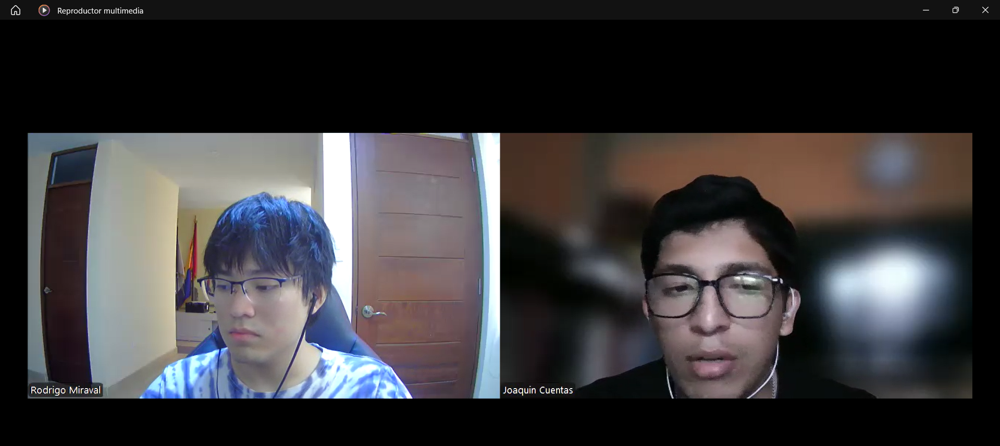

**Resumen:** Rodrigo lleva más de un año como técnico de mantenimiento de equipos. Revisa personalmente el estado de los equipos cada semana y considera que lo más difícil es el mantenimiento completo cuando no hubo prevención adecuada. Estaría dispuesto a adquirir Frigora, ya que mejoraría su alcance de clientes y le permitiría analizar constantemente los equipos en etapa preventiva.

---

**Entrevista 2**

| Campo | Detalle |
| :--- | :--- |
| **Nombre** | Mark Josue Febres Reategui |
| **Edad** | 23 años |
| **Distrito** | San Miguel |
| **Duración** | 3:33 min |
| **Enlace** | [Ver entrevista](https://upcedupe-my.sharepoint.com/:v:/g/personal/u202321281_upc_edu_pe/IQAQ6wZvP8AVSZd18on9ueNJAUNs6rvILt1vcYaPbctgJUA?e=1bQxpw) |

**Resumen:** Mark lidera un equipo de técnicos y se encarga de la captación de clientes y la logística operativa. La entrevista revela una dependencia crítica de procesos manuales y falta de información técnica previa al servicio. Existe alta disposición para adoptar Frigora, valorando especialmente la centralización de órdenes de trabajo y el acceso a datos históricos del equipo como factores clave para transicionar de un modelo reactivo a uno preventivo.

---

**Entrevista 3**

| Campo | Detalle |
| :--- | :--- |
| **Nombre** | Alvaro Pinto |
| **Edad** | 27 años |
| **Distrito** | Lima |
| **Duración** | 4:39 min |
| **Enlace** | [Ver entrevista](https://upcedupe-my.sharepoint.com/:v:/g/personal/u202221632_upc_edu_pe/IQDLCyieBm7QQbTmgm29OOXnAXAevqOoyC-D_P3kS7gz0QU?nav=eyJyZWZlcnJhbEluZm8iOnsicmVmZXJyYWxBcHAiOiJPbmVEcml2ZUZvckJ1c2luZXNzIiwicmVmZXJyYWxBcHBQbGF0Zm9ybSI6IldlYiIsInJlZmVycmFsTW9kZSI6InZpZXciLCJyZWZlcnJhbFZpZXciOiJNeUZpbGVzTGlua0NvcHkifX0&e=0e3js6) |

**Resumen:** Álvaro Pinto es técnico de mantenimiento de equipos de refrigeración con clientes regulares establecidos. Invierte mucho tiempo en visitas presenciales rutinarias para verificar el funcionamiento de equipos. La parte más desgastante ocurre con fallas imprevistas, ya que llegar "a ciegas" a un equipo descompuesto retrasa enormemente el diagnóstico. Estaría muy interesado en usar Frigora para conocer las fallas de antemano y ampliar su capacidad operativa.

---

### 2.2.3 Análisis de Entrevistas

**Segmento #1: Negocios con equipos de refrigeración**

Estos negocios no cuentan con herramientas tecnológicas para el monitoreo de sus equipos y actúan de manera reactiva ante fallas. Esto genera pérdidas económicas, interrupciones en el servicio y, en algunos casos, riesgos sanitarios. El mantenimiento es informal, no existe control adecuado del estado de los equipos y hay dificultad para encontrar técnicos confiables rápidamente.

**Segmento #2: Técnicos y empresas de mantenimiento**

Consiguen clientes principalmente a través de redes sociales y recomendaciones informales. Organizan sus servicios de manera manual, lo que genera desorden, pérdida de tiempo y dificultades para coordinar múltiples trabajos. Carecen de información previa sobre los equipos, lo que afecta su eficiencia. Existe una necesidad clara de herramientas que les permitan organizar mejor su trabajo y acceder a más oportunidades de forma estructurada.

---

## 2.3 Needfinding

### 2.3.1 User Personas

**Segmento #1: Negocios con equipos de refrigeración**

**Segmento #2: Empresas de mantenimiento**

### 2.3.2 User Task Matrix

Las tareas fueron identificadas a partir del análisis cualitativo de entrevistas y evaluadas según frecuencia e importancia para cada perfil: **Renato** (Segmento 1: negocios de refrigeración) y **André** (Segmento 2: empresas de mantenimiento).

| Tarea | Renato — Frecuencia | Renato — Importancia | André — Frecuencia | André — Importancia |
| :--- | :---: | :---: | :---: | :---: |
| Revisar estado de los equipos de refrigeración | Alta | Alta | Media | Alta |
| Recibir alertas de fallas o anomalías | Alta | Alta | Alta | Alta |
| Contactar a un técnico para mantenimiento | Media | Alta | — | — |
| Programar mantenimiento preventivo | Media | Alta | Alta | Alta |
| Revisar historial de mantenimiento | Media | Media | Alta | Alta |
| Registrar servicios realizados | — | — | Alta | Alta |
| Organizar agenda de servicios técnicos | — | — | Alta | Alta |
| Recibir solicitudes de nuevos trabajos | — | — | Alta | Alta |
| Evaluar estado del equipo antes del servicio | Baja | Media | Alta | Alta |
| Monitorear múltiples equipos desde una plataforma | Alta | Alta | Media | Alta |
| Calificar el servicio recibido / realizado | Baja | Media | Media | Media |

### 2.3.3 User Journey Mapping

**Segmento #1: Negocios con equipos de refrigeración**

**Segmento #2: Técnicos y empresas de mantenimiento**

### 2.3.4 Empathy Mapping

**Segmento #1: Negocios con equipos de refrigeración**

**Segmento #2: Empresas de mantenimiento**

## 2.4 Big Picture Event Storming

Se utilizaron post-its en LucidChart para mapear los eventos significativos del flujo operativo actual, desde la detección de fallas hasta el seguimiento post-servicio, identificando procesos clave, actores involucrados y oportunidades de mejora.

## 2.5 Ubiquitous Language

| Término | Definición |
| :--- | :--- |
| **User Profile** | Perfil del usuario dentro de la plataforma. |
| **Smart Dashboard** | Interfaz central donde los usuarios monitorean equipos, reciben alertas y gestionan servicios. |
| **Performance Report** | Informe técnico con historial de uso, consumo energético, temperatura y fallas de cada equipo. |
| **Maintenance Schedule** | Calendario para programar mantenimientos preventivos o correctivos. |
| **Failure Alert** | Notificación automática ante anomalías críticas como sobrecalentamiento o cortes de energía. |
| **Equipment Inventory** | Registro de todos los equipos con sus datos técnicos y ubicación. |
| **Service Provider** | Técnico o empresa que brinda mantenimiento, instalación o reparación de equipos. |
| **Technical History** | Registro detallado de todas las intervenciones realizadas a un equipo. |
| **Work Order** | Documento digital con las tareas asignadas a un técnico para una visita de servicio. |
| **Service Coordination** | Proceso de conexión entre clientes y proveedores según disponibilidad y necesidad. |
| **Real-Time Monitoring** | Supervisión constante del estado operativo del equipo (temperatura, consumo, uso). |
| **Cold Equipment** | Unidad de refrigeración para conservar productos: congeladoras, cámaras, vitrinas. |
| **Preventive Maintenance** | Servicio planificado para evitar fallas y extender la vida útil del equipo. |
| **Corrective Maintenance** | Servicio realizado para solucionar una falla existente en un equipo. |
| **Energy Consumption** | Registro del uso eléctrico de los equipos para detectar anomalías y optimizar recursos. |
| **Client Portfolio** | Lista de negocios atendidos por un proveedor, con sus datos y equipos registrados. |
| **Service Zone** | Área donde un proveedor puede atender equipos con rapidez y eficiencia. |
| **Notification** | Mensajes enviados automáticamente sobre mantenimientos, fallas o cambios importantes. |
| **Automatic Report Generation** | Función que crea informes técnicos sin intervención manual. |

---

# Capítulo III: Requirements Specification

## 3.1 To-Be Scenario Mapping

**Segmento #1: Negocios con equipos de refrigeración**

<em>Figura 1: To-Be Scenario Mapping — Negocios con equipos de refrigeración.</em>

**Segmento #2: Técnicos y empresas de mantenimiento**

<em>Figura 2: To-Be Scenario Mapping — Técnicos y empresas de mantenimiento.</em>

## 3.2 User Stories

### Épicas del Sistema

| ID | Título | Descripción |
| :---: | :--- | :--- |
| EP-01 | Gestión de Cuentas de Usuario | Todo lo necesario para que los usuarios puedan crear, acceder y administrar sus perfiles de forma segura. |
| EP-02 | Gestión y Monitoreo de Equipos | Funcionalidad para que los clientes agreguen, editen y monitoreen sus equipos de refrigeración. |
| EP-03 | Proceso de Solicitudes de Servicio | Ciclo completo de las solicitudes de servicio, desde la solicitud hasta el seguimiento post-servicio. |
| EP-04 | Análisis e Informes de Datos | Generación de reportes sobre rendimiento de equipos, consumo energético y eficiencia de servicios. |
| EP-05 | Sistema de Alertas y Notificaciones | Sistema de alertas automáticas a clientes y empresarios sobre fallas, mantenimientos y progreso de servicios. |
| EP-06 | Página de Aterrizaje y Experiencia Inicial | Landing page que comunica la propuesta de valor y facilita el primer contacto con el equipo comercial. |

### User Stories

| ID | Título | Descripción | Criterios de Aceptación | Epic |
| :--- | :--- | :--- | :--- | :---: |
| **US-01** | Registro de usuario | Como nuevo usuario, quiero registrarme en la plataforma para acceder a ella y empezar a gestionar mis equipos. | **E1 — Éxito:** Dado que el usuario completa el formulario con datos correctos, cuando envía el registro, entonces la cuenta es creada exitosamente. **E2 — Email duplicado:** Dado que el usuario ingresa un email ya registrado, cuando envía el formulario, entonces el sistema muestra un mensaje de error. | EP-01 |
| **US-02** | Inicio de sesión | Como usuario, quiero iniciar sesión en mi cuenta para utilizar sus funcionalidades. | **E1 — Éxito:** Dado que el usuario tiene una cuenta activa e ingresa datos correctos, cuando inicia sesión, entonces accede al panel principal. **E2 — Error:** Dado que el usuario ingresa datos incorrectos, cuando intenta acceder, entonces el sistema muestra un mensaje de error. | EP-01 |
| **US-03** | Gestionar equipos de refrigeración | Como cliente, quiero gestionar mis equipos de refrigeración para mantener un registro y control detallado de cada uno. | **E1 — Registro:** Dado que el usuario ingresa los datos del equipo, cuando los guarda, entonces el equipo se registra correctamente. **E2 — Actualización:** Dado que el usuario modifica los datos de un equipo, cuando guarda los cambios, entonces la información se actualiza correctamente. | EP-02 |
| **US-04** | Recibir notificaciones de estado del equipo | Como cliente, quiero recibir notificaciones automáticas sobre el estado de mis equipos para tomar acciones rápidas ante fallas o mantenimientos próximos. | **E1 — Falla:** Dado que el sistema detecta una falla en el equipo del usuario, cuando se procesa la alerta, entonces el cliente recibe una notificación inmediata. **E2 — Preventivo:** Dado que el usuario tiene un mantenimiento próximo programado, cuando se aproxima la fecha, entonces el cliente es notificado con antelación. | EP-05 |
| **US-05** | Analizar consumo energético | Como cliente, quiero ver y comparar el consumo energético de mis equipos para evaluar su eficiencia. | **E1 — Individual:** Dado que el usuario tiene equipos registrados, cuando solicita los datos de consumo, entonces el sistema muestra un informe detallado. **E2 — Comparativo:** Dado que el usuario selecciona múltiples equipos, cuando solicita la comparación, entonces el sistema genera una vista comparativa. | EP-04 |
| **US-06** | Solicitar servicios de mantenimiento | Como cliente, quiero solicitar servicios de mantenimiento y reparación para recibir atención oportuna con confirmación del servicio. | **E1 — Solicitud:** Dado que el usuario requiere un servicio y lo detalla en el sistema, cuando lo envía, entonces la solicitud se registra y se notifica al equipo. **E2 — Confirmación:** Dado que el usuario envió una solicitud, cuando el sistema la procesa, entonces el cliente recibe confirmación con los detalles del servicio. | EP-03 |
| **US-07** | Seguimiento del progreso del servicio | Como cliente, quiero hacer seguimiento al avance de mi servicio para saber en qué etapa se encuentra. | **E1 — Visualización:** Dado que el usuario tiene una solicitud activa, cuando accede al sistema, entonces se presenta el estado actualizado del servicio. **E2 — Actualización:** Dado que el usuario espera una actualización de estado, cuando ésta ocurre, entonces el sistema lo refleja en tiempo real. | EP-03 |
| **US-08** | Ver reporte del servicio realizado | Como cliente, quiero ver el reporte detallado de un servicio completado para conocer qué intervenciones se realizaron. | **E1 — Generación:** Dado que el usuario tiene un servicio completado, cuando lo consulta, entonces el sistema muestra un reporte detallado de las intervenciones. **E2 — Envío:** Dado que el usuario tiene un reporte generado, cuando el sistema lo procesa, entonces lo envía automáticamente por correo electrónico. | EP-04 |
| **US-09** | Alertas sobre solicitudes de servicio | Como empresario, quiero recibir alertas cuando un cliente solicite un servicio para responder de manera oportuna. | **E1 — Solicitud recibida:** Dado que el cliente envía una solicitud de servicio, cuando el sistema la registra, entonces el empresario recibe una alerta. **E2 — Preventivo:** Dado que el cliente solicita un mantenimiento preventivo, cuando se registra, entonces el empresario es alertado. | EP-05 |
| **US-10** | Ver historial de servicios | Como empresario, quiero consultar el historial de servicios por cliente y equipo para tener trazabilidad completa de las atenciones realizadas. | **E1 — Visualización:** Dado que el usuario empresario accede al historial, cuando lo consulta, entonces puede ver el historial completo de servicios. **E2 — Filtrado:** Dado que el usuario aplica un filtro por cliente o equipo, cuando lo ejecuta, entonces el historial se actualiza con los resultados correspondientes. | EP-04 |
| **US-11** | Seguimiento a solicitudes de servicio | Como empresario, quiero hacer seguimiento detallado a las solicitudes asignadas a mis técnicos para controlar el avance de cada una. | **E1 — Ver estado:** Dado que el usuario empresario accede al sistema, cuando consulta las solicitudes, entonces puede ver el estado actualizado de cada una. **E2 — Actualización:** Dado que el técnico actualiza una solicitud, cuando guarda los cambios, entonces el sistema muestra el nuevo estado en tiempo real. | EP-03 |
| **US-12** | Registrar y gestionar técnicos | Como empresario, quiero registrar técnicos para incluirlos en mi equipo de trabajo. | **E1 — Registro exitoso:** Dado que el usuario empresario ingresa los datos completos del técnico, cuando guarda el registro, entonces el técnico queda registrado correctamente. **E2 — Datos incompletos:** Dado que el usuario deja campos obligatorios vacíos, cuando intenta guardar, entonces el sistema no permite la operación. | EP-01 |
| **US-13** | Consultar perfil de un técnico | Como empresario, quiero consultar el perfil de cada técnico para ver sus datos y métricas de rendimiento. | **E1 — Información completa:** Dado que el usuario empresario selecciona un técnico, cuando accede a su perfil, entonces puede visualizar sus datos y métricas de rendimiento. **E2 — Sin evaluaciones:** Dado que el usuario consulta un técnico sin evaluaciones registradas, cuando accede a su perfil, entonces las métricas de rendimiento no son visibles. | EP-01 |
| **US-14** | Asignar técnicos a servicios | Como empresario, quiero asignar un técnico a una solicitud de servicio para garantizar su atención oportuna. | **E1 — Asignación:** Dado que el usuario empresario recibe una solicitud, cuando selecciona un técnico y confirma, entonces el técnico queda asignado al servicio. **E2 — Notificación:** Dado que el usuario empresario confirma la asignación, cuando el sistema la procesa, entonces el técnico recibe una notificación con los detalles del servicio. | EP-03 |
| **US-15** | Reporte de desempeño de técnicos | Como empresario, quiero generar reportes de desempeño de mis técnicos para evaluar su productividad y calidad de servicio. | **E1 — Generación:** Dado que el usuario empresario solicita un reporte de desempeño, cuando el sistema lo procesa, entonces genera un informe detallado. **E2 — Descarga:** Dado que el usuario tiene un reporte generado, cuando desea descargarlo, entonces el sistema permite descargarlo en formato PDF. | EP-04 |
| **US-16** | Configurar alertas de mantenimiento | Como empresario, quiero configurar alertas automáticas de mantenimiento preventivo para asegurar la atención oportuna de los equipos. | **E1 — Configuración:** Dado que el usuario empresario ingresa los parámetros de la alerta, cuando los guarda, entonces la alerta se configura correctamente en el sistema. **E2 — Actualización:** Dado que el usuario desea modificar una alerta existente, cuando realiza los cambios, entonces la alerta queda actualizada. | EP-05 |
| **US-17** | Visualizar clientes y servicios asociados | Como empresario, quiero ver un listado de clientes con sus servicios asociados para organizar y planificar el trabajo del equipo. | **E1 — Acceso:** Dado que el usuario empresario accede a la funcionalidad, cuando la consulta, entonces puede visualizar el listado de clientes y sus servicios asociados. **E2 — Filtrado:** Dado que el usuario aplica un filtro por estado, cuando lo ejecuta, entonces la lista se actualiza con los resultados correspondientes. | EP-04 |
| **US-18** | Visualizar equipos asignados a clientes | Como empresario, quiero visualizar los equipos entregados a cada cliente para darles seguimiento. | **E1 — Acceso:** Dado que el usuario empresario accede al listado de equipos, cuando lo consulta, entonces puede visualizarlos correctamente. **E2 — Filtrado:** Dado que el usuario aplica filtros sobre el listado, cuando los ejecuta, entonces la lista muestra los resultados correspondientes. | EP-02 |
| **US-19** | Notificaciones de eventos importantes | Como cliente, quiero recibir notificaciones sobre eventos importantes de mi servicio para estar informado de cualquier cambio o complicación. | **E1 — Problema reportado:** Dado que el técnico reporta una complicación durante el servicio, cuando el sistema la registra, entonces el cliente recibe una notificación que requiere su atención. **E2 — Progreso:** Dado que el servicio del cliente cambia de estado, cuando ocurre el cambio, entonces el sistema envía una notificación al cliente. | EP-05 |
| **US-20** | Visualizar la propuesta de valor | Como visitante, quiero conocer la propuesta de valor de la plataforma para evaluar si se ajusta a mis necesidades. | **E1 — Visible:** Dado que el visitante accede a la página principal, cuando la carga, entonces se presenta claramente la propuesta de valor. **E2 — Orientada:** Dado que el visitante pertenece al sector, cuando navega la página, entonces encuentra conceptos de gestión inteligente relevantes para su negocio. | EP-06 |
| **US-21** | Explorar soluciones por rubro | Como visitante, quiero explorar las soluciones que ofrece la plataforma según mi tipo de negocio para identificar si cubre mis necesidades operativas. | **E1 — Refrigeración:** Dado que el visitante explora las soluciones disponibles, cuando navega la sección, entonces encuentra descripciones específicas para negocios de refrigeración. **E2 — Mantenimiento:** Dado que el visitante explora las soluciones disponibles, cuando navega la sección, entonces encuentra información relevante para empresas de mantenimiento. | EP-06 |
| **US-22** | Comprender las funcionalidades clave | Como visitante, quiero entender las funcionalidades principales de la plataforma para evaluar si se adaptan a mi operación. | **E1 — Acceso:** Dado que el visitante revisa las características de la plataforma, cuando las consulta, entonces identifica las opciones clave disponibles. **E2 — Valor:** Dado que el visitante lee las descripciones de cada función, cuando las analiza, entonces comprende el beneficio que aporta cada una. | EP-06 |
| **US-23** | Conocer misión y visión | Como visitante, quiero conocer la misión y visión de la empresa para entender su enfoque y valores. | **E1 — Misión:** Dado que el visitante accede al contenido corporativo, cuando lo revisa, entonces encuentra una descripción clara de la misión de la empresa. **E2 — Visión:** Dado que el visitante accede al contenido estratégico, cuando lo revisa, entonces encuentra la visión a futuro de la empresa. | EP-06 |
| **US-24** | Contactar con el equipo de ventas | Como visitante empresario, quiero contactar fácilmente con el equipo de ventas para obtener información y comenzar el proceso de contratación. | **E1 — Canal de contacto:** Dado que el visitante tiene interés en contactar, cuando busca la opción, entonces encuentra un canal de contacto claramente visible. **E2 — Redirección:** Dado que el visitante selecciona la opción de contacto, cuando hace clic, entonces llega a un canal funcional como un formulario de contacto. | EP-06 |
| **US-25** | Acceder a la plataforma web (CTA) | Como usuario registrado, quiero encontrar un acceso directo a la plataforma desde la página de inicio para ingresar de forma rápida sin buscar la URL. | **E1 — Visibilidad:** Dado que el usuario visita la página principal, cuando la carga, entonces encuentra una opción clara de acceso a la plataforma. **E2 — Redirección:** Dado que el usuario selecciona la opción de acceso, cuando hace clic, entonces es redirigido a la página de inicio de sesión. | EP-06 |
| **TS-01** | Alertas críticas vía API | Como desarrollador, quiero implementar un endpoint que exponga alertas críticas para activar notificaciones automáticas en el sistema. | **E1 — Éxito:** Dado que el sistema procesa una alerta crítica, cuando se ejecuta el endpoint, entonces se envía la notificación al usuario correspondiente. **E2 — Deshabilitado:** Dado que el servicio de notificaciones está deshabilitado, cuando se intenta enviar, entonces no se envía la notificación y se registra en el historial. | EP-05 |
| **TS-02** | Solicitudes de mantenimiento (API) | Como desarrollador, quiero implementar un endpoint para crear solicitudes de mantenimiento para permitir su registro desde el frontend y otros servicios. | **E1 — Éxito:** Dado que el sistema recibe un POST a `/api/v1/service-requests` con datos válidos, cuando procesa la solicitud, entonces responde con código 201 y la solicitud queda guardada. **E2 — Datos incompletos:** Dado que el sistema recibe la solicitud con un campo obligatorio faltante, cuando la procesa, entonces responde con código 400 e indica "Invalid data". | EP-03 |
| **TS-03** | Registro de intervenciones técnicas (API) | Como desarrollador, quiero implementar un endpoint para registrar intervenciones técnicas para almacenar el detalle de cada atención realizada. | **E1 — Éxito:** Dado que el sistema recibe un POST a `/api/v1/interventions` con datos válidos, cuando procesa la solicitud, entonces responde con código 201 y el registro queda almacenado. **E2 — Técnico inexistente:** Dado que el sistema recibe la solicitud con un ID de técnico no existente, cuando la procesa, entonces responde con código 404 indicando "Technician not found". | EP-03 |
| **TS-04** | Registro de usuarios (API RESTful) | Como desarrollador, quiero exponer un endpoint para registrar nuevos usuarios para garantizar la validación de correo único y formato de contraseña desde el backend. | **E1 — Éxito:** Dado que el sistema recibe un POST a `/api/v1/users` con datos válidos, cuando procesa la solicitud, entonces responde con código 201 y el usuario queda registrado. **E2 — Email duplicado:** Dado que el sistema recibe la solicitud con un correo ya registrado, cuando la procesa, entonces responde con código 400 indicando "Email already registered". | EP-01 |
| **TS-05** | Consulta de estado de servicios (API) | Como desarrollador, quiero crear un endpoint para consultar el estado de solicitudes en tiempo real para que el cliente pueda ver el avance actualizado de su servicio. | **E1 — Éxito:** Dado que el sistema recibe un GET a `/api/v1/requests/{id}` con un ID válido, cuando procesa la solicitud, entonces responde con código 200 y el estado actual del servicio. **E2 — No encontrado:** Dado que el sistema recibe la solicitud con un ID inexistente, cuando la procesa, entonces responde con código 404 indicando "Request not found". | EP-03 |

## 3.3 Impact Mapping

**Segmento 1 — Negocios con equipos de refrigeración**

<em>Figura 1: Impact Mapping — Segmento 1.</em>

**Segmento 2 — Empresas de mantenimiento**

<em>Figura 2: Impact Mapping — Segmento 2.</em>

## 3.4 Product Backlog

Para la estimación de esfuerzo se usa la escala de Fibonacci (1, 2, 3, 5, 8) donde: **1** = tarea sencilla, **2** = complejidad moderada, **3** = mayor tiempo y esfuerzo, **5** = tarea compleja, **8** = alta complejidad con impacto en varias áreas.

[Ver tablero en Trello](https://trello.com/invite/b/69edc7316e396d01726fc9c1/ATTIc41d50b3166de3cd176b5b3c82be8c51F5BBF481/frigora-product-backlog)

<em>Figura 1: Product Backlog.</em>

| Orden | ID | Título | Story Points | Epic |
| :---: | :---: | :--- | :---: | :---: |
| 1 | US-20 | Visualizar la propuesta de valor principal | 1 | EP-06 |
| 2 | US-21 | Explorar soluciones específicas para mi rubro | 2 | EP-06 |
| 3 | US-22 | Comprender las funcionalidades clave | 2 | EP-06 |
| 4 | US-23 | Conocer la misión y visión | 1 | EP-06 |
| 5 | US-24 | Contactar con el equipo de ventas | 3 | EP-06 |
| 6 | US-25 | Acceder a la plataforma web (Call to Action) | 1 | EP-06 |
| 7 | TS-04 | Registrar nuevo usuario a través de API RESTful | 3 | EP-01 |
| 8 | US-01 | Registro de usuario | 3 | EP-01 |
| 9 | US-02 | Inicio de sesión | 2 | EP-01 |
| 10 | US-12 | Registrar y gestionar técnicos | 5 | EP-01 |
| 11 | US-13 | Consultar el perfil de un técnico | 2 | EP-01 |
| 12 | US-03 | Gestionar equipos de refrigeración | 5 | EP-02 |
| 13 | US-18 | Visualizar equipos asignados a clientes | 3 | EP-02 |
| 14 | TS-02 | Creación de solicitudes de mantenimiento (API) | 3 | EP-03 |
| 15 | US-06 | Solicitar y gestionar servicios de mantenimiento | 5 | EP-03 |
| 16 | TS-05 | Consulta de estado de servicios por API | 2 | EP-03 |
| 17 | US-09 | Recepción de alertas sobre solicitudes de servicio | 3 | EP-05 |
| 18 | US-14 | Asignar técnicos a servicios | 3 | EP-03 |
| 19 | TS-03 | Registro de intervenciones técnicas por API RESTful | 3 | EP-03 |
| 20 | US-07 | Dar seguimiento al progreso del servicio | 3 | EP-03 |
| 21 | US-11 | Realizar seguimiento a solicitudes de servicio | 3 | EP-03 |
| 22 | TS-01 | Gestión de alertas críticas vía API | 5 | EP-05 |
| 23 | US-19 | Recibir notificaciones de eventos importantes | 5 | EP-05 |
| 24 | US-04 | Recibir notificaciones de estado del equipo | 5 | EP-05 |
| 25 | US-16 | Configurar alertas de mantenimiento | 5 | EP-05 |
| 26 | US-08 | Ver reporte de servicio realizado | 3 | EP-04 |
| 27 | US-10 | Ver historial de servicios | 3 | EP-04 |
| 28 | US-17 | Visualizar clientes y servicios asociados | 3 | EP-04 |
| 29 | US-05 | Analizar el consumo energético de equipos | 8 | EP-04 |
| 30 | US-15 | Generar reporte de desempeño de técnicos | 8 | EP-04 |

---

# Capítulo IV: Product Design

## 4.1 Style Guidelines

### 4.1.1 General Style Guidelines

**Branding:** Frigora es una aplicación para empresas dependientes de sistemas de refrigeración. El objetivo es optimizar el proceso de supervisión y mantenimiento mediante tecnología IoT, aplicando buenas prácticas de UX/UI, pruebas gratuitas y actualizaciones continuas.

**Tipografía:** Se usa *Roboto Serif* por su claridad y legibilidad. Para el cuerpo de texto, *Inter 14px* con interlineado 1.5. Los tamaños se adaptan según jerarquía: títulos, subtítulos y párrafos.

**Colores:** Variantes de azul que conectan con el core de negocio (refrigeración/tecnología) y blanco para limpieza visual.

**Espaciado:**
- Entre secciones principales: mínimo 20px
- Entre encabezados y párrafos: 16px
- Entre párrafos consecutivos: 14px
- Botones e inputs: mínimo 10px entre elementos

**Tono de comunicación:**

| Dimensión | Nivel Adoptado |
| :--- | :--- |
| Divertido / Serio | Medio-Serio |
| Formal / Casual | Semi-Formal |
| Respetuoso / Irreverente | Muy Respetuoso |
| Entusiasta / Sereno | Sereno y Empático |

**Lenguaje:** Claro y directo, orientado a la acción, con terminología técnica consistente en alertas, reportes y documentación.

### 4.1.2 Web Style Guidelines

**Diseño Responsive** — Breakpoints:

| Dispositivo | Ancho mínimo | Ejemplo de uso |
| :--- | :---: | :--- |
| Mobile | ≥ 320px | Teléfonos |
| Tablet | ≥ 768px | iPad / tablets |
| Laptop | ≥ 1024px | Monitores y laptops |
| Widescreen | ≥ 1440px | Pantallas grandes o TV |

**Navegación:** Menú hamburguesa en dispositivos móviles; menú horizontal en pantallas mayores.

**Imágenes:** Formatos JPEG y PNG con compresión optimizada para mantener calidad sin afectar el rendimiento.

**Interacción:** Animaciones sutiles para mostrar imágenes y textos informativos según la interacción del usuario.

---

## 4.2 Information Architecture

### 4.2.1 Organization Systems

- **Jerárquica:** Dashboard principal — alertas críticas primero, luego indicadores de consumo y reportes históricos.
- **Secuencial:** Flujos de registro de equipos, creación de solicitudes y configuración de alertas.
- **Matricial:** Comparación de datos energéticos y desempeño de equipos.

### 4.2.2 Labeling Systems

**Principios:** Etiquetas de 1–3 palabras, descriptivas y directas; terminología consistente en toda la plataforma; lenguaje comprensible para empresarios y técnicos.

| Área | Etiquetas principales |
| :--- | :--- |
| Navegación global | Inicio, Equipos, Servicios, Reportes, Alertas, Administración, Ayuda |
| Landing Page | Bienvenido a Frigora, Soluciones, Funcionalidades, Casos de uso, Contáctanos |
| Gestión de equipos | Añadir equipo, Control remoto, Ajustar temperatura, Historial |
| Servicios | Solicitudes, Progreso, Confirmación, Historial |
| Reportes | Consumo, Comparar, Descargar, Desempeño técnico |
| Acciones | Crear cuenta, Iniciar sesión, Solicitar servicio, Ver reporte, Configurar alerta, Cerrar sesión |

### 4.2.3 SEO Tags and Meta Tags

**Landing Page**
- *Title:* Gestión inteligente de equipos de refrigeración
- *Meta Description:* Optimiza la gestión de tu cadena de frío con monitoreo en tiempo real, alertas automáticas y mantenimiento predictivo.
- *Keywords:* gestión de refrigeración, mantenimiento predictivo, monitoreo en tiempo real, cadena de frío, eficiencia energética

**Web Application**
- *Title:* Monitoreo y gestión de tus equipos de refrigeración
- *Meta Description:* Supervisa el estado de tus equipos, recibe alertas inmediatas y gestiona servicios de mantenimiento desde una sola plataforma.
- *Keywords:* monitoreo de refrigeración, gestión de equipos, alertas preventivas, mantenimiento en línea, reportes energéticos

### 4.2.4 Searching Systems

**Opciones de búsqueda:** Barra de búsqueda con resultados instantáneos, filtros por tipo de equipo, estado, fecha de última revisión y rango de consumo energético. Los resultados muestran nombre del equipo, estado, próxima fecha de mantenimiento y consumo, con opción de ordenación por relevancia o estado.

### 4.2.5 Navigation Systems

**Páginas principales:** Inicio (dashboard), Funcionalidades, Beneficios, Nosotros, Contacto.

---

## 4.3 Landing Page UI Design

### 4.3.1 Landing Page Wireframe

El wireframe define la estructura de cada sección: Header con logo y navegación, Hero con la propuesta de valor, Beneficios, Sobre Nosotros, Testimonios, Contacto (formulario) y Footer.

### 4.3.2 Landing Page Mock-up

**Inicio**

**Beneficios**

**Sobre Nosotros**

**Testimonios**

**Contacto**

---

## 4.4 Web Applications UX/UI Design

### 4.4.1 Web Applications Wireframes

**Login**

**Register**

**Dashboard**

**Sitios y Equipos**

**Detalle de Equipos**

**Alertas**

**Órdenes**

**Reportes**

**Administración**

### 4.4.2 Web Applications Wireflow Diagrams

### 4.4.3 Web Applications Mock-ups

**Login**

**Register**

**Dashboard**

**Sitios y Equipos**

**Detalle de Equipos**

**Alertas**

**Órdenes**

**Reportes**

**Administración**

### 4.4.4 Web Applications User Flow Diagrams

## 4.5 Web Applications Prototyping

La sección de prototipado muestra un modelo interactivo y funcional que permite simular el flujo de usuario, la navegación y las interacciones principales, validando que el diseño sea intuitivo antes del desarrollo final.

**Repositorio:** https://github.com/ColdTech-Peru/Report

## 4.6 Domain-Driven Software Architecture

### 4.6.1 Design-Level EventStorming

**Segmento 1**

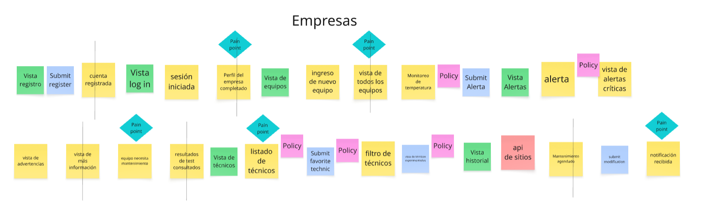

**Segmento 2**

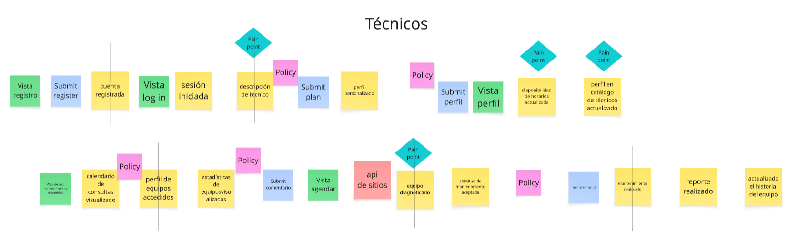

[Ver en Miro](https://miro.com/welcomeonboard/QlBWbmlOR2twVG5zbldnNXk2TDBXMUV1bmxRbGN2clFSQUMyL0lwUGZZL0swRHNJSTBsYkVsTGV5S1Z3am5STkRiMlZ3YWVoRnN5M2svUUFlRm1kYjQ1SXZOeitBdHBNWnorSFlKY2VwWUlLMVIxZ3VPVm5oakdmd0hKT0FQWmtzVXVvMm53MW9OWFg1bkJoVXZxdFhRPT0hdjE=?share_link_id=723339078935)

### 4.6.2 Software Architecture Context Diagram

<em>Figura 1: Context Diagram.</em>

### 4.6.3 Software Architecture Container Diagrams

<em>Figura 2: Container Diagrams.</em>

### 4.6.4 Software Architecture Components Diagrams

<em>Figura 3: API REST Component Diagrams.</em>

<em>Figura 4: Assets Management BC Component Diagrams.</em>

<em>Figura 5: Dashboard BC Component Diagrams.</em>

<em>Figura 6: Monitoring BC Component Diagrams.</em>

<em>Figura 7: Reporting BC Component Diagrams.</em>

<em>Figura 8: Services BC Component Diagrams.</em>

<em>Figura 9: Technicians BC Component Diagrams.</em>

## 4.7 Software Object-Oriented Design

### 4.7.1 Class Diagrams

<em>Figura 1: Class Diagram.</em>

## 4.8 Database Design

### 4.8.1 Database Diagrams

El diagrama ER representa las entidades principales del sistema Frigora, sus atributos y las relaciones entre usuarios, técnicos, negocios, equipos, métricas, alertas y órdenes.

<em>Figura 1: Database Diagram.</em>

---

# Capítulo V: Product Implementation, Validation & Deployment

## 5.1 Software Configuration Management

### 5.1.1 Software Development Environment Configuration

**Project Management**

| Plataforma | Descripción | Enlace |
| :--- | :--- | :--- |
| Trello | Seguimiento detallado del progreso de tareas y designación de responsables. | https://trello.com |
| Discord / WhatsApp | Comunicación interna del equipo para reuniones y mensajes rápidos. | https://discord.com |
| GitHub | Organización centralizada del código fuente y control de versiones. | https://github.com |

**Requirement Management**

| Plataforma | Descripción | Enlace |
| :--- | :--- | :--- |
| UXPressia | Creación y validación de wireframes, mockups y prototipos interactivos. | https://uxpressia.com |
| Miro | Visualización y desarrollo de escenarios As-Is y To-Be. | https://miro.com |

**Product UX/UI Design**

| Plataforma | Descripción | Enlace |
| :--- | :--- | :--- |
| Figma | Herramienta principal para diseño colaborativo de wireframes, mockups y prototipos. | https://www.figma.com |

**Software Development**

| Tecnología | Descripción | Enlace |
| :--- | :--- | :--- |
| HTML | Define la estructura y contenido de la página web. | https://www.w3schools.com/html |
| CSS | Gestiona la presentación visual y el estilo. | https://www.w3schools.com/css |
| JavaScript | Añade interactividad y dinamismo. | https://www.w3schools.com/js |
| Visual Studio Code | IDE para escritura, edición y depuración de código. | https://code.visualstudio.com |
| JetBrains ToolBox | Gestión de IDEs: IntelliJ IDEA, WebStorm, Rider. | https://www.jetbrains.com/toolbox-app |

**Software Documentation**

| Plataforma | Descripción |
| :--- | :--- |
| GitHub | Gestión de la documentación en repositorios y organizaciones. |
| Markdown | Formato base para la presentación y documentación del proyecto. |

### 5.1.2 Source Code Management

Se utiliza la estrategia **GitHub Flow** con las siguientes ramas principales:

- **`main`:** Código de producción (CSS, imágenes, JavaScript e `index.html`). Siempre estable y listo para despliegue.
- **`gh-pages`:** Rama de despliegue automático en GitHub Pages.

**Convenciones de nomenclatura:**

| Tipo | Prefijo | Formato | Ejemplo |
| :--- | :--- | :--- | :--- |
| Característica | `feature/` | `feature/nombre-descriptivo` | `feature/login-ui` |
| Lanzamiento | `release/` | `release/x.y.z` | `release/1.0.0` |
| Corrección urgente | `hotfix/` | `hotfix/x.y.z-descripcion` | `hotfix/1.0.1-fix-login` |

**Repositorios:**
- Organización: https://github.com/ColdTech-Peru
- Landing Page: https://github.com/ColdTech-Peru/Landing-Page
- Informe: https://github.com/ColdTech-Peru/Report

### 5.1.3 Source Code Style Guide & Conventions

**Nomenclatura:**
- Variables y funciones JS: `camelCase` (ej. `myVariable`, `initializeVideos()`)
- Constantes JS: `SNAKE_CASE` (ej. `VIDEO_CONFIG`)
- Archivos: minúsculas con guiones (ej. `index.html`, `style.css`)

**HTML — Etiquetas utilizadas:** `<!DOCTYPE html>`, `<html>`, `<head>`, `<meta>`, `<title>`, `<link>`, `<body>`, `<header>`, `<nav>`, `<section>`, `<footer>`, y etiquetas semánticas complementarias (`<h1>`–`<h5>`, `
`, `
`, `<ul>`, `<li>`, `<a>`, ``, `<button>`, `<script>`).

**CSS — Propiedades clave:** `width`, `height`, `padding`, `font-family`, `font-size`, `font-weight`, `font-style`, `text-align`, `color`, `background-color`.

### 5.1.4 Software Deployment Configuration

Para publicar en **GitHub Pages**:

1. Organizar archivos en la carpeta raíz (`index.html`, `styles.css`, `index.js`, imágenes en `assets/images/`).
2. Subir archivos al repositorio mediante commit.
3. Ir a **Settings → Pages**, seleccionar rama `main` y carpeta raíz `/root`.
4. GitHub Pages realiza el despliegue automático y genera una URL pública.

---

## 5.2 Landing Page, Services & Applications Implementation

### 5.2.1 Sprint 1

#### 5.2.1.1 Sprint Planning 1

| Campo | Detalle |
| :--- | :--- |
| **Fecha** | 2026-04-23 |
| **Hora** | 1:00 PM |
| **Lugar** | Presencial — UPC, sede San Miguel |
| **Preparado por** | Alejandro Galindo |
| **Asistentes** | Alejandro Galindo, Walter Fajardo, Leonardo Cumba, Joaquin Cuentas, Gabriel Perez |
| **Sprint 1 Goal** | Desarrollar la landing page garantizando adaptabilidad a distintos dispositivos, coherencia visual y soporte multilenguaje. El objetivo se valida cuando el usuario puede cambiar idioma fácilmente, navegar sin errores y verificar que los elementos gráficos y textuales estén correctamente alineados. |
| **Sprint 1 Velocity** | 15 |
| **Sum of Story Points** | 15 |

**Review Summary:** Se avanzó en la definición inicial de la plataforma y se establecieron lineamientos clave para el desarrollo de la landing page.

**Retrospective Summary:** El equipo compartió ideas sobre el rubro, segmentos objetivo, beneficios y funcionalidades principales. Las tareas se organizaron eficientemente con avances visibles en el informe y la landing page.

#### 5.2.1.2 Aspect Leaders and Collaborators

| Team Member | GitHub Username | Diseño visual y maquetación | Responsividad y pruebas | Implementación multilenguaje |
| :--- | :--- | :---: | :---: | :---: |
| Galindo Montero, Alejandro Manuel | AlejandroG12970 | C | L | L |
| Fajardo, Walter | walterfajardo | L | C | C |
| Cumba, Leonardo | LeonardoC72 | C | C | L |
| Cuentas, Joaquin | joaCUPE | C | L | C |
| Perez, Gabriel | Gabyoko | C | C | C |

*L = Leader, C = Collaborator*

#### 5.2.1.3 Sprint Backlog 1

[Ver tablero en Trello](https://trello.com/invite/b/69edc7316e396d01726fc9c1/ATTIfe4224969e7f89d8cf52d5f416485b4519519493/frigora-product-backlog)

<em>Figura 1: Sprint Backlog 1.</em>

| US ID | US Título | Task ID | Task Título | Descripción | Horas | Asignado | Estado |
| :---: | :--- | :---: | :--- | :--- | :---: | :--- | :---: |
| US-20 | Visualizar propuesta de valor | UT-01 | Crear sección "Hero" | Diseñar y añadir la sección Hero que comunique el monitoreo inteligente IoT. | 2 | Walter Fajardo | Done |
| US-21 | Explorar soluciones por rubro | UT-01 | Crear sección "Soluciones" | Redactar y maquetar tarjetas de soluciones para supermercados, laboratorios y sector alimentario. | 3 | Joaquin Cuentas | Done |
| US-22 | Comprender funcionalidades clave | UT-01 | Crear sección "Características" | Diseñar la sección con telemetría, alertas preventivas y control de temperatura. | 3 | Alejandro Galindo | Done |
| US-23 | Conocer misión y visión | UT-01 | Crear sección "Nosotros" | Añadir sección visual que refleje la misión y visión de la startup. | 1.5 | Gabriel Perez | Done |
| US-24 | Contactar equipo de ventas | UT-01 | Diseñar formulario de "Contacto" | Maquetar formulario con Nombre, RUC, Teléfono y Mensaje. | 2 | Leonardo Cumba | Done |
| US-24 | Contactar equipo de ventas | UT-02 | Definir flujo de validación | Prototipar mensajes de éxito/error al enviar el formulario. | 1.5 | Gabriel Perez | Done |
| US-25 | Acceder a la plataforma (CTA) | UT-01 | Crear Navbar y botón CTA | Añadir barra de navegación con botón "Ingresar" que redirija al Login. | 1 | Leonardo Cumba | Done |

#### 5.2.1.4 Development Evidence for Sprint Review

| Repositorio | Rama | Commit ID | Mensaje | Descripción |
| :--- | :--- | :---: | :--- | :--- |
| ColdTech-Peru/LandingPage | master | f331259 | feat: cambiar script.js a index.js | Renombramiento del archivo de scripts para cumplir convenciones del proyecto. |
| ColdTech-Peru/LandingPage | master | f57b84b | JS | Creación y vinculación del archivo de lógica JavaScript interactiva. |
| ColdTech-Peru/LandingPage | master | fdf1625 | feature: add images | Integración de recursos gráficos y activos visuales para la landing page. |
| ColdTech-Peru/LandingPage | master | 7e6df51 | feature: hero and benefit section update | Ajustes en el maquetado de la sección Hero y actualización de textos de beneficios. |
| ColdTech-Peru/LandingPage | master | c4d382c | feat: correct footer | Corrección de alineación y validación de enlaces en el pie de página. |
| ColdTech-Peru/LandingPage | master | 1c227de | feat: change footer | Reestructuración del diseño del footer para mejorar la experiencia de navegación. |
| ColdTech-Peru/LandingPage | master | 3e69af4 | feat: add style.css | Implementación de la hoja de estilos CSS inicial con identidad visual y tipografía. |
| ColdTech-Peru/LandingPage | master | 13d089c | html | Creación de la estructura semántica base del `index.html`. |
| ColdTech-Peru/LandingPage | master | 5b6714b | primer commit1 | Inicialización del repositorio y carga de archivos fundamentales. |

#### 5.2.1.5 Execution Evidence for Sprint Review

**Inicio — Sección Hero**

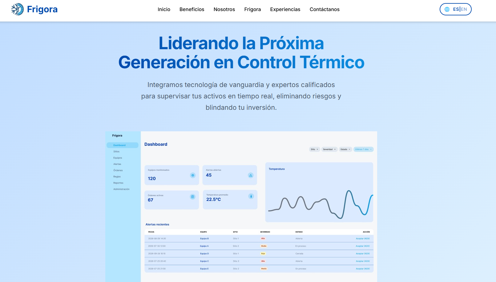

**Beneficios — Panel dinámico por segmento**

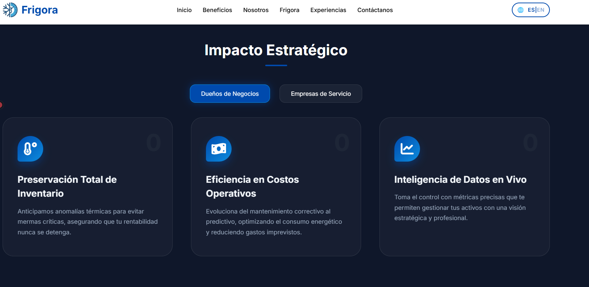

**Sobre Nosotros — Misión y visión**

**Testimonios — Casos de éxito**

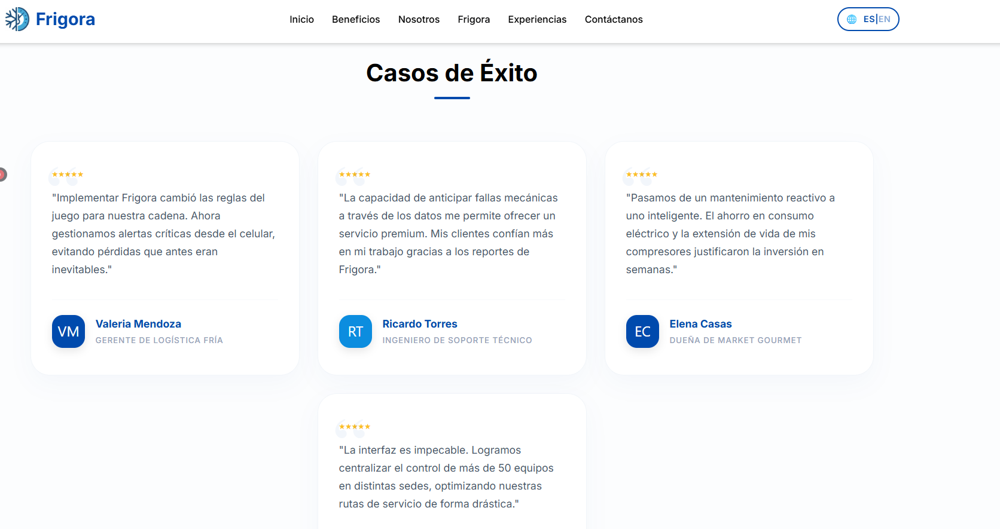

**Contacto — Formulario B2B**

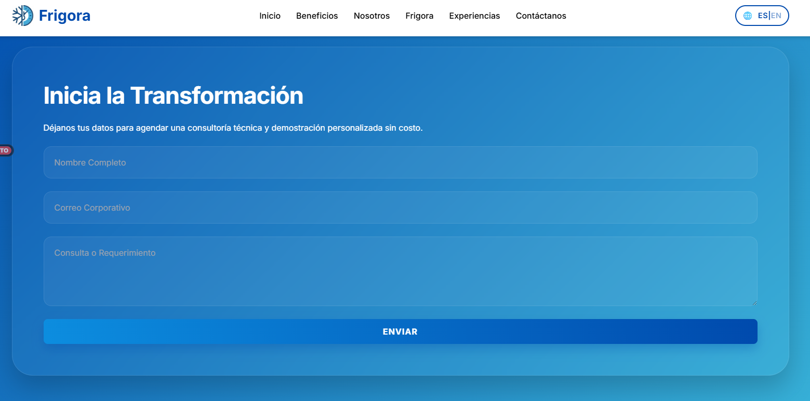

#### 5.2.1.6 Services Documentation Evidence for Sprint Review

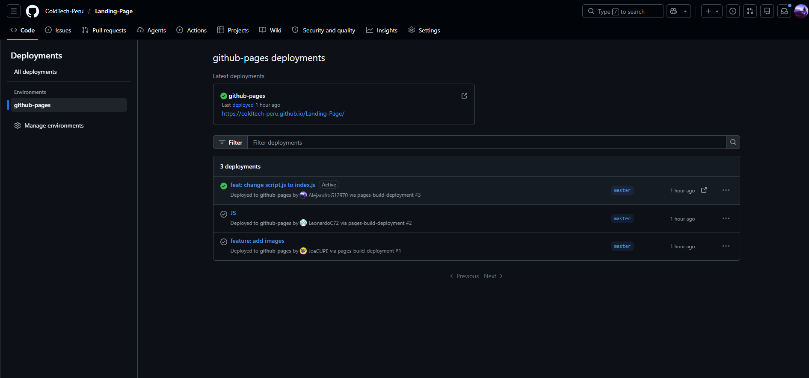

#### 5.2.1.7 Software Deployment Evidence for Sprint Review

Landing Page desplegada en GitHub Pages: **https://coldtech-peru.github.io/Landing-Page/**

| Sección | Captura |
| :---: | :---: |
| Inicio |  |
| Beneficios |  |
| Sobre Nosotros |  |
| Testimonios |  |
| Contacto |  |

#### 5.2.1.8 Team Collaboration Insights during Sprint

---

#### 5.2.2. Sprint 2

#### 5.2.2.1.Sprint Planning 2.

# Sprint 2

| Sprint 2 | Sprint 2 |
|---|---|
| **Sprint Planning Background** |  |
| **Date** | 2026-05-07 |
| **Time** | 17:00 PM |
| **Location** | Via Discord |
| **Prepared By** | Alejandro Galindo |
| **Attendees to planning meeting** |   Galindo Montero, Alejandro Manuel  , Perez Tuesta,  Gabriel  ,  Fajardo Monrroy, Walter Luis  ,Cumba Rengifo, Leonardo Raul y    Cuentas Peña, Joaquin Alberto  |
| **Sprint 2 Review Summary** | En este sprint, nos enfocamos en desarrollar el front-end y en realizar la implementación inicial de la plataforma Frigora. Completamos las funciones principales de la página, ofreciendo a los usuarios una primera experiencia de navegación y exploración del servicio de refrigeración. El equipo cumplió con los objetivos de entrega dentro del plazo previsto, estableciendo además los cimientos de la interfaz gráfica para futuras iteraciones. |
| **Sprint 2 Retrospective Summary** | Durante el sprint, a pesar de estar enfocado en el desarrollo técnico, permitió identificar oportunidades para mejorar nuestra dinámica de trabajo en equipo. En la retrospectiva, se destacó la necesidad de ajustar la duración de las reuniones diarias, redistribuir las tareas de acuerdo con las especialidades del equipo e incorporar una planificación individual con hitos verificables. Estas medidas tienen como objetivo incrementar la eficiencia en las próximas iteraciones. |
| **Sprint Goal & User Stories**  
| **Sprint 2 Goal** | Nuestro enfoque de desarrollo se centra en la creación e implementación de la interfaz front-end de Frigora, con el objetivo de proporcionar una experiencia de navegación fluida e intuitiva, mostrar las principales funcionalidades de la plataforma y disponer de una página de inicio funcional que comunique de manera efectiva el valor diferencial del servicio. |
| **Sprint 2 Velocity** | 36 |
| **Sum of Story Points** | 51 |

### 5.2.2. Aspect Leaders and Collaborators

Durante este segundo sprint, el equipo se enfocó principalmente en el desarrollo, mejora estructural y visual de las aplicaciones del Frontend, asegurando su correcto funcionamiento en distintos dispositivos (diseño responsive), la integración coherente de componentes visuales e interactivos, así como la implementación de funcionalidades dinámicas que mejoran la experiencia del usuario.

Con el objetivo de optimizar la organización y la colaboración del equipo, se elaboró la matriz de Liderazgo y Colaboración (LACX), la cual asigna responsabilidades y roles específicos a cada miembro del equipo en relación con los aspectos clave abordados durante el Sprint.

| Team Member   (Last Name, First Name) | Github Username | Implementacion de la gestión de equipos de refrigeracion (Frontend Applications)   Leader (L) / Collaborator (C) | Responsive y pruebas en distintos dispositivos   Leader (L) / Collaborator (C) | Despliegue de la aplicación web   Leader (L) / Collaborator (C) |
|---|---|---|---|---|
|Galindo Montero, Alejandro Manuel |AlejandroG12970 | L | L | L |
|Perez Tuesta,  Gabriel| Gabyoko | C | C | C |
|Fajardo Monrroy, Walter Luis  | WalterFajardo | C | C | C |
|Cumba Rengifo, Leonardo Raul  | LeonardoC72 | C | C | C |
|Cuentas Peña, Joaquin Alberto  | JoaCUPE | C | C | C |

#### 5.2.2.3.Sprint Backlog 2.
El objetivo principal de este Sprint es elaborar el Frontend de nuestra plataforma. Para ello, dividimos el desarrollo de esta según las User Stories pertenecientes a la Epic enfocada en la aplicacion web. La plataforma elegida para ser la herramienta de control de tareas fue Trello, el cuál se presenta una captura de pantalla de nuestro tablero y su enlace público.

Trello link: https://trello.com/invite/b/6a063f21d0fef018a6fdea7e/ATTI06db17776210086dc9611a5aebb7143cEB975F35/sprint-02

| User Story ID | User Story Título | Task ID | Task Título | Descripción | Estimación (Horas) | Asignado a | Estado (To do/ In-Process/ To-Review/ Done) |
| :---: | :--- | :---: | :--- | :--- | :---: | :--- | :---: |
| **US-01** | Registro de usuario | **UT-01** | Diseñar formulario de registro | Crear la interfaz de registro solicitando datos básicos del usuario y validaciones iniciales. | 3 | [Walter Fajardo] | To do |
| **US-02** | Inicio de sesión | **UT-01** | Implementar pantalla de login | Diseñar la vista de inicio de sesión con validación de credenciales y acceso a la plataforma. | 2 | [Leonardo Cumba] | To do |
| **US-03** | Gestionar equipos de refrigeración | **UT-01** | Crear módulo de gestión de equipos | Diseñar formularios y tablas para registrar, editar y visualizar equipos de refrigeración. | 4 | [Joaquin Cuentas] | To do |
| **US-05** | Analizar el consumo energético de equipos | **UT-01** | Diseñar dashboard energético | Crear gráficos y paneles visuales para comparar el consumo energético de equipos. | 5 | [Alejandro Galindo] | To do |
| **US-07** | Dar seguimiento al progreso del servicio | **UT-01** | Implementar vista de seguimiento | Diseñar una pantalla que permita visualizar el estado y progreso de los servicios técnicos. | 3 | [Gabriel Perez] | To do |
| **US-08** | Ver reporte de servicio realizado | **UT-01** | Crear vista de reporte técnico | Diseñar la interfaz para mostrar reportes detallados de servicios realizados. | 3 | [Walter Fajardo] | To do |
| **US-10** | Ver historial de servicios | **UT-01** | Implementar historial de servicios | Crear tabla o listado cronológico de servicios realizados por cliente o equipo. | 3 | [Leonardo Cumba] | To do |
| **US-12** | Registrar y gestionar técnicos | **UT-01** | Crear módulo de técnicos | Diseñar formularios y vistas para registrar, editar y administrar técnicos. | 4 | [Joaquin Cuentas] | To do |
| **US-13** | Consultar el perfil de un técnico | **UT-01** | Diseñar perfil de técnico | Implementar pantalla con información, métricas y desempeño del técnico. | 2 | [Alejandro Galindo] | To do |
| **US-17** | Visualizar clientes y servicios asociados | **UT-01** | Crear vista de clientes y servicios | Diseñar listado de clientes junto con sus servicios asociados y estado actual. | 3 | [Gabriel Perez] | To do |
| **US-18** | Visualizar equipos asignados a clientes | **UT-01** | Implementar listado de equipos asignados | Crear una vista donde se visualicen los equipos vinculados a cada cliente. | 3 | [Walter Fajardo] | To do |
| **US-25** | Acceder a la plataforma web (Call to Action) | **UT-01** | Crear Navbar y botón CTA | Añadir la barra de navegación superior con el botón "Ingresar" que redirija a la futura vista de Login. | 1 | [Leonardo Cumba] | Done |

### 5.2.2.4. Development Evidence for Sprint Review

En este segundo Sprint hemos realizado la implementación del frontend de nuestra solución **Frigora**, desarrollada por la startup **ColdTech**. Durante esta entrega, el equipo se enfocó en construir las principales vistas de la aplicación, considerando el **Dashboard** como una vista global del sistema y el módulo de **Monitoring** como un bounded context independiente orientado al seguimiento de equipos, aparatos y alertas. La siguiente tabla muestra los commits realizados durante el desarrollo.

| Repository | Branch | Commit Id | Commit Message | Commit Message Body | Committed on (Date) |
|---|---|---|---|---|---|
| 1ASI0729-2610-ColdTech/Frigora-Frontend | develop | N/A | feat(sites): add sites list view | Implemented the frontend view to display registered sites in the Frigora platform. | 03/05/2026 |
| 1ASI0729-2610-ColdTech/Frigora-Frontend | develop | N/A | feat(sites): add site registration form | Created the frontend form for registering new sites in the system. | 04/05/2026 |
| 1ASI0729-2610-ColdTech/Frigora-Frontend | develop | N/A | feat(services): add services list view | Developed the frontend screen to display available services and their basic information. | 05/05/2026 |
| 1ASI0729-2610-ColdTech/Frigora-Frontend | develop | N/A | feat(services): add service creation form | Implemented the frontend form for creating new service records. | 06/05/2026 |
| 1ASI0729-2610-ColdTech/Frigora-Frontend | develop | N/A | feat(services): add service detail view | Created the service detail screen to visualize service information in a structured way. | 07/05/2026 |
| 1ASI0729-2610-ColdTech/Frigora-Frontend | develop | N/A | feat(monitoring): add equipment monitoring view | Implemented the frontend view to display monitored refrigeration equipment and device status. | 08/05/2026 |
| 1ASI0729-2610-ColdTech/Frigora-Frontend | develop | N/A | feat(monitoring): add monitoring creation form | Created the frontend form to register new monitoring records for equipment tracking. | 09/05/2026 |
| 1ASI0729-2610-ColdTech/Frigora-Frontend | develop | N/A | feat(monitoring): add monitoring detail view | Developed the detail screen to review monitoring data, device information and equipment status. | 10/05/2026 |
| 1ASI0729-2610-ColdTech/Frigora-Frontend | develop | N/A | feat(alerts): add alerts view | Implemented the frontend view for displaying alerts generated from monitoring events. | 11/05/2026 |
| 1ASI0729-2610-ColdTech/Frigora-Frontend | develop | N/A | feat(reports): add reports list view | Implemented the frontend screen to display generated reports in the platform. | 12/05/2026 |
| 1ASI0729-2610-ColdTech/Frigora-Frontend | develop | N/A | feat(reports): add report creation form | Created the frontend form for registering new service or monitoring reports. | 13/05/2026 |
| 1ASI0729-2610-ColdTech/Frigora-Frontend | develop | N/A | feat(reports): add report detail view | Developed the frontend detail view to show report information clearly. | 14/05/2026 |
| 1ASI0729-2610-ColdTech/Frigora-Frontend | develop | N/A | feat(dashboard): add global dashboard view | Implemented the global dashboard view to provide a general overview of the Frigora platform. | 15/05/2026 |
| 1ASI0729-2610-ColdTech/Frigora-Frontend | develop | N/A | chore(frontend): organize sprint review evidence | Added and organized frontend evidence images for the Sprint Review documentation. | 15/05/2026 |
| 1ASI0729-2610-ColdTech/Frigora-Frontend | develop | N/A | merge: integrate frontend sprint changes into develop | Final integration of the frontend views developed during the sprint. | 16/05/2026 |

#### 5.2.2.5. Execution Evidence for Sprint Review

En el Sprint 2 se desplegó la primera versión de la Web Application de IceTrack, implementando funcionalidades esenciales como el dashboard del usuario, lugares, equipos que posee el usuario, las solicitudes de servicio de mantenimiento, las alertas y los reportes generados. Estas funcionalidades permiten a los usuarios hacer uso de herramientas que permitan mejorar la gestión de equipos de refrigeración para su posterior mantenimiento y seguimiento. A continuación, se presentan las evidencias:

Dashboard:

  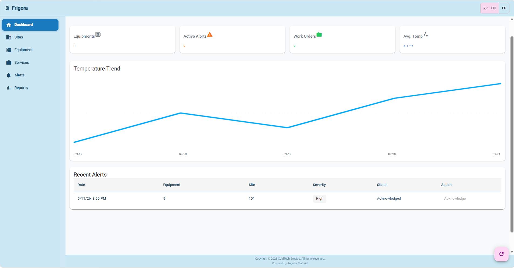

 

Sites:

  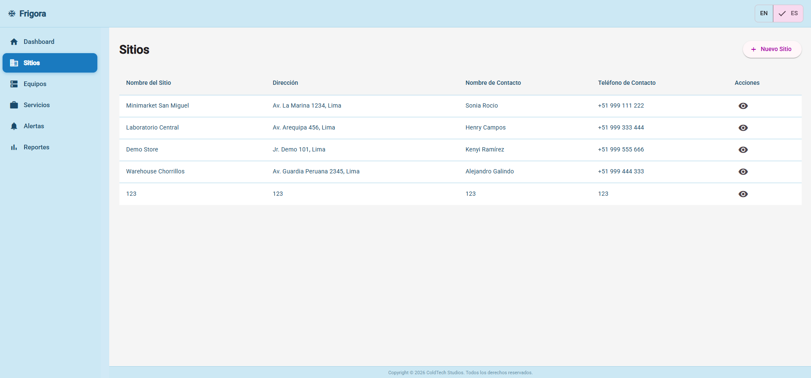

 

Sites created:

  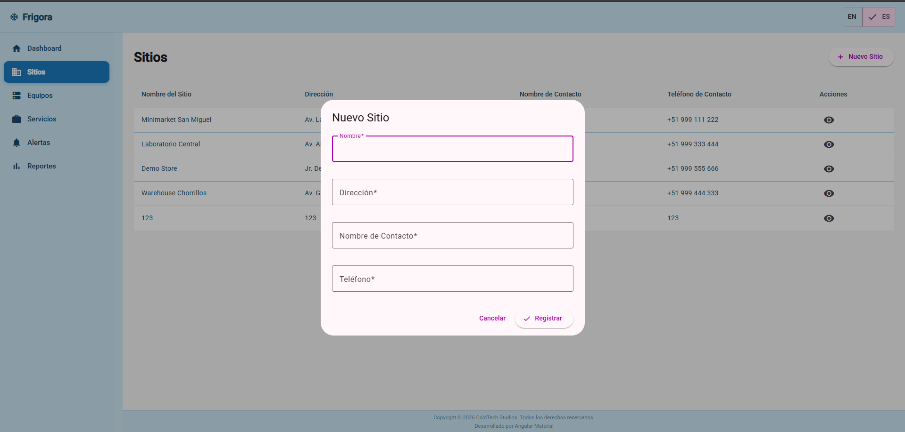

 

Equipments:

  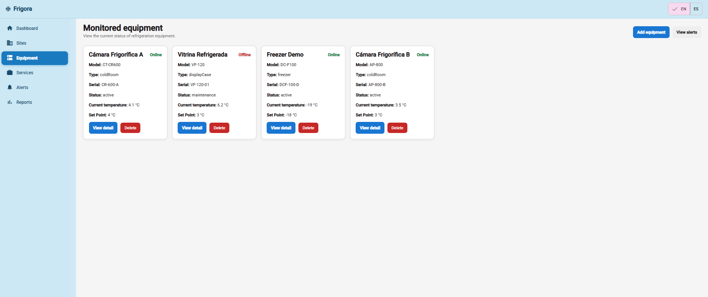

 

Equipments detail:

  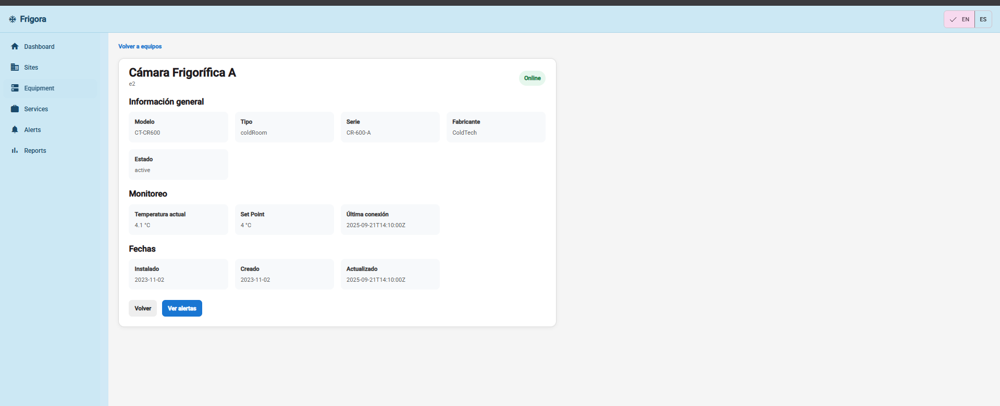

 

Equipments created:

  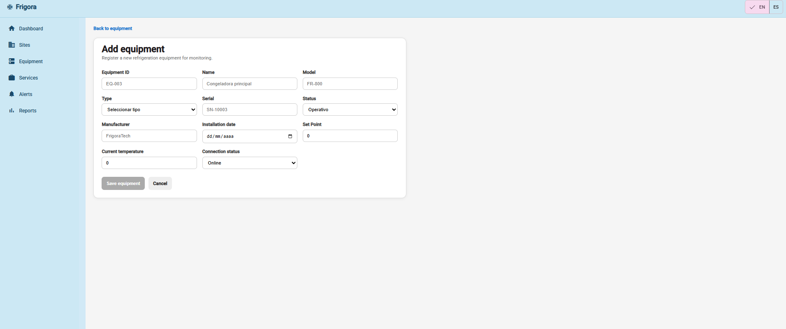

 

Service Requests:

  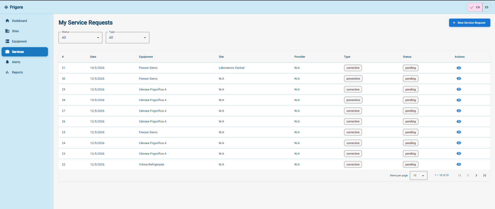

 

Service Requests detail:

  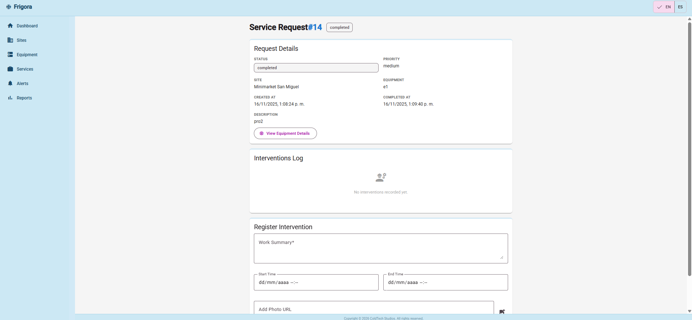

 

Service Requests created:

  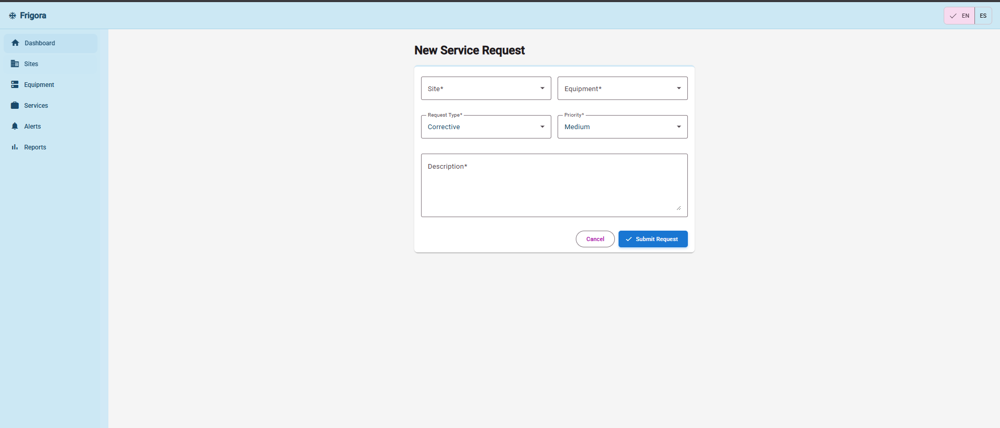

 

Alerts:

  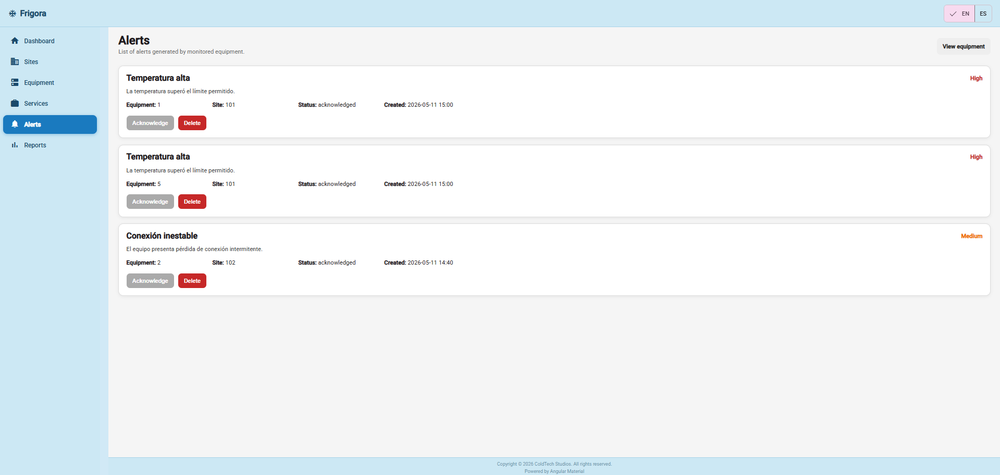

 

Reports:

  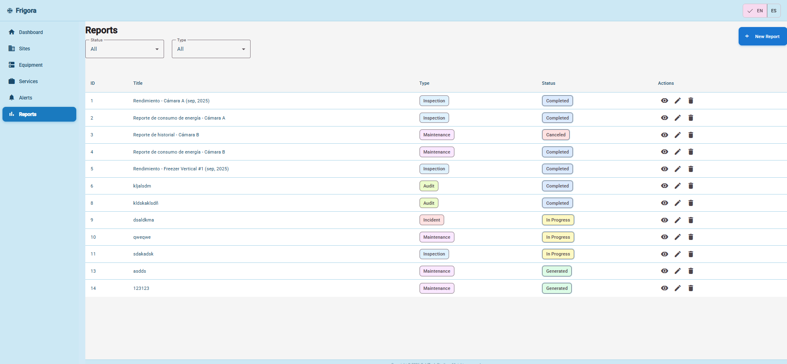

 

Reports detail:

  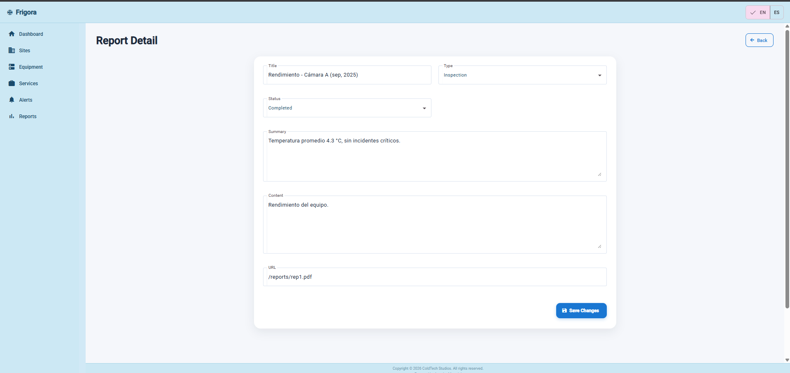

 

Reports created:

  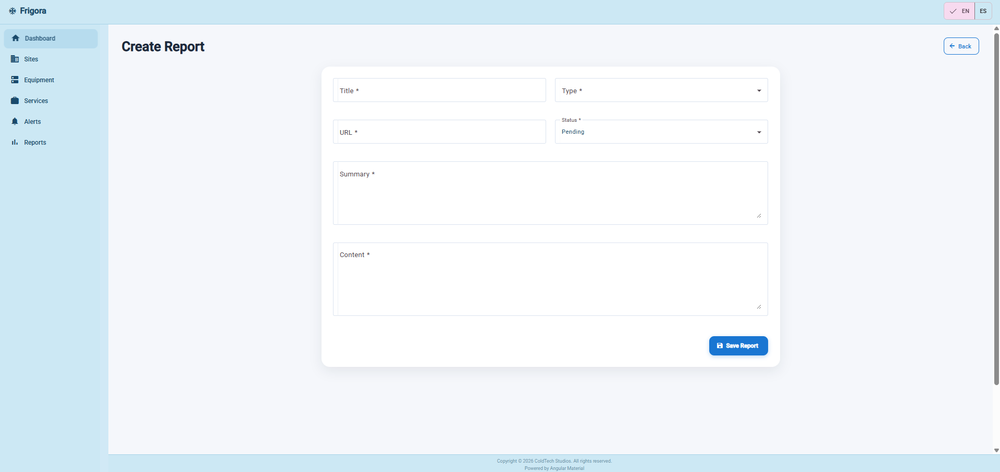

#### 5.2.2.6.Services Documentation Evidence for Sprint Review.

#### 5.2.2.7.Software Deployment Evidence for Sprint Review.

#### 5.2.2.8.Team Collaboration Insights during Sprint.

Insights del Report:

Insights del Landing Page:

  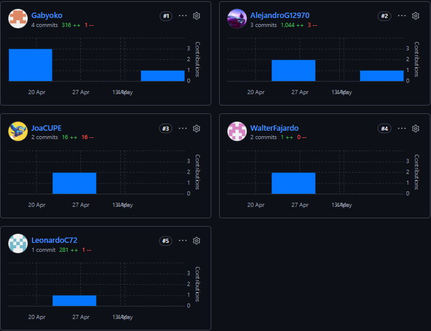

 

Insights del Front-End:

  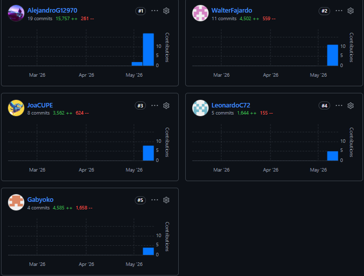

## Conclusiones

**Objetivo comercial cumplido:**  
La Landing Page fue completada al 100%, logrando presentar de manera clara la propuesta de valor de **Frigora** y los principales beneficios de la plataforma. Además, el contenido fue organizado pensando en los dos segmentos objetivo del proyecto: empresas que dependen de equipos de refrigeración y técnicos o proveedores de mantenimiento. Esto permite que el usuario comprenda rápidamente qué problema resuelve la solución y cómo puede ayudar en la gestión, monitoreo y atención de servicios.

**Organización ágil:**  
Se aplicó la metodología Scrum de forma adecuada durante el desarrollo del Sprint. El equipo logró organizar el trabajo mediante User Stories y tareas técnicas, diferenciando claramente los objetivos funcionales de las actividades necesarias para implementarlos. Asimismo, el tablero de Trello permitió visualizar el avance del equipo, asignar responsabilidades y mantener un mejor control sobre el estado de cada tarea durante la entrega.

**Colaboración técnica:**  
Se estableció un flujo de trabajo ordenado en GitHub, permitiendo que los integrantes del equipo integren sus avances de manera controlada. El uso de ramas de trabajo y mensajes de commit bajo la convención de **Conventional Commits** ayudó a mantener un historial claro y entendible del desarrollo realizado. Esto facilitó la revisión de cambios y la integración del frontend en la rama principal del proyecto.

**Avance del frontend:**  
Durante esta entrega, el equipo se enfocó principalmente en la implementación del frontend de la aplicación. Se desarrollaron vistas importantes como sitios, servicios, monitoreo, alertas, reportes y dashboard global. Estas interfaces permiten representar visualmente las funcionalidades principales de Frigora, aunque todavía queda pendiente la integración completa con una API real y el desarrollo del backend para futuras entregas.

**Validación del producto:**  
El avance realizado permite mostrar una primera versión funcional a nivel visual de la plataforma, lo cual es importante para validar la experiencia de usuario, la navegación y la estructura general del sistema. Gracias a estas pantallas, se puede obtener retroalimentación temprana sobre la claridad de la interfaz y la utilidad de las funcionalidades propuestas.

**Trabajo pendiente:**  
Como trabajo pendiente, queda desarrollar e integrar el **backend** de la plataforma. En esta entrega se implementó principalmente el **frontend**, por lo que en los siguientes Sprints se deberá trabajar la lógica del servidor, la conexión con la base de datos y la integración de las funcionalidades con datos reales.

---

# Anexos

| Recurso | URL |
| :--- | :--- |
| Organización del proyecto | https://github.com/ColdTech-Peru |
| Repositorio del reporte | https://github.com/ColdTech-Peru/Report |
| Repositorio de la Landing Page | https://github.com/ColdTech-Peru/Landing-Page |
| Landing Page desplegada | https://coldtech-peru.github.io/Landing-Page/ |
| Video de exposición AV1 | [Ver video](https://upcedupe-my.sharepoint.com/:v:/g/personal/u20201f788_upc_edu_pe/IQAwVSq8fQjySJapi2zSl6heAXLBV3ex_fNvqulDDFLlPh8?nav=eyJyZWZlcnJhbEluZm8iOnsicmVmZXJyYWxBcHAiOiJTdHJlYW1XZWJBcHAiLCJyZWZlcnJhbFZpZXciOiJTaGFyZURpYWxvZy1MaW5rIiwicmVmZXJyYWxBcHBQbGF0Zm9ybSI6IldlYiIsInJlZmVycmFsTW9kZSI6InZpZXcifX0%3D&e=h9sTbw) |
